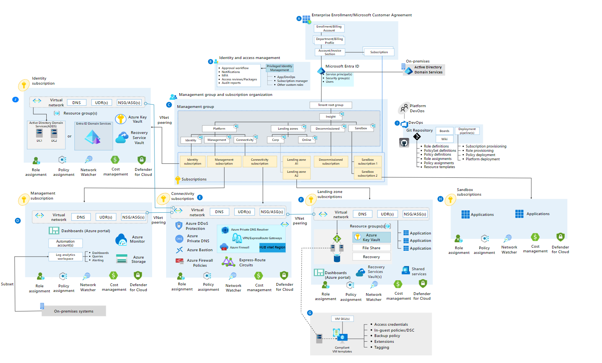

<!-- markdownlint-disable -->

# Azure Landing Zone - Platform

<!-- markdownlint-restore -->

  

   

The following repository was built, curated and cared for by the wonderful teammates at Insight. 💗

<!-- markdownlint-disable -->

<!-- markdownlint-restore -->

## What is an Azure Landing Zone - Platform

An Azure Landing Zone Platform is the output of a multi-subscription Azure environment that accounts for scale, security governance, networking, and identity. An Azure Landing Zone enables application migration, modernization, and innovation at enterprise-scale in Azure. This approach considers all platform resources that are required to support the customer's application portfolio and doesn't differentiate between infrastructure as a service or platform as a service.

## Scalable and Modular

No single solution fits all technical environments. However, a few Azure landing zone implementation options can help you meet the deployment and operations needs of your growing cloud portfolio.

- **Scalable:** All Azure landing zones support cloud adoption at scale by providing repeatable environments, with consistent configuration and controls, regardless of the workloads or Azure resources deployed to each landing zone instance.
- **Modular:** All Azure landing zones provide an extensible approach to building out your environment, based on a common set of design areas. The extensibility of an Azure landing zone enables an organization to easily scale specific elements of the environment, as requirements evolve.

## Platform vs. Application Landing Zones

There are two types of landing zones:

- **Platform landing zones:** Subscriptions deployed to provide centralized services, often operated by a central team, or a number of central teams split by function (e.g. networking, identity), which will be used by various workloads and applications. Platform landing zones represent key services that often benefit from being consolidated for efficiency and ease of operations. Examples include networking, identity, and management services.
- **Application landing zones:** One or more subscriptions deployed as an environment for an application or workload. Application landing zones are placed in management groups like 'corp' or 'online' beneath the 'landing zones' management group to ensure policy controls are correctly applied. Application landing zones can be subcategorized as follows:

  - **Centrally managed**: A central IT team fully operates the landing zone. The team applies controls and platform tools to both the platform and application landing zones.
  - **Technology platforms**: With technology platforms such as AKS or AVS, the underlying service is often centrally managed. The applications running on top of the service have delegated responsibilities to application teams. This results in modified controls or access permissions compared to centrally managed landing zones.
  - **Workload**: A platform administration team delegates the entire landing zone to a workload team to fully manage and support the environment; whilst still being controlled by the policies applied from the Management Groups above that the platform team control. This might include adding additional policies at the subscription scope and using alternative tooling for deploying, securing or monitoring workloads that is fully controlled and operated by the workload team.

## Azure Landing Zone Conceptual Architecture

For many organizations, the Azure landing zone conceptual architecture below represents the destination in their cloud adoption journey. It's a mature, scaled-out target architecture intended to help organizations operate successful cloud environments that drive their business while maintaining best practices for security and governance.

This conceptual architecture represents scale and maturity decisions based on a wealth of lessons learned and feedback from customers who have adopted Azure as part of their digital estate.

While your specific implementation might vary, as a result of specific business decisions or existing investments in tools that need to persist in your cloud environment, this conceptual architecture will help set a direction for the overall approach your organization takes to designing and implementing a landing zone.

## Azure Landing Zone Related Repositories

The following repositories are related to the Azure Landing Zone reference implementation:

| Repository                                            | Description                                                                                                                                                                                                                              | Link                                                                                                                 |
| ----------------------------------------------------- | ---------------------------------------------------------------------------------------------------------------------------------------------------------------------------------------------------------------------------------------- | -------------------------------------------------------------------------------------------------------------------- |
| Azure Landing Zones Code and Documentation (Platform) | Configures the platform related services and 3 x Azure Subscriptions for Platform related services and all related design artifacts, including diagrams and high-level documentation for the Azure Landing Zones reference architecture. | [Azure Landing Zones](https://github.com/Insight-Services-APAC/azure-landing-zones-bicep)                            |
| Azure Landing Zone Vending Machine (Application)      | Configures an Azure Landing Zone for application workloads and resources following a repeatable vending process.                                                                                                                         | [Azure Landing Zone - Vending Machine](https://github.com/Insight-Services-APAC/azure-landing-zones-vending-machine) |
| Azure Landing Zones Templates                         | All related workshop artifacts, including templates used for the Azure Landing Zones reference architecture.                                                                                                                             | [Insight Hero Asset Documentation](https://heroassetsdoc.insight-services-apac.dev/)               |
| Azure Landing Zones PlatformOps                       | All related Infrastructure as Code that is complementary to the Application and Platform Landing Zones that will be used for Day 2 operations.                                                                                           | [Azure Landing Zones PlatformOps](https://github.com/Insight-Services-APAC/azure-landing-zones-platformOps)          |

## Contributing

For information on how to contribute to this project, please see the [contribution guide](/CONTRIBUTING.md).

## Acknowledgements

This repository uses Intellectual Properties (IP) from several other repositories in the open-source community. For more information on these authors and their licenses, please see the [/NOTICE.txt](/NOTICE.txt) file.

## License

GNU GENERAL PUBLIC LICENSE - Version 3, 29 June 2007

See [License](/LICENSE).

## Local Development

For information of how to build and deploy this Infrastructure as Code using VSCode (F5/Run and Debug) functionality, please see the [docs/wiki/LocalDev.md](/docs/wiki/LocalDev.md) file.

## Getting Started with a Customer Deployment

> **NOTE:**
> These instructions are very important to prevent accidental IP oversharing so please follow these instructions fully.

Please follow these instructions to copy/clone this repository to a customer site.

1. Download this artefact/repository as a ZIP archive
1. Open and export the ZIP archive to local disk.
1. Delete the entire folders:
   - `.local`, and
   - `.git` (this is a hidden folder in the root `/`).
1. Delete the following files:
   - [.tours/localdev.tour](.tours/localdev.tour) file.
   - [/docs/wiki/LocalDev.md](./docs/wiki/LocalDev.md) file.
1. Delete these instructions under this heading `## Getting Started with a Customer Deployment`
1. Delete the instructions under this heading also `## Local Development`.
1. Modify [/docs/wiki/Home.md](./docs/wiki/Home.md) and remove references to the [/docs/wiki/LocalDev.md](./docs/wiki/LocalDev.md) file.
1. Upload this modified artefact to the customer site.
