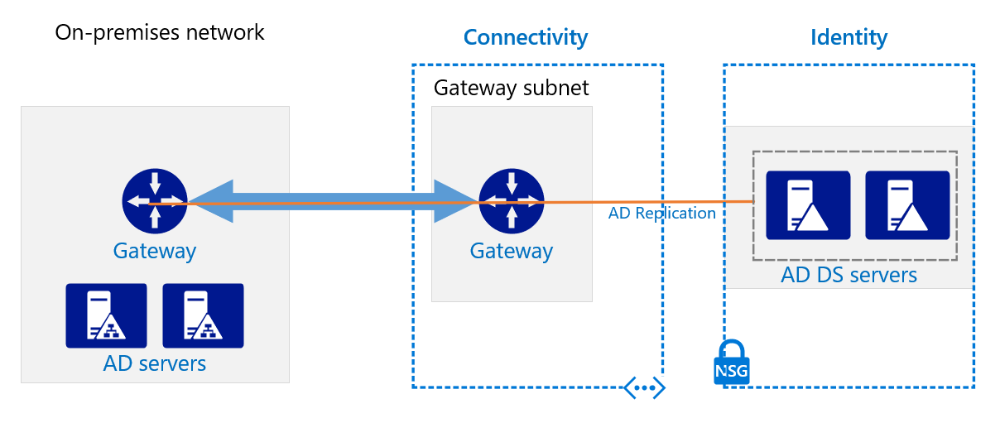
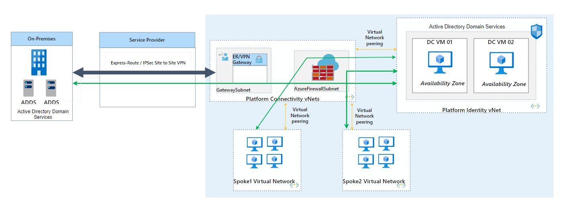

# Active Directory Domain Services

- [Active Directory Domain Services](#active-directory-domain-services)
  - [Active Directory Domain Services Overview](#active-directory-domain-services-overview)
  - [Active Directory Domain Services Design Decisions](#active-directory-domain-services-design-decisions)
  - [Active Directory Domain Controller Design](#active-directory-domain-controller-design)

## Active Directory Domain Services Overview

When deploying Active Directory Domain Services in Azure, some specific areas need to be considered for the Active Directory design. These include:

- AD Sites and Subnets
- Global Catalogue servers
- DNS
- Network connectivity to Azure
- IP addressing
- Storage considerations

When designing your Active Directory infrastructure in Azure, it’s advisable to treat each Azure region as a separate AD site. Each region has its own private address space and unique routing considerations, which makes local Domain Controllers essential for optimal performance.

For many applications and services, having a Domain Controller available within the region is critical, as it ensures connectivity remains local rather than routing traffic over the WAN. Consequently, the best practice is to deploy a minimum of two Domain Controllers in every Azure region where virtual machines are hosted.

For further guidance, please refer to the [AD Sites and Services documentation](https://learn.microsoft.com/en-us/windows-server/identity/ad-ds/get-started/virtual-dc/active-directory-domain-services-overview).

[[/.media/active-directory.png]]

| **Feature Reference**                                                                                                                                |
| ---------------------------------------------------------------------------------------------------------------------------------------------------- |
| [Active Directory Domain Services in Azure](https://docs.microsoft.com/en-us/azure/architecture/reference-architectures/identity/adds-extend-domain) |
| [Cloud Adoption Framework Reference](https://docs.microsoft.com/en-us/azure/cloud-adoption-framework/decision-guides/identity/)                      |

## Active Directory Domain Services Design Decisions

- [[Customer]] may decide to extend the corporate domain into Azure to enable directory services, DNS, Kerberos services to Azure IaaS workloads. If this decision is undertaken then the following design decisions are recommended:
  - Two (2) replica virtual machines should be provisioned in the Australia East Azure region across different Availability Zones.
  - The domain controllers should be placed in the dedicated Platform Identity Subscription so that they can be secured and controlled as it is a tier 0 service.
  - The domain controllers should be placed in a dedicated virtual network and subnet so that it can be secured using Network Security Groups to restrict in and outbound connections to only the ports and protocols required for domain services.
  - Each virtual machine should use small Standard SSD managed disks to ensure that the underlying storage meets Microsoft SLAs.
  - Specifications for the virtual machines will align with Microsoft best practices and include the following:
    - All external endpoints should be removed
    - Static private IP addresses should be set
    - Active Directory Sites & Services need to be created to localize Azure traffic to domain services within that region for IaaS workloads.
    - The Domain Services database and SYSVOL location should be placed on a separate data disk to prevent disk cache corruption in Azure.

## Active Directory Domain Controller Design

A dedicated Platform Identity Subscription will be created that will be used to segregate Identity and Access Management components, in the future this can include a pair of Active Directory Domain Controllers. The Domain Controllers are hosted in a small Virtual Network and Subnet, spread across multiple Availability Zones that is locked down to specific rules to allow replication from the on-premises environment and also provide Domain Services to Azure Virtual Machines.

The diagram below outlines the proposed architecture for extending Domain Services into Azure.

[[/.media/active-directory.png]]

The required ports and protocols will need to be opened across the Network Security Groups and associated firewalls to allow AD replication to the existing on-premises Domain Controllers and also to spoke networks within the Azure environment for access and authentication to Active Directory Services.

[[/.media/domain-controller-replication.png]]

