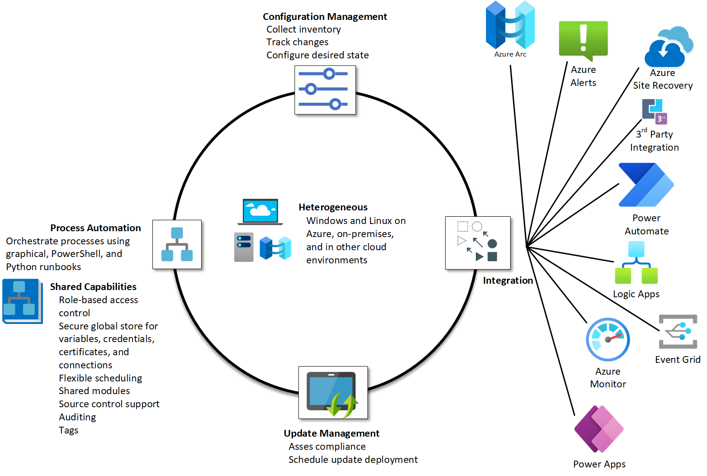

# Azure Automation

- [Azure Automation](#azure-automation)
  - [Azure Automation Overview](#azure-automation-overview)
    - [Process Automation](#process-automation)
    - [Configuration Management](#configuration-management)
      - [Change Tracking and Inventory](#change-tracking-and-inventory)
      - [Azure Automation State Configuration](#azure-automation-state-configuration)
  - [Azure Automation Design Decisions](#azure-automation-design-decisions)
  - [Azure Automation Configuration](#azure-automation-configuration)

## Azure Automation Overview

Azure Automation delivers cloud-based automation, and configuration services that supports consistent management across Azure and non-Azure environments. It includes process automation, configuration management, shared capabilities, and heterogeneous features.

[[/.media/automation-overview.png]]

### Process Automation

Process Automation in Azure Automation enables automation of frequent, time-consuming, and error-prone management tasks. The process automation operating environment is detailed in [Runbook execution in Azure Automation](https://docs.microsoft.com/en-us/azure/automation/automation-runbook-execution).

Process automation supports the integration of Azure services and other third party systems required in deploying, configuring, and managing end-to-end processes. The service allows you to author graphical, PowerShell and Python [Runbooks](https://docs.microsoft.com/en-us/azure/automation/automation-runbook-types). To run runbooks directly on the Windows or Linux machine or against resources in the on-premises or other cloud environment to manage those local resources, you can deploy a [Hybrid Runbook Worker](https://docs.microsoft.com/en-us/azure/automation/automation-hybrid-runbook-worker) to the machine.

[Webhooks](https://docs.microsoft.com/en-us/azure/automation/automation-webhooks) lets you fulfil requests and ensure continuous delivery and operations by triggering automation from Azure Logic Apps, Azure Function, ITSM product or service, DevOps, and monitoring systems.

### Configuration Management

Configuration Management in Azure Automation is supported by two capabilities:

- Change Tracking and Inventory
- Azure Automation State Configuration

#### Change Tracking and Inventory

Change Tracking and Inventory combines functions to allow the tracking of Linux and Windows virtual machine and server infrastructure changes. The service supports change tracking across services, daemons, software, registry, and files in an environment to help diagnose unwanted changes and raise alerts. Inventory support allows querying in-guest resources for visibility into installed applications and other configuration items. For details of this feature, see [Change Tracking and Inventory](https://docs.microsoft.com/en-us/azure/automation/change-tracking/overview).

#### Azure Automation State Configuration

[Azure Automation State Configuration](https://docs.microsoft.com/en-us/azure/automation/automation-dsc-overview) is a cloud-based feature for PowerShell desired state configuration (DSC) that provides services for enterprise environments. Using this feature, you can manage DSC resources in Azure Automation and apply configurations to virtual or physical machines from a DSC pull server in the Azure cloud.

| **Feature Reference**                                                                   |
| --------------------------------------------------------------------------------------- |
| [Azure Automation Overview](https://docs.microsoft.com/en-us/azure/automation/overview) |

## Azure Automation Design Decisions

- A dedicated Azure Automation account will be provisioned in the Platform Management Subscription.
- The Change Tracking and Inventory services will also be enabled to provide visibility into changes and resources within the environment.

## Azure Automation Configuration

| Item             | Details                     |
| ---------------- | --------------------------- |
| Name             | aaa-[[locPrefix]]-plat-mgmt-01         |
| Resource Group   | arg-[[locPrefix]]-plat-mgmt-logging     |
| Location         | Australia East              |
| Subscription     | sub-[[CustomerCode]]-plat-mgmt-01 |
| Linked Workspace |  |
