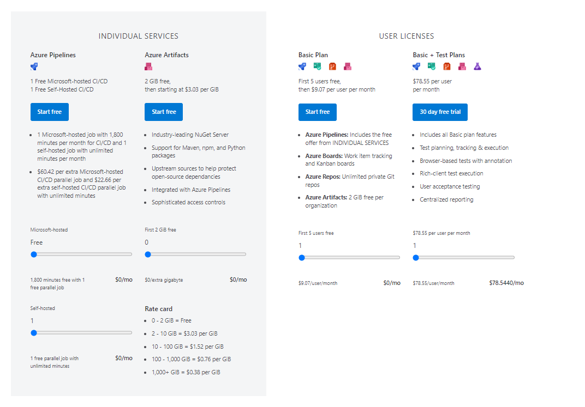

# Platform Automation and DevOps

- [Platform Automation and DevOps](#platform-automation-and-devops)
  - [Platform Automation and DevOps Overview](#platform-automation-and-devops-overview)
  - [Azure DevOps vs GitHub Repos](#azure-devops-vs-github-repos)
    - [What is Azure DevOps?](#what-is-azure-devops)
    - [What is GitHub?](#what-is-github)
  - [Platform Automation and DevOps Design Decisions](#platform-automation-and-devops-design-decisions)
  - [DevOps Project Details](#devops-project-details)

## Platform Automation and DevOps Overview

Platform automation and DevOps help evaluate opportunities to modernise the approach to environmental deployment with infrastructure as code options. This is a key component in enabling the Azure Landing Zone architecture. The scale, agility, and flexibility of cloud technologies lead to opportunities for new ways of working and modern approaches to service delivery.

The ability to make changes at scale through a prescribed automated process provides direct benefits and enables expansion beyond the baseline configuration, which includes security, governance, and management. Platform automation is directly applicable to the outcomes associated with implementing a landing zone, supporting the concept of building repeatable, scalable environments. Automation focuses on tools and techniques that streamline tasks for Azure Landing Zone development, deployment, provisioning, and operations using automation tools such as Azure DevOps Services or GitHub.

| **Feature Reference**                                                                                                                                            |
| ---------------------------------------------------------------------------------------------------------------------------------------------------------------- |
| [Cloud Adoption Framework Reference](https://learn.microsoft.com/en-us/azure/cloud-adoption-framework/ready/landing-zone/design-area/platform-automation-devops) |

## Azure DevOps vs GitHub Repos

### What is Azure DevOps?

Azure DevOps provides developer services for allowing teams to plan work, collaborate on code development, and build and deploy applications. Azure DevOps supports a collaborative culture and set of processes that bring together developers, project managers, and contributors to develop software. It allows organisations to create and improve products at a faster pace than they can with traditional software development approaches.

Azure DevOps provides integrated features that you can access through your web browser or IDE client. You can use one or more of the following standalone services based on your business needs:

- **Azure Repos** provides Git repositories or Team Foundation Version Control (TFVC) for source control of your code. For more information about Azure Repos, see [What is Azure Repos?](https://docs.microsoft.com/en-us/azure/devops/repos/get-started/what-is-repos?view=azure-devops).
- **Azure Pipelines** provides build and release services to support continuous integration and delivery of your applications. For more information about Azure Pipelines, see [What is Azure Pipelines?](https://docs.microsoft.com/en-us/azure/devops/pipelines/get-started/what-is-azure-pipelines?view=azure-devops).
- **Azure Boards** delivers a suite of Agile tools to support planning and tracking work, code defects, and issues using Kanban and Scrum methods. For more information about Azure Boards, see [What is Azure Boards?](https://docs.microsoft.com/en-us/azure/devops/boards/get-started/what-is-azure-boards?view=azure-devops).
- **Azure Test Plans** provides several tools to test your apps, including manual/exploratory testing and continuous testing. For more information about Azure Test Plans, see [Overview of Azure Test Plans](https://docs.microsoft.com/en-us/azure/devops/test/overview?view=azure-devops)
- **Azure Artifacts** allows teams to share packages such as Maven, npm, NuGet, and more from public and private sources and integrate package sharing into your pipelines. For more information about Azure Artifacts, see [Overview of Azure Artifacts](https://docs.microsoft.com/en-us/azure/devops/pipelines/artifacts/artifacts-overview?view=azure-devops).

#### Licenses & Parallel Jobs

Azure DevOps users licenses and Services can be purchased (Pipeline jobs or Artifacts) as required to align to the need for more pipelines and users within the organisation.

[[/.media/ado-pricing.png]]

### What is GitHub?

GitHub is a platform for version control and collaboration, allowing multiple people to work on projects at the same time. GitHub repositories can be used to store, share, and collaborate on code, and it supports various CI/CD tools for automation.

GitHub offers the following key features:

- **GitHub Repos** provides Git repositories for source control. For more information about GitHub Repos, see [GitHub Repositories](https://docs.github.com/en/repositories).
- **GitHub Actions** provides CI/CD workflows that can build, test, and deploy applications directly from GitHub. For more information about GitHub Actions, see [GitHub Actions](https://docs.github.com/en/actions).
- **GitHub Projects** offers project management tools to track work and manage projects. For more information about GitHub Projects, see [About Projects](https://docs.github.com/en/issues/planning-and-tracking-with-projects/learning-about-projects/about-projects).
- **GitHub Packages** allows hosting and managing packages, and integrates with GitHub repositories. For more information about GitHub Packages, see [GitHub Packages](https://docs.github.com/en/packages).

## Platform Automation and DevOps Design Decisions

For [[Customer_Shortname]]. Below are the key design decisions:

| Feature                     | Azure DevOps                                                                            | GitHub                                                                                                           | Selected       |
| --------------------------- | --------------------------------------------------------------------------------------- | ---------------------------------------------------------------------------------------------------------------- | -------------- |
| Source Control              | Azure Repos: Git repositories or Team Foundation Version Control (TFVC)                 | GitHub Repos: Git repositories                                                                                   | [[GitHubORAzDO]] |
| CI/CD Pipelines             | Azure Pipelines: Build and release services for continuous integration and delivery     | GitHub Actions: CI/CD workflows                                                                                  | [[GitHubORAzDO]] |
| Project Management          | Azure Boards: Agile tools for planning and tracking work, code defects, and issues      | GitHub Projects: Project management tools for tracking work                                                      | [[GitHubORAzDO]]   |
| Testing                     | Azure Test Plans: Tools for manual/exploratory testing and continuous testing           | GitHub Actions: Can integrate with various testing tools                                                         | [[GitHubORAzDO]] |
| Package Management          | Azure Artifacts: Hosting and sharing packages like Maven, npm, NuGet, etc.              | GitHub Packages: Hosting and managing packages                                                                   | [[GitHubORAzDO]] |
| Documentation               | Azure DevOps Wiki                                                                       | GitHub Gollum Wiki                                                                                               | [[GitHubORAzDO]] |
| Integration and Flexibility | High integration with other Azure services; can be complex for multi-cloud environments | Highly flexible and widely adopted across multi-cloud environments; seamless integration with other DevOps tools | [[GitHubORAzDO]] |

**Rationale**: Moving towards platform automation and CI/CD provisioning of the Azure Landing Zones will enable secure deployments, and standardised and repeatable environments for hosting various workloads and applications.

## DevOps Project Details

The following table outlines the GitHub repositories used to deploy the Azure Platform Landing Zone environment.

| Organisation                   | URL                                              | Repository                                                |
| ------------------------------ | ------------------------------------------------ | --------------------------------------------------------- |
| [[OrgName_GitHubDevOps]]| [[OrgURL_GitHubDevOps]] | [[RepoURL_GitHubDevOps]] |
