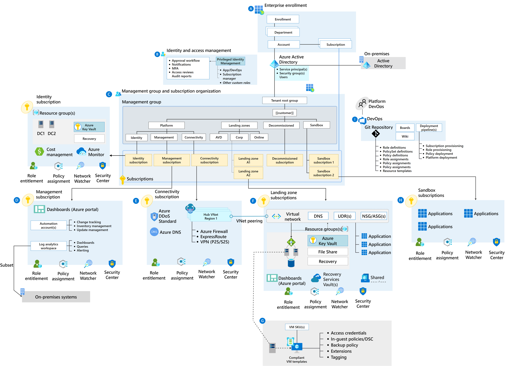

# Azure Landing Zone Architecture

- [Azure Landing Zone Architecture](#azure-landing-zone-architecture)
  - [What is an Azure Landing Zone](#what-is-an-azure-landing-zone)
    - [Scalable and modular](#scalable-and-modular)
  - [What is the Azure Landing Zone Architecture](#what-is-the-azure-landing-zone-architecture)
  - [Design Principles](#design-principles)
  - [Design Guidelines](#design-guidelines)
  - [Critical Design Areas](#critical-design-areas)

The principle challenges facing enterprise customers adopting Azure are:

1. How to allow applications (legacy or modern) to seamlessly move at their own pace
2. How to provide secure and streamlined operations, management, and governance across the entire platform and all encompassed applications. To address these challenges, requires forward-looking an Azure-native design approach, which in the context is represented by the Azure Landing Zone architecture.

## What is an Azure Landing Zone

Azure landing zones are the output of a multi-subscription Azure environment that accounts for scale, security governance, networking, and identity. Azure landing zones enable application migration, modernization, and innovation at enterprise-scale in Azure. These zones consider all platform resources that are required to support the customer's application portfolio and don't differentiate between infrastructure as a service or platform as a service. A landing zone is an environment for hosting workloads, pre-provisioned through code. As outlined in the video below

<!-- markdownlint-disable MD034 -->

[Azure Landing Zones](https://www.microsoft.com/videoplayer/embed/RE4xdvm)

<!-- markdownlint-enable MD034 -->

### Scalable and modular

No single solution fits all technical environments. A few Azure landing zone implementation options can help meet the deployment and operations needs of a growing cloud portfolio.

- **Scalable:** All Azure landing zones support cloud adoption at scale by providing repeatable environments, with consistent configuration and controls, regardless of the workloads or Azure resources deployed to each landing zone instance.
- **Modular:** All Azure landing zones provide a modular approach to building out your environment, based on a common set of design areas. Each design area can be easily extended to support the distinct needs of various technology platforms like Azure SQL Database, Azure Kubernetes Service, and Azure Virtual Desktop.

## What is the Azure Landing Zone Architecture

The Azure Landing Zone architecture represents the strategic design path and target technical state for an Azure environment. It will continue to evolve in lockstep with the Azure platform and is ultimately defined by the various design decisions that must be made to define the Azure journey.

It is important to highlight that not all enterprises adopt Azure in the same way, and as a result the Azure Landing Zone architecture may vary between customers. Ultimately, the technical considerations and design recommendations outlined are based off requirements and recommendations. Some variation is therefore expected, but provided core recommendations are followed, the resultant target architecture will position a path to sustainable scale and use of Azure.

[[/.media/azure-landing-zone-architecture.png]]

## Design Principles

The Azure Landing Zone architecture is based on the [five design principles](https://docs.microsoft.com/en-us/azure/cloud-adoption-framework/ready/enterprise-scale/design-principles). These principles serve as a compass for subsequent design decisions across critical technical domains. Readers and users of the reference implementation are strongly advised to familiarize themselves with these principles to better understand their impact and the trade-offs associated with non-adherence.

- [Subscription democratization](https://docs.microsoft.com/en-us/azure/cloud-adoption-framework/ready/enterprise-scale/design-principles?branch#subscription-democratization)
- [Policy-driven governance](https://docs.microsoft.com/en-us/azure/cloud-adoption-framework/ready/enterprise-scale/design-principles#policy-driven-governance)
- [Single control and management plane](https://docs.microsoft.com/en-us/azure/cloud-adoption-framework/ready/enterprise-scale/design-principles#single-control-and-management-plane)
- [Application-centric and archetype-neutral](https://docs.microsoft.com/en-us/azure/cloud-adoption-framework/ready/enterprise-scale/design-principles?#application-centric-and-archetype-neutral)
- [Aligning Azure-native design and road maps](https://docs.microsoft.com/en-us/azure/cloud-adoption-framework/ready/enterprise-scale/design-principles#aligning-azure-native-design-and-road-maps)

## Design Guidelines

At the centre of the Azure Landing Zone architecture lies a critical design path, comprised of fundamental design topics with heavily interrelated and dependent design decisions. This repository provides design guidance across these architecturally significant technical domains to support the critical design decisions which must occur to define the Azure Landing Zone architecture. For each of the considered domains, readers should review provided considerations and recommendations, using them to structure and drive designs within each area.

## Critical Design Areas

The [eight critical design areas](https://docs.microsoft.com/en-us/azure/cloud-adoption-framework/ready/enterprise-scale/design-guidelines#critical-design-areas) are intended to support the translation of customer requirements to Azure constructs and capabilities, to address the mismatch between on-premises infrastructure and cloud-design which typically creates dissonance and friction with respect to the Azure Landing Zone definition and Azure adoption.

The impact of decisions made within these critical areas will reverberate across the Azure Landing Zone architecture and influence other decisions. Readers and reference implementation users are strongly advised to familiarize themselves with these eight areas, to better understand the consequences of encompassed decisions, which may later produce trade-offs within related areas.

- [Enterprise enrolment and Entra ID Tenants](https://docs.microsoft.com/en-us/azure/cloud-adoption-framework/ready/enterprise-scale/enterprise-enrollment-and-azure-ad-tenants)
- [Identity and access management](https://docs.microsoft.com/en-us/azure/cloud-adoption-framework/ready/enterprise-scale/identity-and-access-management)
- [Management Group and Subscription organization](https://docs.microsoft.com/en-us/azure/cloud-adoption-framework/ready/enterprise-scale/management-group-and-subscription-organization)
- [Network topology and connectivity](https://docs.microsoft.com/en-us/azure/cloud-adoption-framework/ready/enterprise-scale/network-topology-and-connectivity)
- [Management and monitoring](https://docs.microsoft.com/en-us/azure/cloud-adoption-framework/ready/enterprise-scale/management-and-monitoring)
- [Business continuity and disaster recovery](https://docs.microsoft.com/en-us/azure/cloud-adoption-framework/ready/enterprise-scale/business-continuity-and-disaster-recovery)
- [Security, governance and compliance](https://docs.microsoft.com/en-us/azure/cloud-adoption-framework/ready/enterprise-scale/security-governance-and-compliance)
- [Platform automation and DevOps](https://docs.microsoft.com/en-us/azure/cloud-adoption-framework/ready/enterprise-scale/platform-automation-and-devops)
