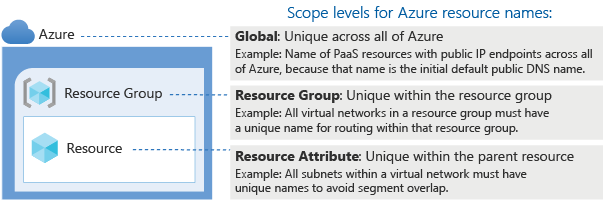

# Azure Naming Standards

- [Azure Naming Standards](#azure-naming-standards)
  - [Azure Naming Standards Overview](#azure-naming-standards-overview)
    - [Naming Scope](#naming-scope)
  - [Azure Naming Standards Design Decisions](#azure-naming-standards-design-decisions)
  - [Azure Naming Standards Design](#azure-naming-standards-design)
    - [Azure Naming Standards Configuration](#azure-naming-standards-configuration)

## Azure Naming Standards Overview

An effective naming convention composes resource names from important information about each resource. A well-chosen name helps you quickly identify the resource's type, its associated workload, its deployment environment, and the Azure region hosting it.

| **Feature Reference**                                                                                                                               |
| --------------------------------------------------------------------------------------------------------------------------------------------------- |
| [Cloud Adoption Framework Reference](https://docs.microsoft.com/en-us/azure/cloud-adoption-framework/ready/azure-best-practices/naming-and-tagging) |

### Naming Scope

All Azure resource types have a scope that defines the level that resource names must be unique. A resource must have a unique name within its scope. For example, a virtual network has a resource group scope, which means that there can be only one network named `vnt-[[locPrefix]]-plat-conn-10.0.0.0` in a given resource group. Other resource groups could have their own virtual network named `vnt-[[locPrefix]]-plat-xxxx-10.x.x.x`. Subnets are scoped to virtual networks, so each subnet within a virtual network must have a distinct name.

Some resource names, such as PaaS services with public endpoints or virtual machine DNS labels, have global scopes, so they must be unique across the entire Azure platform.

[[/.media/resource-naming-scope.png]]

Resource names have length limits. Balancing the context embedded in a name with its scope and length limit is important when developing naming conventions. For more information, see [Naming rules and restrictions for Azure resources](https://docs.microsoft.com/en-us/azure/azure-resource-manager/management/resource-name-rules).

---

**Important** This is list is expected to evolve over the lifecycle of the platform and should be updated when creating new resources that need a naming standard defined.

---

## Azure Naming Standards Design Decisions

- A naming standard will be defined for all Azure subscriptions and Management Groups, the names of these objects can be changed at a later stage if required.
- An Azure virtual machine naming convention should be created for both stateful and stateless IaaS workloads, this should ideally align to existing on-premises naming conventions as it will need to address the 16 character NETBIOS length limitation.
- A set of acronyms for Azure resources will be established to guide common Azure resources, there maybe a need to distinguish `Platform` resources from `Landing Zone` resources.
- A naming standard will be defined for all Azure resources using the acronyms and segmented approach to naming as outlined below.
- There are limited hard controls that can be put in place to ensure alignment of these naming conventions, so the best path to alignment is through awareness and making people understand the approach that is being taken.

> **Rationale:** Defining naming standards helps support the ability to automate resource provisioning, assist with the triage of issues, and makes it easier to identify resources and workloads.\*

**_Implications:_**

- _Azure resource naming must enable unique naming across Azure since some objects must-have globally unique names._
- _VM naming must support the 15-character limit of a virtual machine name as well as the maximum length of Azure resource names. A naming standard for all domain joined virtual machines will be required._
- _Most Azure resources cannot be renamed after creation, with the exception being subscriptions and Management Groups._
- _Resource tags provide information that can change over time to complement the names of Azure resources._

## Azure Naming Standards Design

| Key Used | Description                             | Values                                                               |
| -------- | --------------------------------------- | -------------------------------------------------------------------- |
| **A**    | Company Identifier Prefix               | `[[CustomerCode]]`                                                         |
| **B**    | Location or Region Prefix               | `ae` (Australia East)                                                |
| **C**    | Platform/Landing Zone Identifier Prefix | - `plat` (for Platform)                                              |
|          |                                         | - `avd`, `sap`, `avs`, `edge`, `rmc` (for Application Landing Zones) |
| **D**    | Environment Identifier Prefix           | - `conn`, `idam`, `mgmt` (for Platform)                              |
|          |                                         | - `qa`, `stg`, `prd`, etc. (for Environments)                        |
| **E**    | Azure Resource Identifier Prefix        | See examples in the resource naming table below                      |
| **F**    | Unique Identifier                       | - `GUID`                                                             |
|          |                                         | - `number`                                                           |
|          |                                         | - alphanumeric text                                                  |

**Note**: The **Unique String** (F) can be a sequence number or generated using the `uniqueString()` function in Bicep/ARM templates where `subscription().id` is used. For example, `uniqueString(subscription().id)`.

### Azure Naming Standards Configuration

| Resource Type                        | Naming Convention             | Example                             | Comments                                                                                                                                            |
| ------------------------------------ | ----------------------------- | ----------------------------------- | --------------------------------------------------------------------------------------------------------------------------------------------------- |
| **Automation Account**               | `aaa-B-C-D`                   | `aaa-[[locPrefix]]-plat-mgmt-01`               |                                                                                                                                                     |
| **Azure Container Registry**         | `acrBF`                       | `acrae[[CustomerCode_Lower]]eg01`               | Must be a globally unique name; consider for `F` giving intention of ACR. E.g. [[Customer_Shortname]] Example ACR, so `[[CustomerCode_Lower]]eg01`, 01 for future multiples of. |
| **Azure Firewall**                   | `afw-B-C-D`                   | `afw-[[locPrefix]]-plat-conn-01`               |                                                                                                                                                     |
| **Azure Kubernetes Service (AKS)**   | `aks-B-C-D`                   | `aks-[[locPrefix]]-rmc-stg-apps`               |                                                                                                                                                     |
| **Azure Managed Grafana**            | `grf-B-C-D`                   | `grf-[[locPrefix]]-plat-mgmt-01`               |                                                                                                                                                     |
| **Azure Monitor Workspace**          | `amo-B-C-D`                   | `amo-[[locPrefix]]-plat-mgmt-01`               |                                                                                                                                                     |
| **Bastion Host**                     | `bas-B-C-D`                   | `bas-[[locPrefix]]-plat-conn-01`               |                                                                                                                                                     |
| **Data Collection Endpoint**         | `dce-B-C-D`                   | `dce-[[locPrefix]]-plat-mgmt-01`               |                                                                                                                                                     |
| **Data Collection Rule**             | `dcr-B-C-D`                   | `dcr-[[locPrefix]]-plat-mgmt-changetracking`   |                                                                                                                                                     |
| **Disk**                             | `disk-B-C-D`                  | `disk-[[locPrefix]]-rmc-stg-csip-01`           |                                                                                                                                                     |
| **Event Grid System Topic**          | `egst-B-C-D-F`                | `egst-[[locPrefix]]-edge-cert-k8s-01`          | Use `F` for uniqueness; consider using `uniqueString()`.                                                                                            |
| **Firewall Policy**                  | `afp-B-C-D`                   | `afp-[[locPrefix]]-plat-conn-01`               |                                                                                                                                                     |
| **Flow Log**                         | `flg-B-C-D`                   | `flg-[[locPrefix]]-edge-cert-auth-01`          |                                                                                                                                                     |
| **Key Vault**                        | `akv-B-C-D`                   | `akv-[[locPrefix]]-edge-stg-k8s`               |                                                                                                                                                     |
| **Log Analytics Workspace**          | `law-B-C-D-F`                 | `law-[[locPrefix]]-plat-mgmt-01`               | Use `F` for uniqueness; consider using `uniqueString()`.                                                                                            |
| **Managed Identity (User-Assigned)** | `uai-B-C-D`                   | `uai-[[locPrefix]]-plat-mgmt-ama`              |                                                                                                                                                     |
| **Management Group**                 | `mg-A-C-D`                    | `mg-[[CustomerCode_Lower]]-plat-conn`           |                                                                                                                                                     |
| **Network Interface**                | `nic-B-C-D`                   | `nic-[[locPrefix]]-plat-mgmt-01`               |                                                                                                                                                     |
| **Network Security Group**           | `nsg-B-C-D`                   | `nsg-[[locPrefix]]-edge-stg-auth`              |                                                                                                                                                     |
| **Private Endpoint**                 | `pe-{resourceName}-{groupId}` | `pe-akv-[[locPrefix]]-plat-idam-cefs5gj-vault` |                                                                                                                                                     |
| **Public IP Address**                | `pip-B-C-D`                   | `pip-[[locPrefix]]-plat-conn-bastion`          |                                                                                                                                                     |
| **Resource Group**                   | `arg-B-C-D`                    | `arg-[[locPrefix]]-plat-mgmt-logging`            |                                                                                                                                                     |
| **Route Table**                      | `udr-B-C-D`                   | `udr-[[locPrefix]]-edge-stg-auth`              |                                                                                                                                                     |
| **Storage Account**                  | `staABCDF`                    | `sta[[locPrefix]]edgecertk8s`                  | No hyphens, all lowercase, globally unique. Use `uniqueString()` for `F`.                                                                           |
| **Subscription**                     | `sub-A-C-D-F`                 | `sub-[[CustomerCode_Lower]]-plat-conn-01`       |                                                                                                                                                     |
| **Virtual Machine**                  | `vm-B-C-D`                    | `vm-[[locPrefix]]-plat-mgmt-01`                |                                                                                                                                                     |
| **Virtual Machine Scale Set**        | `vmss-B-C-D`                  | `vmss-[[locPrefix]]-rmc-stg-apps-01`           |                                                                                                                                                     |
| **Virtual Network**                  | `vnt-B-C-D-F`                 | `vnt-[[locPrefix]]-plat-conn-[[platConnCIDRwith_]]`    | Include address space for `F`.                                                                                                                      |
