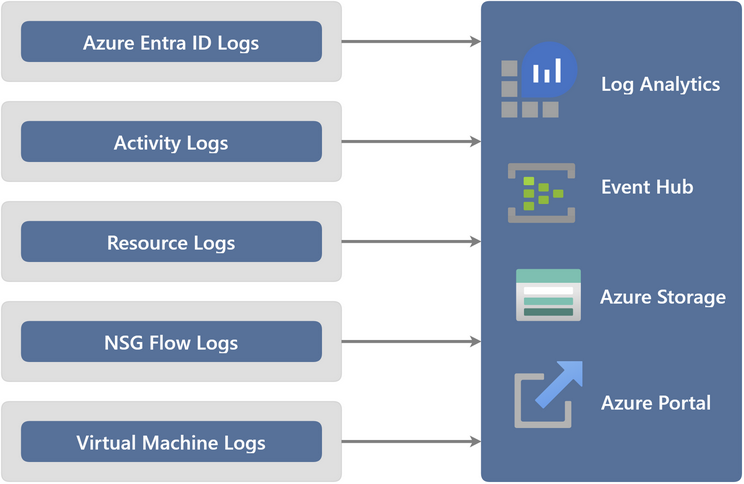
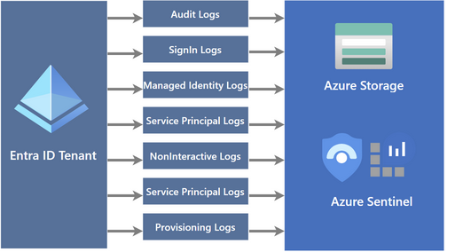
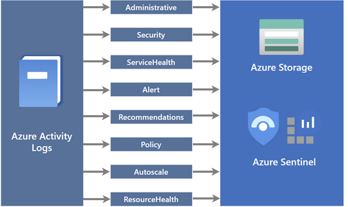
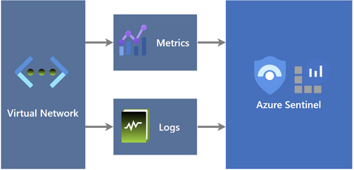
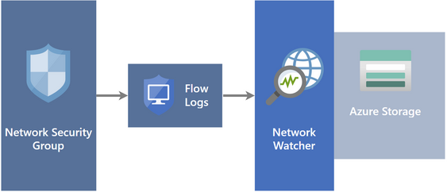

# Azure Platform Logs

- [Azure Platform Logs](#azure-platform-logs)
  - [Azure Platform Logs Overview](#azure-platform-logs-overview)
  - [Azure Platform Logs Design Decisions](#azure-platform-logs-design-decisions)
  - [Azure Platform Logs Configuration](#azure-platform-logs-configuration)
    - [Log Destinations](#log-destinations)
    - [Entra ID Logs](#entra-id-logs)
    - [Activity Logs](#activity-logs)
    - [Resource Logs](#resource-logs)
    - [Flow Logs](#flow-logs)

## Azure Platform Logs Overview

Azure Platform logs provide detailed diagnostic and auditing information for all Azure resources and the Azure platform they depend on. They are automatically generated and can be forwarded to one or more destinations to be retained.

The following table lists the specific platform logs that are available at different layers of Azure.

| Log                                                                                                                      | Layer              | Description                                                                                                                                                                                                                                                                                                                                                                                       |
| :----------------------------------------------------------------------------------------------------------------------- | :----------------- | :------------------------------------------------------------------------------------------------------------------------------------------------------------------------------------------------------------------------------------------------------------------------------------------------------------------------------------------------------------------------------------------------ |
| [Resource logs](https://docs.microsoft.com/en-us/azure/azure-monitor/essentials/resource-logs)                           | Azure Resources    | Provide insight into operations that were performed within an Azure resource (the _data plane_), for example getting a secret from a Key Vault or making a request to a database. The content of resource logs varies by the Azure service and resource type.  _Resource logs were previously referred to as diagnostic logs._                                                              |
| [Activity log](https://docs.microsoft.com/en-us/azure/azure-monitor/essentials/activity-log)                             | Azure Subscription | Provides insight into the operations on each Azure resource in the subscription from the outside (_the management plane_) in addition to updates on Service Health events. Use the Activity Log, to determine the _what_, _who_, and _when_ for any write operations (PUT, POST, DELETE) taken on the resources in your subscription. There is a single Activity log for each Azure subscription. |
| [Microsoft Entra Id logs](https://learn.microsoft.com/en-us/entra/identity/monitoring-health/overview-monitoring-health) | Azure Tenant       | Contains the history of sign-in activity and audit trail of changes made in the Azure Active Directory for a particular tenant.                                                                                                                                                                                                                                                                   |

[[/.media/logs-overview.png]]

Azure Platform logs can be sent to one or more of the destinations in the following table depending on the monitoring requirements.

| Destination                                                                                                 | Description                                                                                                                                                                                                                                                                                                                                                                                                                                                                                                                     |
| :---------------------------------------------------------------------------------------------------------- | :------------------------------------------------------------------------------------------------------------------------------------------------------------------------------------------------------------------------------------------------------------------------------------------------------------------------------------------------------------------------------------------------------------------------------------------------------------------------------------------------------------------------------ |
| [Log Analytics workspace](https://docs.microsoft.com/en-us/azure/azure-monitor/logs/design-logs-deployment) | Analyse the logs of all your Azure resources together and take advantage of all the features available to [Azure Monitor Logs](https://docs.microsoft.com/en-us/azure/azure-monitor/logs/data-platform-logs) including [log queries](https://docs.microsoft.com/en-us/azure/azure-monitor/logs/log-query-overview) and [log alerts](https://docs.microsoft.com/en-us/azure/azure-monitor/alerts/alerts-log). Pin the results of a log query to an Azure dashboard or include it in a workbook as part of an interactive report. |
| [Event hub](https://docs.microsoft.com/en-us/azure/event-hubs/)                                             | Sending logs and metrics to Event Hubs allows you to stream data to external systems such as third-party SIEMs and other Log Analytics solutions.                                                                                                                                                                                                                                                                                                                                                                               |
| [Azure storage Account](https://docs.microsoft.com/en-us/azure/storage/blobs/)                              | Archiving logs and metrics to an Azure storage account is useful for audit, static analysis, or backup. Compared to Azure Monitor Logs and a Log Analytics workspace, Azure storage is less expensive and logs can be kept there indefinitely.                                                                                                                                                                                                                                                                                  |
|                                                                                                             |

| **Feature Reference**                                                                                                  |
| ---------------------------------------------------------------------------------------------------------------------- |
| [Azure Platform Logs Overview](https://docs.microsoft.com/en-us/azure/azure-monitor/essentials/platform-logs-overview) |

## Azure Platform Logs Design Decisions

- All Azure Platform logs will be captured for logging and auditing purposes.
- A dedicated Log Analytics workspace that has been enabled for Microsoft Sentinel (if also enabled) will be used as a log destination, retention of these logs will be for 90 days.
- A dedicated Azure Storage account will be used for long-term retention of logs that can be used if these logs are required post 90 days.
- All Activity logs will be configured using Azure Policy for Log Analytics, Microsoft Sentinel (if also enabled) and Azure Storage.
  - The following Activity logs will be captured for each subscription:
    - Administrative
    - Security
    - ServiceHealth
    - Alert
    - Recommendation
    - Policy
    - Auto-scale
    - ResourceHealth
- All Microsoft Entra ID logs will be configured using Azure Policy for Log Analytics, Microsoft Sentinel (if also enabled) and Azure Storage.
  - The following Microsoft Entra ID logs will be captured from the Entra ID tenant:
    - AuditLogs
    - SignInLogs
    - NonInteractiveUserSignInLogs
    - ServicePrincipalSignInLogs
    - ManagedIdentitySignInLogs
    - ProvisioningLogs
    - ADFSSignInLogs
    - RiskyUsers
    - UserRiskEvents
- All Azure Resource Logs for supported Azure services will be configured and enforced by Azure Policy for Log Analytics and Microsoft Sentinel (if also enabled) only.

## Azure Platform Logs Configuration

The configuration and enforcement of all Platform logs to the associated destination will be enforced by Azure Policy _DeployIfNotExist_ effects to automatically configure the diagnostic settings.

### Log Destinations

The following log destinations have been configured for Platform logs.

| Item                | Details                               |
| ------------------- | ------------------------------------- |
| Name                | law-[[locPrefix]]-plat-mgmt-`uniqueString()`        |
| Resource Group      | arg-[[locPrefix]]-plat-mgmt-logging                |
| Location            | Australia East                        |
| Subscription        | sub-[[CustomerCode]]-plat-mgmt-01           |
| Pricing Tier        | PerGB2018                             |
| Access Control Mode | Use resource or workspace permissions |
| Retention           | 90 Days                               |

| Storage Account                                                                  | Details                                                 |
| -------------------------------------------------------------------------------- | ------------------------------------------------------- |
| Name                                                                             | sta[[locPrefix]]platmgmt`uniqueString()`                            |
| Resource Group                                                                   | arg-[[locPrefix]]-plat-mgmt-logging                                  |
| Location                                                                         | Australia East                                          |
| Subscription                                                                     | sub-[[CustomerCode]]-plat-mgmt-01                             |
| Performance/Access Tier                                                          | Hot                                                     |
| Replication                                                                      | Geo-redundant storage (GRS)                             |
| Account Kind                                                                     | StorageV2                                               |
| Firewall Restriction                                                             | Enabled from selected virtual networks and IP addresses |
| Allow Azure services on the trusted services list to access this storage account | Yes                                                     |
| Allow read access to storage logging from any network                            | Yes                                                     |
| Allow read access to storage metrics from any network                            | Yes                                                     |

### Entra ID Logs

Entra ID Logs provide information around access and authentication into the Azure platform and include Sign-in, Audit, Provisioning, and Risky Sign-in logs. These logs will be sent to the centralised Log Analytics workspace that is enabled for Microsoft Sentinel (if enabled).

[[/.media/platform-azure-ad-logs.png]]

### Activity Logs

The Activity logs provide insight into subscription-level events, including when a resource is modified or when a virtual machine is started.

[[/.media/platform-azure-activity-logs.png]]

### Resource Logs

Azure resource logs provide insight into operations that were p

[[/.media/platform-resource-logs.png]]

### Flow Logs

Virtual Network (VNT) (or formerly, Network Security Group) flow logs is a feature of Azure Network Watcher that enables collection of log information about IP traffic flowing through a vNet.

[[/.media/platform-nsg-flow-logs.png]]

