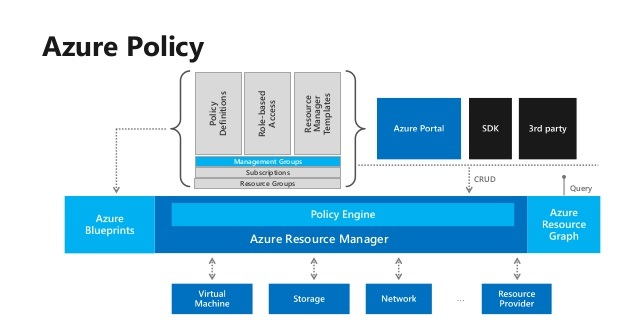
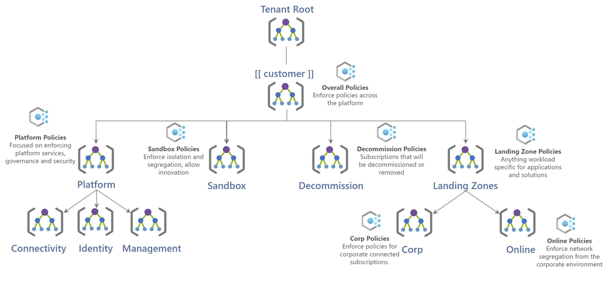

# Azure Policy

- [Azure Policy](#azure-policy)
  - [How Azure Policy Works](#how-azure-policy-works)
  - [Policy Actions in Azure](#policy-actions-in-azure)
  - [Azure Policy vs Role-Based Access Control (RBAC)](#azure-policy-vs-role-based-access-control-rbac)
  - [Managing Policies at Scale with Management Groups](#managing-policies-at-scale-with-management-groups)
  - [Azure Policy Design Decisions](#azure-policy-design-decisions)
  - [Azure Policy Design](#azure-policy-design)
  - [Azure Policy Configuration and Management](#azure-policy-configuration-and-management)
    - [Policy Sources](#policy-sources)
    - [Viewing Policy Assignments, Definitions, and Exemptions](#viewing-policy-assignments-definitions-and-exemptions)

## Azure Policy Overview

Azure Policy is always controlled via **code** in enterprise governance, ensuring that cloud environments meet **operational, security, and management standards**. In **Azure Landing Zone**, Azure Policies are widely used to enforce **guardrails**, making it easier to implement governance measures at scale.

### How Azure Policy Works

Azure Policy operates within **Azure Resource Manager (ARM)** to control resources and maintain compliance. Policies prevent users from breaching organisational standards, ensuring consistent management across cloud environments.

Each **policy definition** specifies the actions or resources that must be controlled. These policies are then assigned at different scopes, including:

- **Management Group**
- **Subscription**
- **Resource Group**
- **Individual Resource**

### **Policy Actions in Azure**

Azure Policy allows for **fine-grained control** over resource compliance through various actions:

- **Append** – Adds additional fields to a resource during creation or update. For example, specifying allowed IPs for a storage account.
- **Audit** – Logs a warning when a resource is non-compliant but does not block the request. Useful for alerts or triggering automation.
- **AuditIfNotExists** – Checks if a related resource exists and audits if missing. For example, verifying if an anti-malware extension is installed on a VM.
- **Deny** – Prevents the creation or modification of a resource if it does not meet policy requirements.
- **DeployIfNotExists** – Deploys a required configuration when a resource is found to be non-compliant. For example, enabling Transparent Data Encryption (TDE) on SQL databases if missing.

  > Note: _DeployIfNotExists_ is sometimes overused to complete the last parts of deployments, however, this approach should never be adopted as good/best practice. Infrastructure as Code (IaC) should always complete full configuration of Azure Resources.
- **Disabled** – Disables a policy assignment without removing it, useful for testing or flexible enforcement.
- **Modify** – Adds, updates, or removes properties or tags on a resource. For example, enforcing cost centre tags on resources. Non-compliant resources can be remediated with a **remediation task**.

### Azure Policy vs Role-Based Access Control (RBAC)

While **Azure Policy and RBAC** serve different purposes, they work together:

- **RBAC** manages who can perform actions within Azure.
- **Azure Policy** enforces **what** configurations and standards must be followed.
- Policies operate on a **default allow, explicit deny** model, unlike RBAC, which grants access based on assigned roles.

### Managing Policies at Scale with Management Groups

To reduce administrative overhead when managing **multiple subscriptions and policies**, **Management Groups** can be used as an Azure Policy scope. Management Groups allow organisations to **structure subscriptions into a hierarchy**, making it easier to manage:

- **Access**
- **Policy enforcement**
- **Cost controls**
- **Compliance requirements**

Azure Policy plays a critical role in enforcing **security, governance, and resource usage** across all levels of an organisation’s cloud environment.

[[/.media/azure-policy-architecture.png]]

| **Feature Reference**                                                                                                                      |
| ------------------------------------------------------------------------------------------------------------------------------------------ |
| [Azure Policy Definitions](https://docs.microsoft.com/en-us/azure/governance/policy/samples/built-in-policies)                             |
| [Azure Policy Initiatives](https://docs.microsoft.com/en-us/azure/governance/policy/samples/built-in-initiatives)                          |
| [Cloud Adoption Framework Reference](https://docs.microsoft.com/en-us/azure/cloud-adoption-framework/ready/enterprise-scale/dine-guidance) |

## Azure Policy Design Decisions

- The Azure Policy implementation has taken into consideration both traditional governance standards and regulatory compliance standards. Both Policy Definitions and Initiatives are used with built-in policy definitions and initiatives being preferred, however some custom policies have been created for specific requirements.
- Azure Policy will provide the guardrails to enforce security and governance across the platform and empower application owners to be self-sufficient under these guard rails.
- Azure Policy will be applied at the management group and optionally at the subscription level to ensure policies are inherited during the creation of future Landing Zone subscriptions. Azure Policies should be assigned at a Resource Group level where possible.
- The proposed Azure Policy framework will evolve as the use of Azure platform matures and new business requirements are known.

> **Rationale:** Controlling and defining how resources are deployed in Azure will help meet security, governance, and compliance requirements.
>
> **Implications:** [[Customer]] will need to define processes to review and manage new Azure Policy Definitions and Assignments as the platform matures.\*

## Azure Policy Design

While the decisions in this design provide a governance MVP, the use of Azure Policy will evolve as [[Customer]] continues their use of Azure. Once future policy sets are confirmed relevant and successful testing has taken place, they can be applied across the platform. The diagram below outlines the Azure Policy framework that has been implemented across the Management Group and Subscription structure.

[[/.media/azure-policy-design.png]]

The diagram is summarised below:

- **Top Level Management Group**

  - Azure Policies that will be applied to the whole platform\*\*
    - Only allow the use of Australian Azure Regions.
    - Enforcement of required tags across the whole environment.
    - Enforcement of key security and controls.
    - Enforcement of logging and monitoring.
    - Regulatory Compliance Policies.

- **Platform Management Group**

  - Azure Policies that will control and build out the Connectivity, Identity, and Management subscriptions.

- **Landing Zone Management Group**

  - List of Policies that apply to “Corp” and “Online” subscriptions and enforce mandatory security & governance.
    - Deny vNet peering to the Hub for Online Subscriptions.
    - Deploy agents and extensions for IaaS workloads.
    - Prevent the use of Public IP addresses.
    - Govern and secure specific applications and workloads.

- **Decommissioned Management Group**

  - A single Azure Policy that will restrict the creation of any new resources.

- **Sandbox Management Group**
  - Azure Policies at this management group will enable ideation and testing of solutions in an isolated environment that will restrict access to the corporate network and on-premises systems.

## Azure Policy Configuration and Management

All Azure Policy configurations in this solution are managed automatically using **Bicep files** located in the [`src/modules/policy`](/src/modules/policy) directory. These configurations are deployed through **CI/CD pipelines**, ensuring a consistent and repeatable approach to governance and compliance.

### Policy Sources

The policies applied within this solution originate from two distinct sources:

1. **ALZ Default Policies** (`alzDefault`):
   - These policies are sourced directly from **Microsoft's open-source repositories**.
   - They align with **Azure Landing Zone (ALZ) best practices**, ensuring compliance with Microsoft's recommendations for cloud governance.
   - Policies in this category can be found in nested subfolders labeled **`alzDefault`**.

2. **Custom Insight Policies** (`custom`):
   - These policies are curated by **Insight**, leveraging industry-leading expertise in designing and implementing **Landing Zones**.
   - They are tailored to meet specific compliance, security, and operational requirements beyond the default ALZ recommendations.
   - Policies in this category are located in nested subfolders labeled **`custom`**.

### Viewing Policy Assignments, Definitions, and Exemptions

To review all policies that are **assigned, defined, or exempted** as part of the automated process, refer to the **documentation directory**:

- **[docs/wiki/Policy](/Policy/)**

This directory contains Markdown files that are **automatically generated**, ensuring that documentation remains up to date with each deployment.

By following this structured approach, policy management remains **automated, version-controlled, and transparent**, reducing manual effort while maintaining compliance across Azure environments.
