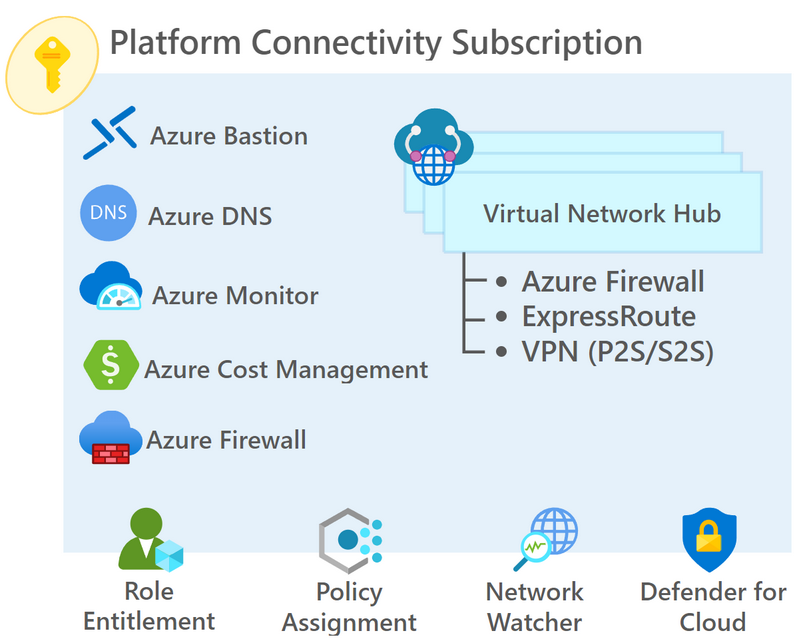
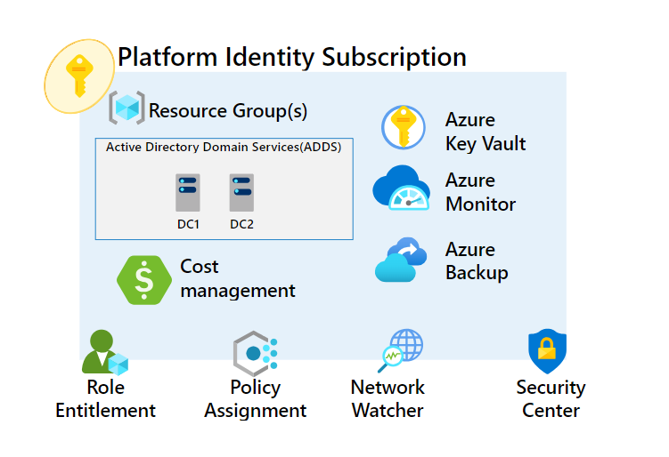
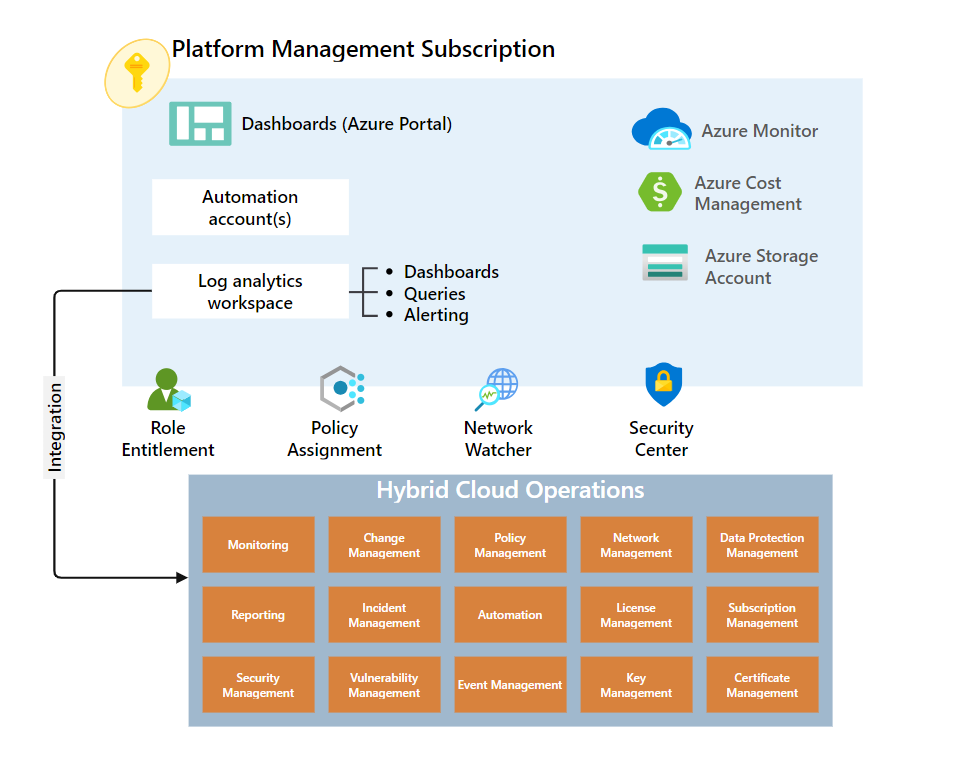
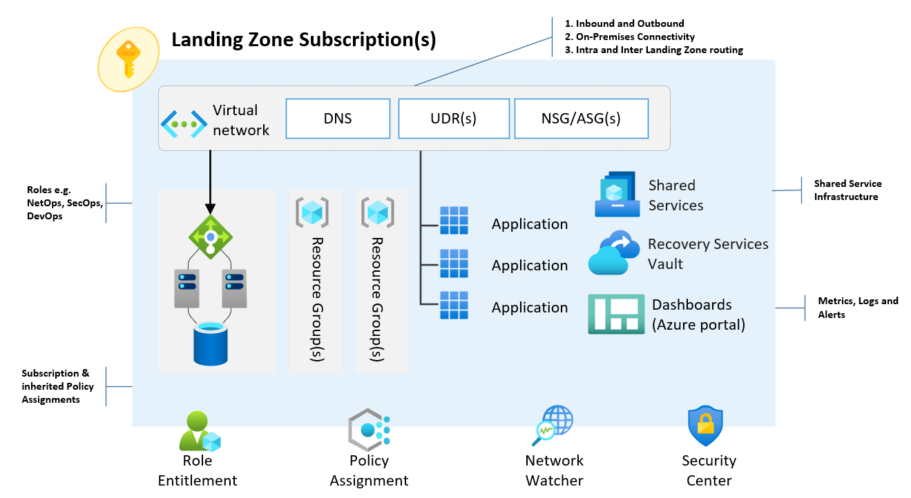

# Azure Subscriptions

- [Azure Subscriptions](#azure-subscriptions)
  - [Azure Subscriptions Overview](#azure-subscriptions-overview)
  - [Azure Subscriptions Design Decisions](#azure-subscriptions-design-decisions)
  - [Azure Subscription Design](#azure-subscription-design)
    - [Platform Connectivity](#platform-connectivity)
    - [Platform Identity](#platform-identity)
    - [Platform Management](#platform-management)
    - [Landing Zone Subscriptions](#landing-zone-subscriptions)
    - [Platform Subscriptions Configuration](#platform-subscriptions-configuration)
    - [Landing Zone Subscriptions Configuration](#landing-zone-subscriptions-configuration)

## Azure Subscriptions Overview

Subscriptions are a unit of management, billing, and scale within Azure. They play a critical role when you're designing for large-scale Azure adoption. This section helps you capture subscription requirements and design target subscriptions based on critical factors. These factors are environment type, ownership and governance model, organizational structure, and application portfolios.

| **Feature Reference**                                                                                                                |
| ------------------------------------------------------------------------------------------------------------------------------------ |
| [Cloud Adoption Framework Reference](https://docs.microsoft.com/en-us/azure/cloud-adoption-framework/decision-guides/subscriptions/) |

## Azure Subscriptions Design Decisions

- Azure subscriptions aligning to Landing Zones will be created beneath the required Management Groups to ensure that all Azure Policies, RBAC, and inheritance of subscription scaffolding is addressed as part of the creation process.
- There will be separate subscriptions created to align to Production and Non-Production environments for applications and solutions.
- These Landing Zone subscriptions will be created as required to align with new projects or initiatives within the business.
- Dedicated Platform subscriptions (Connectivity, Management, Identity) will be pre-created to separate shared platform services from workloads.
- All sandbox subscriptions should be enabled for the Enterprise Dev/Test offer to reduce the cost for these non-critical subscriptions. Users who access these subscriptions via the portal Must-Have a valid MSDN license to ensure compliance to Microsoft licensing.
- As subscriptions are decommissioned, they will be placed in the Decommissioned Management Group to ensure that resources cannot be deployed to these subscriptions.

> **Rationale:** The creation of new subscriptions will align with the future build-out of the Azure platform. The segregation of these subscriptions allows alignment to environments, classifications, and platform services. Enterprise Dev/Test subscriptions occur at a lower cost for some Azure resources ensuring development and evaluation activities can be done in these subscriptions as a cost-saving measure.
>
> **Implications:** An Azure subscription should be a democratised unit of management aligned to requirements and priorities, the creation process and management of these subscriptions will need to be addressed as the environment and landscape expand. A rigid subscription model should be avoided and instead opt for a set of flexible criteria to group subscriptions across the organisation. This flexibility ensures that as the structure and workload composition changes, new subscription groups can be instead of using a fixed set of existing subscriptions.\*

## Azure Subscription Design

The diagrams below outline the Platform and Landing Zone subscriptions architecture, the Landing Zone subscription structure would be used as a baseline for all future Landing Zone subscriptions.

### Platform Connectivity

The Platform Connectivity subscription is designed to provide essential networking services for the Azure environment. It ensures secure and efficient communication between various components and resources within the platform.

- Connectivity subscription will provide Hub virtual network for transit networking services.
- Azure Firewall will be used to provide North South and East West filtering.
- Azure Bastion will be used to provide secure remote access to your Virtual Machine(s).
- Azure Private DNS will be used to resolve domain names in the virtual network.
- Azure Monitor will provide centralised monitoring service.

Additionally, public DNS can be added if needed. For more information, refer to [Azure DNS](https://learn.microsoft.com/en-us/azure/dns/dns-overview).

[[/.media/platform-conn-sub.png]]

### Platform Identity

The Platform Identity subscription is designed to manage identity and access control for Azure resources. It ensures secure authentication and authorization across the platform.

- Identity subscription will provide Identity and access management services to Azure Landing Zone resources.
- A pair of Active Directory Domain Services Server (Windows Virtual Machines) will be hosted in separate fault and update domains to provide local Kerberos authentication and DNS service in Azure.
- Azure Recovery Services Vault will be used for backup services.
- Azure Key Vault will be used to securely store credentials for managed identities, service principals, etc., for platform resources associated with identity.

[[/.media/platform-idam-sub.png]]

### Platform Management

The Platform Management subscription is designed to centralize and streamline the management and monitoring of Azure resources. It ensures that logs, metrics, and other management data are collected, stored, and analyzed effectively to maintain the health and performance of the Azure environment.

- Platform Management subscription will have Log Analytics Workspace to aggregate and retain logs from Azure Platform and Landing Zone resources.
- Azure Storage account will be used for long term retention of logs.

- The Platform Management subscription can also have additional features toggled on/off as needed, such as:
  - [Grafana (Azure Managed)](https://learn.microsoft.com/en-us/azure/managed-grafana/)
  - Jumphosts in the form of virtual machines (used with Bastion in the connectivity subscription)
  - [Centralized Container Registries](https://docs.microsoft.com/en-us/azure/container-registry/container-registry-intro)
  - [Managed DevOps (Azure Pipelines)](https://docs.microsoft.com/en-us/azure/devops/pipelines/?view=azure-devops) or [GitHub Enterprise VNet integrated runners](https://docs.github.com/en/enterprise-cloud@latest/admin/managing-github-actions-for-your-enterprise/getting-started-with-github-actions-for-your-enterprise/getting-started-with-self-hosted-runners-for-your-enterprise)
  - [Sentinel](https://docs.microsoft.com/en-us/azure/sentinel/overview)
  - [EASM (External Attack Surface Management)](https://learn.microsoft.com/en-us/azure/external-attack-surface-management/)
  - [Update Manager](https://learn.microsoft.com/en-us/azure/update-manager/workflow-update-manager?tabs=azure-vms%2Cupdate-win)
  - Other critical services and products essential to the operation of the entire platform

[[/.media/platform-mgmt-sub.png]]

### Landing Zone subscriptions

Landing Zone subscriptions are dedicated environments within Azure designed to host specific workloads and applications. They provide a structured and secure foundation for deploying and managing resources, ensuring compliance with organizational policies and standards. These subscriptions are typically created through a subscription vending process, which automates the deployment and configuration of the necessary resources and settings.

Typically, subscritpion vending will cater for:

- A dedicated Virtual Network being created to connect with the Hub Virtual Network for East/West and North/South connectivity.
- The Virtual Network will be also be configured with the correct DNS, User Defined Route, and Network Security Group (NSG) resources/settings to provide inbound and outbound connectivity to on-premises and intra and inter Landing Zone routing.

This is typically achieved with another repository deployed into the customer's environment. See below reference to where that repository lives.

[[/.media/landing-zone-sub.png]]

### Platform Subscriptions Configuration

| Subscription Name             | Subscription Use      | Azure Regions  | Management Group             | Subscription ID   |
| ----------------------------- | --------------------- | -------------- | ---------------------------- | ----------------- |
| sub-[[CustomerCode_Lower]]-plat-conn-01 | Platform Connectivity | Australia East | mg-[[CustomerCode_Lower]]-connectivity | [[platConnSubId]] |
| sub-[[CustomerCode_Lower]]-plat-idam-01 | Platform Identity     | Australia East | mg-[[CustomerCode_Lower]]-identity     | [[platIdamSubId]] |
| sub-[[CustomerCode_Lower]]-plat-mgmt-01 | Platform Management   | Australia East | mg-[[CustomerCode_Lower]]-management   | [[platMgmtSubId]] |

### Landing Zone Subscriptions Configuration

Refer to the [Vending Machine Repository]([[VendingMachine_GitHubDevOpsURL]]) for documented Landing Zone subscriptions.
