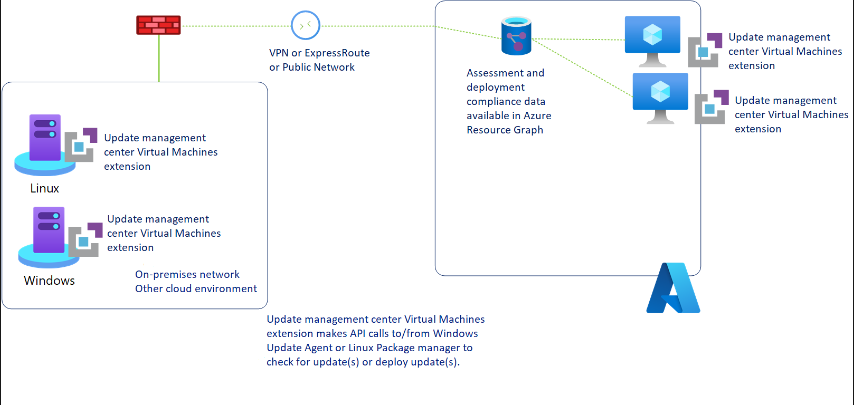

# Azure Update Manager(AUM)

- [Azure Update Manager(AUM)](#azure-update-manageraum)
  - [Azure Update Manager Overview](#azure-update-manager-overview)
  - [Uses of Azure Update Manager](#uses-of-azure-update-manager)
  - [Azure Update Manager Design](#azure-update-manager-design)
  - [Key Benefits of Azure Update Manager](#key-benefits-of-azure-update-manager)
  - [Azure Update Manager Design Decisions](#azure-update-manager-design-decisions)

## Azure Update Manager Overview

Update Manager is a unified service to help manage and govern updates the machines. It can monitor Windows and Linux update compliance across your deployments in Azure, on-premises, and on other cloud platforms from a single dashboard. Also, it can be used to make real-time updates or schedule them within a defined maintenance window.

| **Reference**                                                                                                   |
| --------------------------------------------------------------------------------------------------------------- |
| [Azure Update Manager Overview](https://learn.microsoft.com/en-gb/azure/update-manager/overview?tabs=azure-vms) |

## Uses of Azure Update Manager

1. Oversee update compliance of the entire fleet of machines in Azure, on-premises, and in other cloud environments.
2. Instantly deploy critical updates to secure the machines.
3. Use flexible patching options such as automatic virtual machine (VM) guest patching in Azure, hot patching, and customer-defined maintenance schedules.

## Azure Update Manager Design

- The below diagram illustrates how the Update Manager assesses and applies updates to all Azure machines and Azure Arc-enabled servers for both Windows and Linux. Once Azure Update Manager operation is triggered on the machine, it will push an extension on the machine that interacts with the VM agent (for Azure machine) or Arc agent (for Arc-enabled machines) to fetch and install updates.

[[/.media/azure-update-manager-config.png]]

## Key Benefits of Azure Update Manager

- Provides native experience with zero on-boarding such as native functionality on Azure compute and the Azure Arc, Azure Policy support, Global availability in all Azure compute and Azure Arc regions and no dependency on Log Analytics and Azure Automation.
- Works with Azure roles and identity such as Granular access control at the per-resource level and also have Azure Resource Manager-based operations.
- Offers enhanced flexibility such as installing updates immediately or scheduling them for a later date, check updates automatically or on demand, secure machines with new ways of patching, hot patching, or custom maintenance schedules and Sync patch cycles in relation to "patch Tuesday".
- All Azure Update Manager data is stored in Azure Resource Graph (ARG). Custom reports can be generated on the updates data for deeper understanding and patterns using Azure Workbooks.

## Azure Update Manager Design Decisions

- [[Customer_Shortname]] Platform will be using Azure Update Manager to onboard the Azure Virtual Machines and configure the settings.

> **Rationale:** Centralized management simplifies update management across environments. Security is enhanced by keeping machines secure with the latest patches. Compliance ensures adherence to industry standards. Flexibility allows scheduling and various patching methods.
>
> **Implications:** Resource utilization must be planned to avoid peak usage times. Downtime should be scheduled to minimize system reboot impact. Teams need training to use Azure Update Manager effectively. Dependency management is crucial to ensure compatibility with updates and avoid disruptions.
