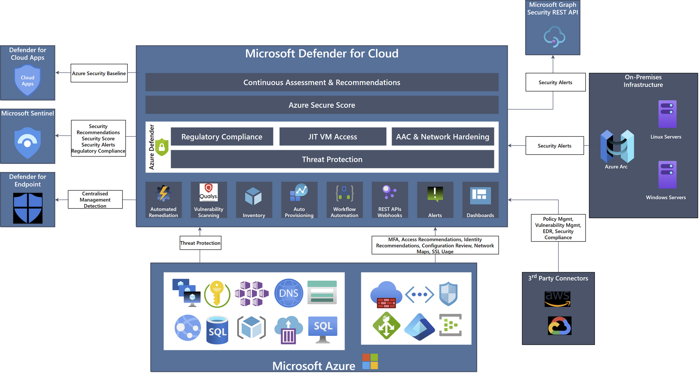

# Microsoft Defender for Cloud

- [Microsoft Defender for Cloud](#microsoft-defender-for-cloud)
  - [Microsoft Defender for Cloud Overview](#microsoft-defender-for-cloud-overview)
  - [Microsoft Defender for Cloud Design Decisions](#microsoft-defender-for-cloud-design-decisions)
  - [Microsoft Defender for Cloud Design](#microsoft-defender-for-cloud-design)

## Microsoft Defender for Cloud Overview

Microsoft Defender for Cloud is a tool for security posture management and threat protection. It strengthens the security posture of your cloud resources, and with its integrated Microsoft Defender plans, Defender for Cloud protects workloads running in Azure, hybrid, and other cloud platforms.
Defender for Cloud provides the tools needed to harden your resources, track your security posture, protect against cyber attacks, and streamline security management. Because it's natively integrated, deployment of Defender for Cloud is easy, providing you with simple auto-provisioning to secure your resources by default.

Defender for Cloud fills three vital needs to manage the security of your resources and workloads in the cloud and on-premises.

[[/.media/defenderForCloud.png]]

Microsoft Defender for Cloud provides two broad pillars of cloud security.

- Cloud Security Posture Management (CSPM) - Features such as secure score, detection of security misconfigurations in virtual machines, and asset inventory among other things. These features will strengthen the cloud posture and track compliance with built-in policies.
- Cloud Workload Protection (CWP) - CWP brings a range of additional security features including regulatory standards (such as NIST and Azure CIS). CWP also include vulnerability scanning from Qualys that is included with the Standard edition.

| **Feature Reference**                                                                                                              |
| ---------------------------------------------------------------------------------------------------------------------------------- |
| [Microsoft Defender for Cloud Overview](https://docs.microsoft.com/en-us/azure/defender-for-cloud/defender-for-cloud-introduction) |

## Microsoft Defender for Cloud Design Decisions

- The following Defender plans will be enforced across all new subscriptions using Azure Policy, this will capture current and future Azure subscriptions in the `mg-[[CustomerCode_Lower]]` Management Group structure.
  - Microsoft Defender for Servers
  - Microsoft Defender for App Services
  - Microsoft Defender for Azure SQL Databases
  - Microsoft Defender for Open-source relational databases
  - Microsoft Defender for Storage
  - Microsoft Defender for Containers
  - Microsoft Defender for Key Vault
  - Microsoft Defender for Resource Manager
  - Microsoft Defender for DNS
- Security alerts and notifications will be configured to go to Subscription owners and the security team.
- Integration to Microsoft Defender for Cloud Apps and Microsoft Defender for Endpoint will be configured to enable these solutions to access this data.
- CI/CD vulnerability scanning won’t be configured at this stage as the solution is not generally available in the country.
- Continuous Export will be enabled within Defender for Cloud to stream these data sources into Azure Sentinel (if enabled)
  - Security alerts.
  - Security recommendations.
  - Security findings.
  - Secure score information per subscription.
  - Regulatory compliance data.
- The following Azure Policy Initiatives will be applied across the Azure platform to ensure alignment to these compliance standards.
  - [Azure CIS](https://docs.microsoft.com/en-us/azure/governance/blueprints/samples/cis-azure-1-1-0)
  - [Azure Security Benchmark](https://docs.microsoft.com/en-us/security/benchmark/azure/overview)

> **Rationale:** Microsoft Defender for Cloud will provide a centralized security posture management and threat protection solution across both the entire Azure platform and selected non-azure workloads.
>
> **Implications:** Microsoft Defender for Cloud is a paid service with the first 30 days free, and all associated costs can be found [here](https://azure.microsoft.com/en-au/pricing/details/defender-for-cloud).

## Microsoft Defender for Cloud Design

The diagram below outlines the architecture for Defender for Cloud, including the integration between the other Microsoft security products and Defender for Cloud and on-premises integration using Azure Arc.

[[/.media/platform-defenderForCloud.png]]

