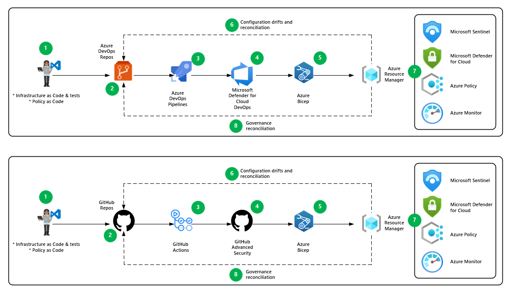

# DevSecOps

- [DevSecOps](#devsecops)
  - [Architecture](#architecture)
    - [Dataflow](#dataflow)
    - [Components](#components)
  - [Scenario details](#scenario-details)
    - [Potential use cases](#potential-use-cases)
  - [Environments](#environments)
  - [Service Principals uages for deployment pipelines](#service-principals-usage-with-deployment-pipelines)

## Architecture

The diagram below outlines the devSecOps architecture using both GitHub and Azure DevOps.

[[/.media/devsecops.png]]

### Dataflow

1. With test driven development, you check in code changes for infrastructure definitions, like IaC templates, into GitHub repositories or Azure DevOps repos. You develop unit tests, integration tests, and PaC at the same time to test the quality of IaC.
2. Pull requests (PRs) trigger automated unit testing through GitHub Actions or Azure DevOps Pipelines.
3. You configure the GitHub Actions or Azure DevOps Pipelines workflow process to test the IaC with PSRule.
4. You configure GitHub Actions or Azure DevOps Pipelines to scan for code quality and security issues. You then use security scanning tools to scan for security vulnerabilities on the IaC. If a vulnerability is detected, GitHub sends alerts to the organization or to repository owners and maintainers or Defender for Cloud surfaces these in the Azure portal.
5. The IaC tool provisions and modifies resources for each environment, tailoring size, instance count, and other properties. You can run automated integration tests for IaC on provisioned resources.
6. When a manual update to the infrastructure is necessary, the designated administrator access is elevated to perform the modifications. After modification, the elevated access is removed, and an issue should be logged into GitHub or Azure Boards for reconciliation of the IaC. The reconciliation steps and possibility depend on the specific IaC tools.
7. SecOps continuously monitors and defends against security threats and vulnerabilities. Azure Policy enforces cloud governance.
8. When an anomaly is detected, an issue should be automatically raised in GitHub or Azure DevOps for rectifications.

### Components

- [GitHub](https://github.com) is a code-hosting platform for version control and collaboration. A GitHub source-control.
- [GitHub Repository](https://docs.github.com/github/creating-cloning-and-archiving-repositories/about-repositories) contains all project files and their revision history. Developers can work together to contribute, discuss, and manage code in the repository.
- [Azure Repos](https://docs.microsoft.com/en-us/azure/devops/repos/get-started/what-is-repos?view=azure-devops) provides Git repositories or Team Foundation Version Control (TFVC) for source control of your code.
- [GitHub Actions](https://github.com/features/actions) provides a suite of build and release workflows that covers continuous integration (CI), automated testing, and container deployments.
- [Azure Pipelines](https://docs.microsoft.com/en-us/azure/devops/pipelines/get-started/what-is-azure-pipelines?view=azure-devops) provides build and release services to support continuous integration and delivery of your applications.
- [GitHub Advanced Security](https://github.com/advanced-security) provides features to secure your IaC. It requires another license.
- [CodeQL](https://codeql.github.com) provides security scanning tools that run on static code to detect infrastructure misconfigurations.
- [Microsoft Defender for Cloud DevOps Security](https://learn.microsoft.com/en-us/azure/defender-for-cloud/defender-for-devops-introduction) Microsoft Defender for Cloud enables comprehensive visibility, posture management, and threat protection across multicloud environments including Azure, AWS, GCP, and on-premises resources.
- [Azure Bicep](https://learn.microsoft.com/en-us/azure/azure-resource-manager/bicep/overview?tabs=bicep) is a domain-specific language (DSL) that uses declarative syntax to deploy Azure resources
- [Microsoft Defender for Cloud](https://azure.microsoft.com/en-au/products/defender-for-cloud/) provides unified security management and advanced threat protection across hybrid cloud workloads.
- [Microsoft Sentinel](https://azure.microsoft.com/en-au/products/microsoft-sentinel/) is a cloud-native SIEM and security orchestration automated response (SOAR) solution. It uses advanced AI and security analytics to help you detect and respond to threats across your enterprise.
- [Azure Policy](https://azure.microsoft.com/en-au/products/azure-policy/) helps teams manage and prevent IT issues through policy definitions that can enforce rules for cloud resources. For example, if your project is about to deploy a virtual machine with an unrecognized SKU, Azure Policy alerts you to the problem and stops the deployment.
- [Azure Monitor](https://azure.microsoft.com/en-au/products/monitor/) collects and analyzes app telemetry, such as performance metrics and activity logs. When this service identifies irregular conditions, it alerts apps and personnel.

## Scenario details

When you adopt IaC, it's important to create automation tests as you develop the code. These tests reduce the complexity of testing IaC when your workload scales. You can use local infrastructure configuration states like Terraform states and plans to develop [test-driven development (TDD) for IaC](https://learn.microsoft.com/en-us/azure/cloud-adoption-framework/ready/considerations/development-strategy-test-driven-development). These configuration states emulate the actual deployments.

Policy as Code (PaC) is also an important method to deliver infrastructure that's compliant to regulations and corporate governance. You can add [PaC workflows](https://learn.microsoft.com/en-us/azure/governance/policy/concepts/policy-as-code) into your pipelines to automate cloud governance.

Securing infrastructure early in the development stage reduces the risks of misconfiguring infrastructure that opens up points for attack after deployment. You can integrate static code analysis tools for infrastructure like Synk, or Aquasecurity tfsec by using GitHub’s CodeQL, to scan security issues in infrastructure code. This process is similar to Static Application Security Testing (SAST).

When the infrastructure is deployed and operational, cloud configuration drifts can be difficult to resolve, especially in production environments.

Set up dedicated service principals to deploy or modify cloud infrastructure for production environments. Then remove all other access that allows manual configuration of the environment. In the event you need manual configurations, elevate access for the designated administrator, and then remove elevated access once the change is modified. You should configure Azure Monitor to raise an issue in GitHub for developers to reconcile the changes. However, manual configuration should be avoided if possible.

It's important to continuously monitor the cloud environment for threats and vulnerabilities to prevent security incidents. You can use Threat protection and security information and event management (SIEM) tools to detect abnormal traffic. These tools automatically alert security administrators and raise an issue in GitHub for attention.

### Potential use cases

You're part of a central team of IaC developers that uses a multicloud strategy for the fictional company Contoso. You want to deploy cloud infrastructure into a new Azure landing zone, using DevSecOps for IaC to ensure the security and quality of deployments. You also want to track and audit all modifications to the infrastructure.

## Environments

For both GitHub and Azure DevOps deployments, Environments are used in this platform.

| Environment Name          | Context                                       | Relative bicepparam File                                                                                                                                                                                                                                              |
| ------------------------- | --------------------------------------------- | --------------------------------------------------------------------------------------------------------------------------------------------------------------------------------------------------------------------------------------------------------------------- |
| platform_managementGroups | Management Groups                             | `src/configuration/platform/managementGroups.bicepparam`                                                                                                                                                                                                              |
| platform_connectivity     | Platform Connectivity                         | `src/configuration/platform/platformConnectivity-<hub/vwan>.bicepparam`                                                                                                                                                                                               |
| platform_management       | Platform Management                           | `src/configuration/platform/platformManagement.bicepparam`                                                                                                                                                                                                            |
| platform_identity         | Platform Identity                             | `src/configuration/platform/platformIdentity.bicepparam`                                                                                                                                                                                                              |
| platform_policy           | Azure Policy                                  | `src/configuration/platform/definitions.Custom.bicepparam`, `src/configuration/policy/assignments.ALZDefault.bicepparam`, `src/configuration/policy/assignments.Custom.bicepparam` and  `src/configuration/policy/exemptions.Custom.bicepparam`                                                                                                                                                                                                |
| platform_role             | Roles (Role Definitions and Role Assignments), including Privileged Identity Management | `src/configuration/platform/roleAssignments.bicepparam`, `src/configuration/platform/customRoleDefinitions.bicepparam` and `src/configuration/platform/privilegedIdentityManagement.bicepparam`|
| platform_firewall         | Azure Firewall Rules                          | `src/configuration/platform/azFirewallRules.bicepparam`                                                                                                                                                                                                               |

These environment can be configured and changed in code to be different, however the defaults are recommended for the purposes of completeness.

Approval gates, timers, and other measures can be placed on these environments to prevent automatic deployment without first having human intervention. As a default, all environments will have the same approval gate of:

1. One person to approve
1. Code must be in `main`
1. Cannot self approve.

## Service Principals usage with deployment pipelines

For both GitHub and Azure DevOps, Azure AD/Entra Service Principals are used to deploy Azure resources and infrastructure.

As a default, at least five (5) Azure AD/Entra Service Principals are recommended:

| Service Principal # | Purpose                                                  | Used by default environment(s)                                                 |
| ------------------- | -------------------------------------------------------- | ------------------------------------------------------------------------------ |
| 1.                  | Deployment of Management Groups and supporting resources | **All environments** except those explictly listed in other service principals |
| 2.                  | Deployment of Platform Connectivity                      | platform_connectivity                                                          |
| 3.                  | Deployment of Management                                 | platform_management                                                            |
| 4.                  | Deployment of Identity                                   | platform_identity                                                              |
| 5.                  | Deployment of Azure Firewall Policy                      | platform_firewall                                                              |

These service principals require the appropriate rights in the Entra Tenant. For the platform, this is `owner` rights within the appropriate management group topology. E.g. Deployment of management groups will need `owner` right at the root management group while Platform Connectivity will need rights at the `Connectivity` management group.

Refer to [Management Groups](HighLevelDesign-management-groups.md) for the names used.

### GitHub

In GitHub, [OIDC configurations](https://docs.github.com/en/actions/security-for-github-actions/security-hardening-your-deployments/configuring-openid-connect-in-azure) have been used to support password/secretless credentials. Refer to the environments of the repository fot the appropriate configuration.

### Azure DevOps

In Azure DevOps, multiple service principals can be used by creating multiple service connections in the Azure DevOps Project. This can then be referenced in the `.azdo/azure-pipelines-*.yml` files to use the most appropriate service connection.
