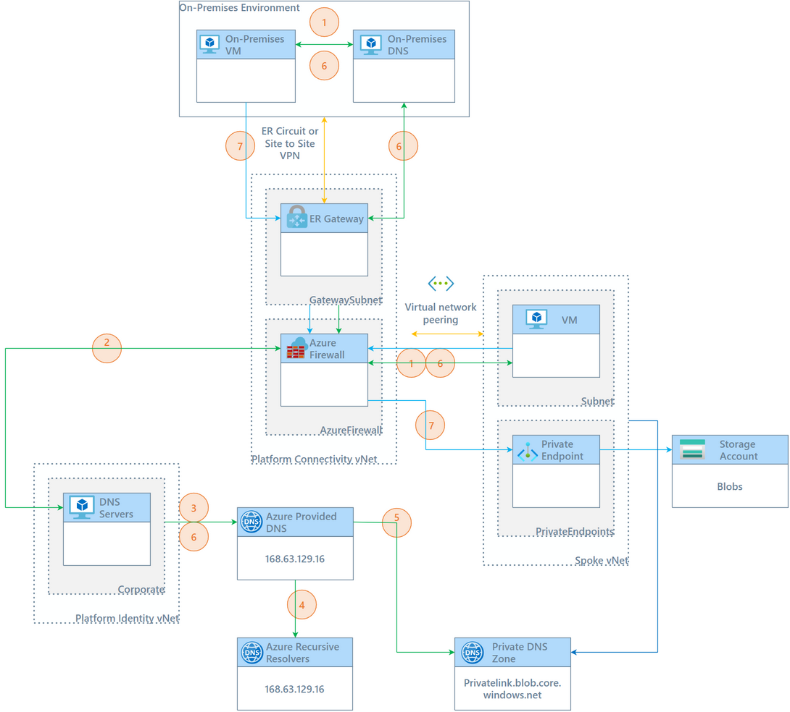

# DNS Resolution

- [DNS Resolution](#dns-resolution)
  - [Overview](#overview)
  - [Azure DNS Private Resolver](#azure-dns-private-resolver)
    - [Workflows](#workflows)
    - [Benefits and Limitations](#benefits-and-limitations)
  - [DNS Forwarder using Virtual Machines](#dns-forwarder-using-virtual-machines)
    - [Workflow](#workflow)
    - [Benefits and Limitations](#benefits-and-limitations-1)
  - [Design Decision](#design-decision)
    - [Implications and Rationale](#implications-and-rationale)

## Overview

## Azure DNS Private Resolver

Azure DNS Private Resolver simplifies hybrid recursive DNS resolution by allowing on-premises workloads and Azure workloads to resolve private DNS zones. You don't need a DNS forwarder VM, and Azure DNS can resolve on-premises domain that may be in use by [[Customer_Shortname]].

It also provides a fully managed, highly available, and scalable DNS solution, which is cost-effective and DevOps-friendly.

### Workflows

| Workflow for On-Premises DNS Query                                                                                                                                                                                                     | Details                                                                                                                                                                                        | Recommendation         |
| -------------------------------------------------------------------------------------------------------------------------------------------------------------------------------------------------------------------------------------- | ---------------------------------------------------------------------------------------------------------------------------------------------------------------------------------------------- | ---------------------- |
| [Traffic flow for an on-premises DNS query](https://learn.microsoft.com/en-us/azure/architecture/networking/architecture/azure-dns-private-resolver#traffic-flow-for-an-on-premises-dns-query)                                         | A client on-premises resolving a private DNS zone endpoint.                                                                                                                                    |                        |
| [Traffic flow for a VM DNS query](https://learn.microsoft.com/en-us/azure/architecture/networking/architecture/azure-dns-private-resolver#traffic-flow-for-a-vm-dns-query)                                                             | A client in Azure (in this case a virtual machine) resolving either an Azure Private DNS zone endpoint, or an on-premise domain record using the Azure DNS backbone (outbound endpoint).       |                        |
| [Traffic flow for a VM DNS query via DNS Private Resolver](https://learn.microsoft.com/en-us/azure/architecture/networking/architecture/azure-dns-private-resolver#traffic-flow-for-a-vm-dns-query-via-dns-private-resolver)           | A client in Azure (in this case a virtual machine) resolving either an Azure Private DNS zone endpoint, or an on-premise domain record using the Azure Private DNS Resolver (inbound endpoint) | Insight Recommendation |
| [Traffic flow for a VM DNS query via an on-premises DNS server](https://learn.microsoft.com/en-us/azure/architecture/networking/architecture/azure-dns-private-resolver#traffic-flow-for-a-vm-dns-query-via-an-on-premises-dns-server) | A client in Azure (in this case a virtual machine) resolving either an Azure Private DNS zone endpoint, or an on-premise domain record by being forced back to on-premises.                    | Not Recommended        |

### Benefits and Limitations

- Simplifies DNS management with Azure Platform-as-a-Service (PaaS) resources
- Eliminates the need for custom DNS solutions or extending on-premises DNS to Azure.
- Provides High availability and scalability
- Cost-effective solution with reduced total-cost of ownership

| **Feature Reference**                                                                                       |
| ----------------------------------------------------------------------------------------------------------- |
| [Azure DNS Private Resolver Overview](https://docs.microsoft.com/en-us/azure/dns/private-resolver-overview) |

> **Rationale:** A fully managed service that simplifies DNS resolution and reduces maintenance overhead.
>
> **Implications:** Reduced complexity and cost, improved reliability, and ease of use.

## DNS Forwarder using Virtual Machines

Alternatively, a traditional DNS forwarder VM can used so that on-premises DNS server(s) can resolve requests to the Azure private DNS service using a virtual Machine hosted in Azure. This setup involves configuring a conditional forwarder on the on-premises DNS server to forward requests to Azure.

> **Note:** If using Windows DNS with Active Directory Domain Services, the Conditional Forwarder cannot be AD-integrated as this would result in the forwarder replicating also to the servers in Azure.

### Workflow

The way in which DNS resolution is achieved with this approach is shown in the below diagram.

[[/.media/private-dns-zones.png]]


1. A virtual machine submits a DNS query for the FQDN of the Azure Storage account `mystorageaccount.blob.core.windows.net`, either from on-premises or in Azure.
2. For the on-premises virtual machine, the request for `mystorageaccount.blob.core.windows.net` is conditionally forwarded to the AD integrated DNS servers in the Platform Identity virtual network in Azure.
3. The DNS servers does a server level forwarder to the Azure-provided DNS service `168.63.129.16`.
4. Authoritative query for `blob.core.windows.net`, returns the query of `mystorageaccount.blob.core.windows.net` and CNAME response `mystorageaccount.privatelink.blob.core.windows.net`.
5. The Private DNS Zone receives the query for `mystorageaccount.privatelink.blob.core.windows.net` and responds with `A Record (private IP)`.
6. The response is sent back to the virtual machines `Response: CNAME mystorageaccount.privatelink.blob.core.windows.net + A Record (private IP)`.
7. A private connection to `(private IP)` is established.

### Benefits and Limitations

- Customisable solution beneficial for hybrid designs
- Can be integrated with existing DNS infrastructure
- Suitable for complex environments where split-brain DNS is necessary
- Does requires additional management and maintenance of the virtual machines in Azure.

> **Note**: To aid in the creation of Conditional Forwarder on the [[CustomerCode]] on-premises DNS servers, script `scripts\Add-DNSConditionalForwardersforAzurePrivateDNSZones.ps1` can be run on each server which will create all the zone necessary for Azure Private DNS Zones. The `-Remove` switch should only be needed when cleaning up existing forwarding zones.

| **Feature Reference**                                                                             |
| ------------------------------------------------------------------------------------------------- |
| [DNS Forwarder VM Overview](https://docs.microsoft.com/en-us/azure/dns/dns-forwarder-vm-overview) |

## Design Decision

The following option has been selected for [[Customer]].

| Option                                   | Selected                                       |
| ---------------------------------------- | ---------------------------------------------- |
| **Azure DNS Private Resolver**           |  |
| **DNS Forwarder using Virtual Machines** | |

### Implications and Rationale

If _Azure Private DNS Resolver_ was selected:

- All DNS resolution in Azure will be achieved by using the inbound endpoint of the Azure Private DNS Resolver. _No DNS resolution should be forced-tunneled back to on-premises._
- A rule set will be created to forward [[Customer_Shortname]] on-premises domain to their nominated on-premises DNS server.
- All on-premises DNS servers must be configured either by using Conditional Forwarders or a simple IP forwarder to resolve the Azure Private DNS resolver (inbound) endpoint.

If _DNS Forwarder using Virtual Machines_ was selected:

- Conditional Forwarders must be configured for Azure Private DNS Zones on [[Customer_Shortname]] on-premises DNS Servers.
- Conditional Forwarders must resolve the virtual machines deployed in Azure.
- If deploying **Active Directory Domain Services** virtual machines in Azure, these VM's will be considered as part of the DNS resolution path.

  - To allow **Active Directory Domain Services** with the Windows DNS roles to work correctly with DNS resolution, ensure the virtual network links are updated to be to connected on the `Identity` vNet as well as the `Connectivity` vNet either via Azure Policy or in code. For code `src/configuration/plaform/platformConnectivity-hub.parameters.bicepparam` change:

  ```bicep
  param virtualNetworkIdToLink = 'resourceId_IdentitySubscriptionvNet'
  ```

  > **Note**: The Identity subscription must be deployed along with its virtual network, before the resourceId can be provided. _It does not create it_ in `platformConnectivity-*.bicep`
