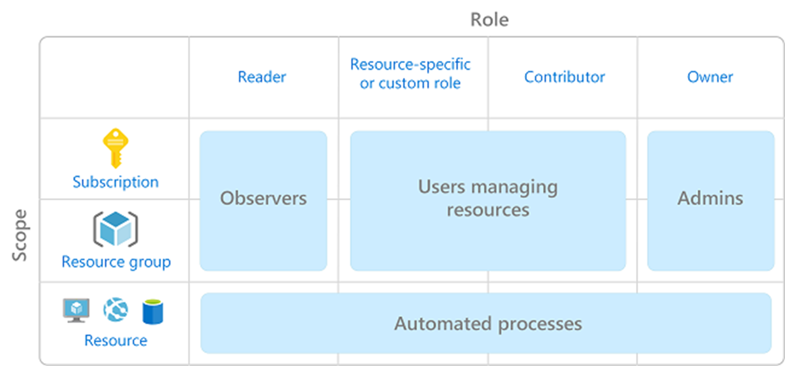
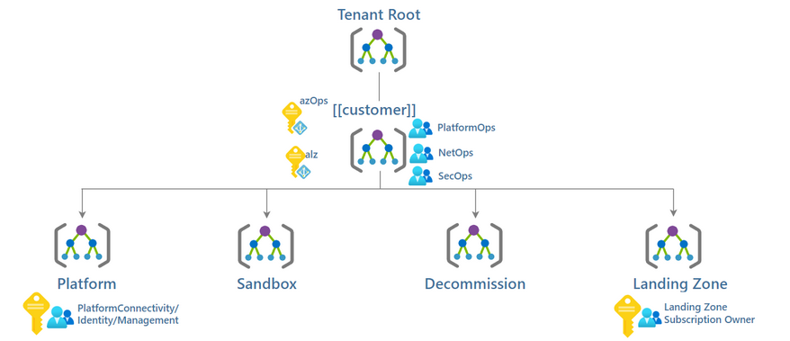

# Identity & Access Management

- [Identity \& Access Management](#identity--access-management)
  - [Identity \& Access Management Overview](#identity--access-management-overview)
    - [Role Based Access Control](#role-based-access-control)
    - [Managed Identities](#managed-identities)
  - [Identity \& Access Management Design Decisions](#identity--access-management-design-decisions)
  - [Identity \& Access Management Design](#identity--access-management-design)
    - [Custom Role Definitions Configuration](#custom-role-definitions--configuration)
      - [Azure Resources Configuration](#azure-resources-configuration)
    - [System-Assigned Managed Identity Configuration](#system-assigned-managed-identity-configuration)

## Identity & Access Management Overview

### Role Based Access Control

Role-Based Access Control (RBAC) is the Entra ID security model to perform access control of resources by users on a more granular level. Users specified in RBAC permissions can access and execute actions on the resources within their scope of work. RBAC can limit access to only the specific resources needed rather than the entire subscription.

RBAC is designed to leverage existing Entra ID users and groups or use on-premises Active Directory accounts for access management via synchronization. It is recommended to use Groups with RBAC instead of individual users. In addition to the built-in roles that can be used creating customer RBAC roles that relate to key user personas and consumers of the platform will provide a good starting point to manage permissions across the environment.

[[/.media/role-based-access-control.png]]

| **Feature Reference**                                                                                  |
| ------------------------------------------------------------------------------------------------------ |
| [Role Based Access Control](https://docs.microsoft.com/en-us/azure/role-based-access-control/overview) |

### Managed Identities

There are two types of managed identities:

- **System-assigned:** Some Azure services allow you to enable a managed identity directly on a service instance. When creating a system-assigned managed identity, an identity is created in Entra ID. The identity is tied to the lifecycle of that service instance. When the resource is deleted, Azure automatically deletes the identity. By design, only that Azure resource can use this identity to request tokens from Entra ID.
- **User-assigned:** You may also create a managed identity as a standalone Azure resource. You can create a user-assigned managed identity and assign it to one or more instances of an Azure service. For user-assigned managed identities, the identity is managed separately from the resources that use it.

| **Property**                   | **System-assigned managed identity**                                                                                                                                                            | **User-assigned managed identity**                                                                                                                                                                                                                                                                                                                                          |
| ------------------------------ | ----------------------------------------------------------------------------------------------------------------------------------------------------------------------------------------------- | --------------------------------------------------------------------------------------------------------------------------------------------------------------------------------------------------------------------------------------------------------------------------------------------------------------------------------------------------------------------------- |
| Creation                       | Created as part of an Azure resource (for example, Azure Virtual Machines or Azure App Service).                                                                                                | Created as a stand-alone Azure resource.                                                                                                                                                                                                                                                                                                                                    |
| Life cycle                     | Shared life cycle with the Azure resource that the managed identity is created with.  When the parent resource is deleted, the managed identity is deleted as well.                         | Independent life cycle.  Must be explicitly deleted.                                                                                                                                                                                                                                                                                                                    |
| Sharing across Azure resources | Can’t be shared.  It can only be associated with a single Azure resource.                                                                                                                   | Can be shared.  The same user-assigned managed identity can be associated with more than one Azure resource.                                                                                                                                                                                                                                                            |
| Common use cases               | Workloads that are contained within a single Azure resource.  Workloads for which you need independent identities.   For example, an application that runs on a single virtual machine. | Workloads that run on multiple resources and can share a single identity.   Workloads that need pre-authorization to a secure resource, as part of a provisioning flow.  Workloads where resources are recycled frequently, but permissions should stay consistent.   For example, a workload where multiple virtual machines need to access the same resource. |

## Identity & Access Management Design Decisions

- A modular Role-based Access Control (RBAC) framework will be implemented that includes the Management Groups and Subscriptions hierarchy. Permissions will be inherited from the parent and flow down to the resources below.
- The RBAC framework will align with user personas to encapsulate roles and responsibilities across the platform.
  - Platform level roles will be responsible for key activities across the whole Azure platform.
  - Landing Zone-level roles will be allocated to the appropriate Landing Zone where users would have access to the whole Landing Zone.
- Permissions will be assigned using Microsoft Entra ID security groups that will control access to these resources using associated Entra ID roles.
- Each Entra ID Security Group should have an owner assigned to the group that is accountable for the permissions.
- All user permissions will be controlled by Entra ID Privileged Identity Management.
- Initially there will be four (4) custom roles that will align to roles and define the required permissions, over time this can evolve to include other rules as needed
  - **PlatformOps:** Responsible for management and deployment of control plane resource types such as Subscriptions, Management Groups via IaC and the respective CI/CD pipelines.
  - **NetOps:** Responsible for definition and management of the common networking components in Azure including the hybrid connectivity and firewall resource to control internet facing networking traffic. The NetOps team is responsible to handout virtual networks to landing zone subscriptions.
  - **SecOps:** Responsible for definition and management of Azure Policy and RBAC permissions on the platform for landing zones and platform management groups and subscriptions. Security operations including monitoring and the definition and the operation of reporting and auditing dashboard.
  - **Landing Zone Subscription Owner:** Responsible for definition and management of a Landing Zone, has the same permissions as `Contributor`, except for making changes to core networking resources."
- System Managed Identities will be used by Azure Policy to apply `DeployIfNotExist` actions across the platform.
- There will be Service Connections and associated Service Principals created that Azure DevOps will be use for CI/CD purposes.

> **Rationale:** Defining a modular RBAC framework will assist with the principle of least privileged for accessing resources within Azure
>
> **Implications:** A process will need to be defined for managing RBAC permissions using Entra ID security groups to ensure operational requests meet compliance requirements and agility within the platform

## Identity & Access Management Design

Multiple types of identities will be used across the Azure Platform, these include:

- **Custom Role Definitions-** Custom Roles that will align to responsibilities to provide the specific access to Azure actions.
- **System-Assigned Managed Identities-** Azure Policy will use System-Assigned Managed Identities to manage the lifecycle of `DeployIfNotExist` Azure Policy remediation.
- **Service Connections & Service Principals-** These will work in parallel to provide permissions to deploy resources into Azure programmatically using Azure DevOps pipelines.

### Custom Role Definitions Configuration

A layered approach to RBAC permissions will be implemented using cloud-based Microsoft Entra ID Security Groups. These permissions will be targeted at the associated management group and subscription levels but can also be done at a more granular resource group level if required.

The table below outlines the custom roles that have been created and applied across the environment.

| Role                                                 | Description                                                                                                                                                                                                                                                                   | Permissions                                                                                                                                                                                                                                                                                                         |
| ---------------------------------------------------- | ----------------------------------------------------------------------------------------------------------------------------------------------------------------------------------------------------------------------------------------------------------------------------- | ------------------------------------------------------------------------------------------------------------------------------------------------------------------------------------------------------------------------------------------------------------------------------------------------------------------- |
| [mg-[[CustomerCode_Lower]]] Application Owners (DevOps/AppOps)   | Contributor role granted for application/operations team at resource group level                                                                                                                                                                                              | All actions except:   - Microsoft.Authorization/\*/write   - Microsoft.Network/publicIPAddresses/write   - Microsoft.Network/virtualNetworks/write   - Microsoft.KeyVault/locations/deletedVaults/purge/action                                                                                          |
| [mg-[[CustomerCode_Lower]]] Data Platform Engineer               | Contributor role granted for the Data Platform Engineer role                                                                                                                                                                                                                  | All read actions and specific write actions for Data Factory, alert rules, deployments, event subscriptions, Key Vault checks, and storage accounts.   Data actions on blobs and Key Vault secrets.                                                                                                              |
| [mg-[[CustomerCode_Lower]]] Data Platform Reader                 | Contributor role granted for the Data Platform Reader role                                                                                                                                                                                                                    | Read actions for all resources, storage account containers, and delegation key generation.   Data actions on storage account blobs.                                                                                                                                                                              |
| [mg-[[CustomerCode_Lower]]] Deployments                          | Microsoft Resources Deployments role for the service principals, users and groups to initiate deployments. Use this role with other roles like Network Contributor to deploy resources to explicit resources with automation and CI/CD tooling.                               | Read actions for authorization, resource deployments, resource groups, support, action groups, alerts, diagnostic settings, and operational insights.                                                                                                                                                               |
| [mg-[[CustomerCode_Lower]]] Network Operations (NetOps)          | Platform-wide global connectivity management: Virtual networks, UDRs, NSGs, NVAs, VPN, Azure ExpressRoute, and others                                                                                                                                                         | Read actions for all resources, network resources, alert rules, resource health, deployments, resource groups, and support.                                                                                                                                                                                         |
| [mg-[[CustomerCode_Lower]]] Platform Operations (PlatformOps)    | Responsible for management and deployment of control plane resource types such as subscriptions, management groups via IaC and the respective CI/CD pipelines. Management of the platform related identity resources on Microsoft Entra and cost management for the platform. | All actions except:   - Microsoft.Authorization/_/Delete   - Microsoft.Authorization/_/Write   - Microsoft.Authorization/elevateAccess/Action   - Microsoft.Blueprint/blueprintAssignments/write   - Microsoft.Blueprint/blueprintAssignments/delete   - Microsoft.Compute/galleries/share/action |
| [mg-[[CustomerCode_Lower]]] Security Operations (SecOps)         | Security Operations role with a horizontal view across the entire Azure estate and the Azure Key Vault purge policy                                                                                                                                                           | Read and register actions for all resources, Key Vault purge, policy insights, authorization, policy assignments, policy definitions, policy exemptions, policy set definitions, alert rules, management groups, operational insights, deployments, resource groups, security, and support.                         |
| [mg-[[CustomerCode_Lower]]] Subscription Owner                   | Responsible for definition and management of a Landing Zone, including associated resource that are deployed into it, has the same RBAC permissions as the Contributor role, except for notActions on key networking resources.                                               | All actions except:   - Various Microsoft.Authorization actions   - Various Microsoft.Network actions   - Various policy and role assignment actions.                                                                                                                                                      |
| [mg-[[CustomerCode_Lower]]] Subscription Owner Service Principal | A custom Role Definition for a Landing Zone / Subscription Service Principal that has the same RBAC permissions as the Contributor role, except for notActions on key networking resources.                                                                                   | All actions except:   - Various Microsoft.Authorization actions   - Various Microsoft.Network actions   - Various policy and role assignment actions.                                                                                                                                                      |
| [mg-[[CustomerCode_Lower]]] VM Operator                          | Start and Stop Virtual Machines and reader access                                                                                                                                                                                                                             | Read actions for virtual machines and resource groups, start, restart, deallocate, and power off virtual machines and scale sets.                                                                                                                                                                                   |

Role assignment to some of these custom roles are applied at different scopes as outlined in the diagram below:

[[/.media/rbac-assignment.png]]

As result of these role assignments, the following Entra AD groups must be created so that can be assigned.

| **Group Name**                                | **Source**     | **Group Type** | **Custom Role Name**              | **Assignment Scope** |
| --------------------------------------------- | -------------- | -------------- | --------------------------------- | -------------------- |
| [[ADGroupPrefix]]-Azure-[[CustomerCode]]-NetworkOps                 | Azure Entra ID | Security       | Network Operations (NetOps)       | Management Group     |
| [[ADGroupPrefix]]-Azure-[[CustomerCode]]-Reader                     | Azure Entra ID | Security       | Reader                            | Management Group     |
| [[ADGroupPrefix]]-Azure-[[CustomerCode]]-Owner                      | Azure Entra ID | Security       | Owner                             | Management Group     |
| [[ADGroupPrefix]]-Azure-[[CustomerCode]]-LandingZones               | Azure Entra ID | Security       | Landing Zones                     | Management Group     |
| [[ADGroupPrefix]]-EntraID-[[CustomerCode]]-DirectoryReader          | Azure Entra ID | Security       | Directory Reader                  | Management Group     |
| [[ADGroupPrefix]]-Azure-[[CustomerCode]]-SecurityOps                | Azure Entra ID | Security       | Security Operations (SecOps)      | Management Group     |
| [[ADGroupPrefix]]-EntraID-[[CustomerCode]]-ApplicationDeveloper     | Azure Entra ID | Security       | Application Developer             | Management Group     |
| [[ADGroupPrefix]]-Azure-[[CustomerCode]]-PlatfromOps                | Azure Entra ID | Security       | Platform Operations (PlatformOps) | Management Group     |

### Azure Resources Configuration

For the full configuration of RBAC assignments for the Azure Landing Zone, refer to the Bicep parameter file `src\configuration\platform\roleAssignments.bicepparam`

### System-Assigned Managed Identity Configuration

There will be several System-Managed Identities created across the platform that will be applied at various scopes (Management Group and Subscriptions) and have specific permissions to ensure that the `DeployIfNotExist` actions that are used by Azure Policy so that it can function.
