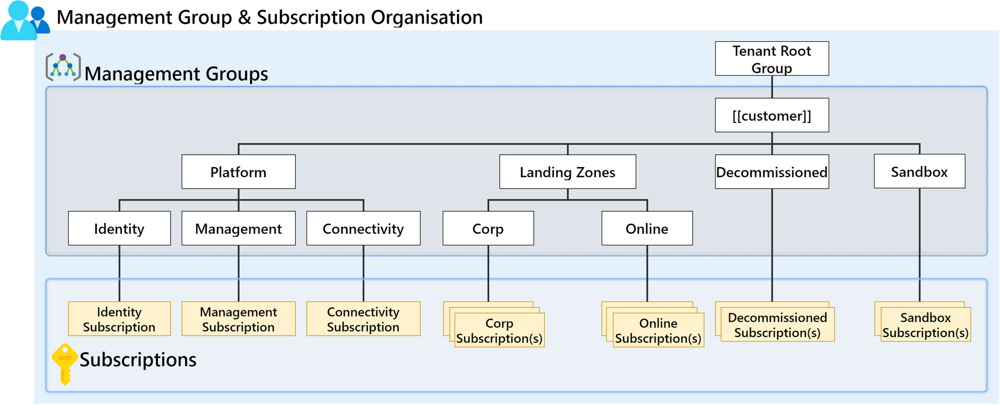

# Management Groups

- [Management Groups](#management-groups)
  - [Management Groups Overview](#management-groups-overview)
  - [Management Groups Design Decisions](#management-groups-design-decisions)
  - [Management Group Design](#management-group-design)
  - [Management Group Configuration](#management-group-configuration)
  - [Management Groups in tabular structure](#management-groups-in-tabular-structure)

## Management Groups Overview

The Management Group structure within a Microsoft Entra ID tenant supports organisational mapping and must be considered thoroughly when planning Azure adoption at scale. Subscriptions are a unit of management, billing, and scale within Azure. They play a critical role when designing for large-scale Azure adoption. This critical design area helps capture subscription requirements and design target subscriptions based on critical factors. These factors are environment type, ownership and governance model, organisational structure, and application portfolios.

| **Feature Reference**                                                                                                                                               |
| ------------------------------------------------------------------------------------------------------------------------------------------------------------------- |
| [Management Groups Overview](https://docs.microsoft.com/en-us/azure/governance/management-groups/overview)                                                          |
| [Cloud Adoption Framework Reference](https://docs.microsoft.com/en-us/azure/cloud-adoption-framework/ready/landing-zone/design-area/resource-oarg-management-groups) |

## Management Groups Design Decisions

- The Management Group hierarchy should be reasonably flat, ideally with no more than three to four levels to reduce management overhead and complexity.
- The Management Group structure will sit under the root-level Management Group to represent the types of workloads that will be used These groups are based on the security, compliance, connectivity, and feature needs of the workloads.
- The Management Group structure will segregate platform services and workload resources.
- Management Groups will be created to structure subscriptions into logical groupings that align with requirements around environment segregation and classification.
- A top-level sandbox Management Group will enable users to immediately experiment with Azure. They can then experiment with resources that might not yet be allowed in production environments. The sandbox provides isolation from development, test, and production environments.
- A platform Management Group under the root management group will support common platform policy and Azure role assignments. This grouping structure ensures that different policies can be applied to the subscriptions used for the Azure platform.
- The proposed Management Group structure will be used to aggregate Azure policies for workloads that require the same type of security and compliance under the same management group. The structure will avoid duplication of the organisational structure that will result in a deeply nested management group hierarchy.
- All new subscriptions will be placed under the _Decommissioned_ Management Group by default, where they can be moved to the appropriate locations as needed.
- Management Groups won't be created for production, testing, and development environments. If necessary, these will be separate subscriptions in the same management group. Further guidance on this topic can be seen below.
  - [How do we handle "dev/test/production" workload landing zones in enterprise-scale architecture? - FAQ](https://docs.microsoft.com/en-us/azure/cloud-adoption-framework/ready/enterprise-scale/faq#how-do-we-handle-devtestproduction-workload-landing-zones-in-enterprise-scale-architecture)
  - [Testing approach for enterprise-scale](https://docs.microsoft.com/en-us/azure/cloud-adoption-framework/ready/enterprise-scale/testing-approach)

> **Rationale:** The Management Group structure will enable the Azure Policy and Azure RBAC structure to flow through to child Management Groups, subscriptions, and Resource Groups. The proposed structure is modular and can iterate over time as the needs and requirements of the business change.
>
> **Implications:** Moving subscriptions between Management Groups in the future can be done without impacting the services that are running within the subscription. Subscriptions will lose all Azure Policies and RBAC permissions and will inherit the new policies and RBAC permissions from the target Management Group.\*

## Management Group Design

The Management Group structure that has been proposed is modular and aligns with the Enterprise Scale Landing Zone Architecture in the Microsoft Cloud Adoption Framework. It is anticipated that the Landing Zone Management Group structure would iterate over time and can be expanded to include further classification levels and environments as required without affecting the existing subscriptions or workloads within these subscriptions.

[[/.media/mg-structure.png]]

## Management Group Configuration

- **Tenant Root Group:**
  The default root Management Group will not be used directly, allowing for greater flexibility in the future to incorporate any changes to the structure and further expansion of Management Groups.

  - **[[Customer]] Root:**
    This is the top-level Management Group (or intermediate root management group) implemented within the Azure tenant and will serve as the container for all custom role definitions, custom policy definitions, and global policy assignments, but will have minimal direct role assignments. For policy assignments at this scope, the target state is to ensure security and autonomy for the platform as additional sub scopes are created, such as child Management Groups and subscriptions.

    - **Landing Zones:**
All workloads will be created in subscriptions within child Management Groups of the Landing Zones Management Groups. This allows for a generic yet more granular approach to policy assignments to separate Corporate connected subscriptions from Online only subscriptions.

      - **Corp:**
The _Corp_ Management Group will be used for all Landing Zone Subscriptions, these subscriptions will support virtual network peering and enable connectivity to the on-premises environment.

      - **Online:**
The _Online_ Management Group will be used for all Landing Zone Subscriptions, these subscriptions will essentially be an island and have **NO CONNECTIVITY** to the on-premises environment.

    - **Platform:**
The Platform Management Group will be the parent for the Connectivity, Management, and Identity child Management Groups. RBAC permissions and Azure policies will be assigned at this level for roles that will be responsible for managing and maintaining the platform and key Azure Policies that will drive the build of the platform.

      - **Connectivity:**
A dedicated subscription will be utilised for the centrally managed networking infrastructure which will control end-to-end connectivity for all Landing Zones within the Azure platform. Azure resources that will be deployed into this subscription include virtual network hubs, ExpressRoute circuits and associated gateways, firewalls, and Azure Private DNS Zones.

      - **Identity:**
The Identity Management Group will have a dedicated Identity subscription that will be used to host VMs running Windows Server Active Directory.

      - **Management:**
A dedicated Management subscription will reside in this Management Group and be utilized for centrally managed platform infrastructure to ensure a holistic at-scale management capability across all Landing Zones within the Azure platform.

    - **Decommissioned:**
All cancelled subscriptions should be moved under this Management Group and will be deleted after 90 days.

    - **Sandbox:**
A sandbox Management Group will be created so that users can immediately experiment with Azure. They can then experiment with resources that might not yet be allowed in production environments. The sandbox provides isolation from the development, test, and production environments and has **NO CONNECTIVITY** to the on-premises environment.

## Management Groups in tabular structure

| Intermediate Top Management Group | Landing Zone Management Groups | Sub-level Management Groups         | Subscription Name             |
| :-------------------------------- | :----------------------------- | :---------------------------------- | :---------------------------- |
| mg-[[CustomerCode_Lower]]                   |                                |                                     |                               |
|                                   | mg-[[CustomerCode_Lower]]-decommissioned |                                     |                               |
|                                   | mg-[[CustomerCode_Lower]]-sandbox        |                                     |                               |
|                                   | mg-[[CustomerCode_Lower]]-platform       |                                     |                               |
|                                   |                                | mg-[[CustomerCode_Lower]]-plat-connectivity   | sub-[[CustomerCode]]-plat-conn-01 |
|                                   |                                | mg-[[CustomerCode_Lower]]-plat-identity       | sub-[[CustomerCode]]-plat-idam-01 |
|                                   |                                | mg-[[CustomerCode_Lower]]-plat-management     | sub-[[CustomerCode]]-plat-mgmt-01 |
|                                   | mg-[[CustomerCode_Lower]]-landingzones   |                                     |                               |
|                                   |                                | mg-[[CustomerCode_Lower]]-landingzones-corp   |                               |
|                                   |                                | mg-[[CustomerCode_Lower]]-landingzones-online |                               |
