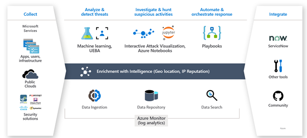
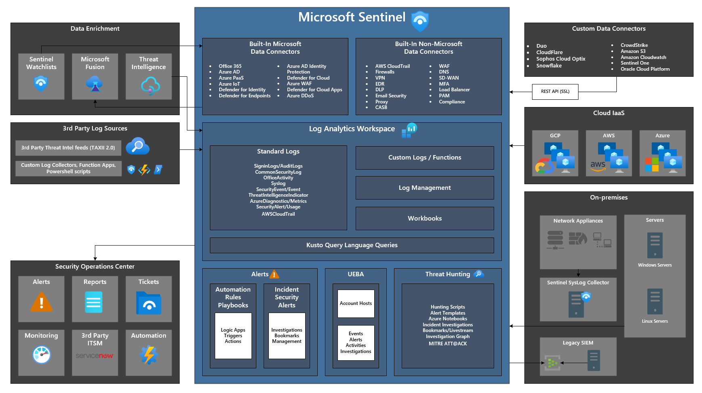

# Microsoft Sentinel

- [Microsoft Sentinel](#microsoft-sentinel)
  - [Microsoft Sentinel Overview](#microsoft-sentinel-overview)
  - [Microsoft Sentinel Design Decisions](#microsoft-sentinel-design-decisions)
  - [Microsoft Sentinel Design](#microsoft-sentinel-design)

## Microsoft Sentinel Overview

Microsoft Sentinel is a cloud-native security information event management (SIEM) and security orchestration automated response (SOAR) tool. Microsoft Sentinel will enable out of the box connectivity and log aggregation with the M365 security suite, built-in analytics/alerts, and the ability to correlate threats across endpoint, cloud, application, and identity.

[[/.media/microsoft-sentinel.png]]

| **Feature Reference**                                                                   |
| --------------------------------------------------------------------------------------- |
| [Microsoft Sentinel Overview](https://docs.microsoft.com/en-us/azure/sentinel/overview) |

## Microsoft Sentinel Design Decisions

- A dedicated Log Analytics workspace will be provisioned in the Platform Management subscription that will be with Azure Sentinel also enabled and configured.
- Retention of the Log Analytics workspace will be set to 90 days, this can be configured up to 730 days. There will be no table-level retention set but this can be enabled at a later stage to override the settings for a particular table as outlined [here](https://docs.microsoft.com/en-us/azure/azure-monitor/logs/manage-cost-storage#retention-by-data-type)
- The Log Analytics workspace will be configured for Resource-context mode to enable access to logs that the user has access to using Azure RBAC permissions.
- Data Collection for Windows Security events will be set to common to collect a standard set of events for auditing purposes.
- A dedicated Repo will be created in Azure DevOps to enable deployment of Microsoft Sentinel content using Source Control.
- The following built-in data connectors will be enabled for the Microsoft Sentinel workspace.
  - Azure Active Directory
  - Azure Active Directory Identity Protection
  - Azure Activity
  - Azure Key Vault
  - Azure Storage Account
  - Network Security Groups
  - Microsoft Defender for Cloud
  - Microsoft Defender for Office 365
  - Security Events via Log Analytics agent
  - Office 365
  - Windows Firewall
- Microsoft Sentinel Analytics Rules will provide an intelligent solution to detect potential threats and vulnerabilities within.
- Out-of-the-box, built-in rule templates will be deployed to create incidents in Microsoft Sentinel based on alerts from the connected data sources.
- Further rules can be created to extend these built-in rules as needed.
- Workbooks will be used for monitoring and data visualization using the Microsoft Sentinel adoption of Azure Monitor Workbooks.
- Microsoft Sentinel allows for a custom workbook creation and comes with built-in workbook templates for insight and visibility across the data as soon as a data source is connected.
- The following workbooks can be deployed to complement the proposed data connectors through Infrastructure as Code (IaC):
  - Azure Activity
  - Azure AD Audit logs
  - Azure AD Sign-in logs
  - Azure Key Vault Security
  - Azure Network Watcher
  - Data Collection Health Monitoring
  - DNS
  - Exchange Online
  - Incident Overview
  - Insecure Protocols
  - Microsoft Sentinel Costs
  - Office 365
  - Security Alerts
  - Security Status
  - SharePoint and OneDrive
  - User and Entity Behavior Analytics
  - Security Operations Efficiency
  - Windows Firewall
  - Workspace Usage Reports

> **Rationale:** The creation of a dedicated Log Analytics workspace with Sentinel also enabled will facilitate centralisation of Logs and simplify Log collection. Granular RBAC access and retention per table can be enabled at a later stage if this is needed to negate the need for further workspaces.
>
> **Implications:** The ingestion of logs and retention for these logs will directly correlate to the overall cost of the Microsoft Sentinel solution. Monitoring this in the interim will be important to ensure that the cost doesn’t become unmanageable.

## Microsoft Sentinel Design

The diagrams below outline the architecture for Microsoft Sentinel and its integration with other Microsoft security solutions.

[[/.media/microsoft-sentinel-arch.png]]

