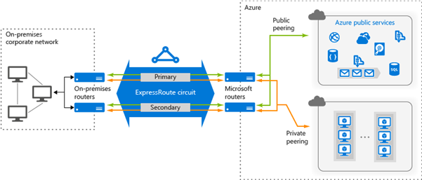
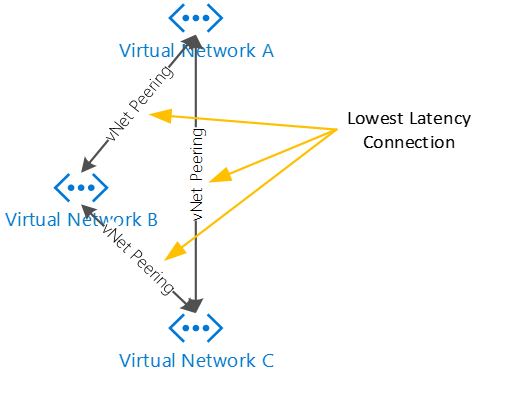
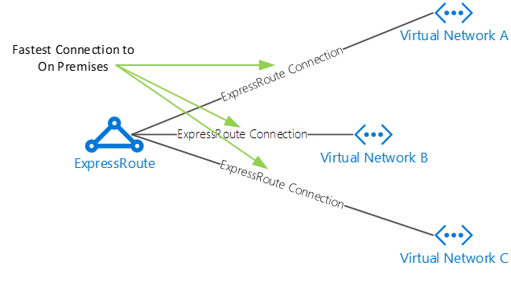
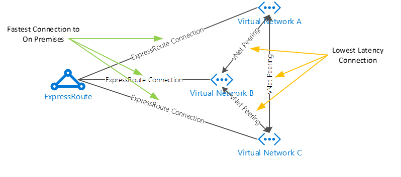

# Network Connectivity

- [Network Connectivity](#network-connectivity)
  - [Network Connectivity Overview](#network-connectivity-overview)
    - [Virtual Network Gateways](#virtual-network-gateways)
    - [ExpressRoute](#expressroute)
    - [Virtual Network Peering](#virtual-network-peering)
  - [Network Connectivity Design Decisions](#network-connectivity-design-decisions)
    - [On-Premises to Azure Design Decisions](#on-premises-to-azure-design-decisions)
    - [Azure to Azure Design Decisions](#azure-to-azure-design-decisions)
  - [Network Connectivity Configuration](#network-connectivity-configuration)

## Network Connectivity Overview

### Virtual Network Gateways

To enable cross premises connectivity, a Virtual Network must be attached to a virtual network gateway (often referred to as a gateway).
The type of gateway determines the cross-premises connectivity capabilities, the performance, and the features that are offered. Static and dynamic gateways are used when establishing Point-to-Site (P2S) and Site-to-Site (S2S) VPN connections where the cross-premises connectivity leverages the Internet for the transport path. ExpressRoute gateways are designed for high-speed, private, cross-premises connectivity where the traffic flows across dedicated circuits and not the Internet.

| **Feature Reference**                                                                                                |
| -------------------------------------------------------------------------------------------------------------------- |
| [Virtual Network Gateway Overview](https://docs.microsoft.com/en-us/azure/vpn-gateway/vpn-gateway-about-vpngateways) |

### ExpressRoute

Microsoft ExpressRoute extends an on-premises networks into the Microsoft cloud over a dedicated private connection facilitated by a connectivity provider. With ExpressRoute, you can establish connections to Microsoft cloud services, such as Microsoft Azure, Office 365, and CRM Online. Connectivity can use an any-to-any (IP VPN) network, a point-to-point Ethernet network, or a virtual cross-connection through a connectivity provider at a co-location facility. ExpressRoute connections do not go over the public internet. This allows ExpressRoute connections to offer more reliability, faster speeds, lower latencies, and higher security than typical connections over the internet.

[[/.media/expressroute.png]]

| **Feature Reference**                                                                                  |
| ------------------------------------------------------------------------------------------------------ |
| [ExpressRoute Overview](https://docs.microsoft.com/en-us/azure/expressroute/expressroute-introduction) |

### Virtual Network Peering

Virtual Network Peering is a feature in Azure Resource Manager networking that allows for the connection of two VNets without the need for VNet gateways. Benefits of this approach is direct connection between two VNets without requiring a gateway, lower latency between resources on each VNet, and wire speed performance (the gateway is not the performance bottleneck).
VNet peering has a single hop routing limit. If you have VNets A, B, and C, and you peer A to B and B to C, but A cannot talk to C. To allow that you also must peer A with C.

[[/.media/vnet1.png]]

ExpressRoute connected VNets are designed to allow VNet resources to talk to on-premises or other ExpressRoute connected VNets. Every VNet connected to an ExpressRoute circuit must communicate through the ExpressRoute gateway to get to on-premises.

[[/.media/vnet2.png]]

VNet peering and ExpressRoute connected VNets are complimentary features. You can have two VNets connected to ExpressRoute circuits to get up to 2 Gbps throughput to on premises while also having the two circuits VNet peered to achieve the lowest latency between the resources on each VNet.
To achieve the maximum bandwidth from a VNet to on premises while also achieving the lowest latency between resources in the VNet requires the implementation of both features.

[[/.media/vnet3.png]]

Routing will prefer VNet peering paths over ExpressRoute paths. In the diagram above, routing traffic from VNet A to VNet B will flow over the VNet peering connection versus out the VNet ExpressRoute gateway to the ExpressRoute circuit and then back up to the VNet B ExpressRoute gateway.

| **Feature Reference**                                                                                                       |
| --------------------------------------------------------------------------------------------------------------------------- |
| [Virtual Network Peering Overview](https://docs.microsoft.com/en-us/azure/virtual-network/virtual-network-peering-overview) |

## Network Connectivity Design Decisions

The approach to network connectivity addresses two (2) main network patterns:

- On-premises to Azure network connectivity
- Azure to Azure network connectivity

### On-Premises to Azure Design Decisions

- A new ExpressRoute circuit will be provisioned into the new hub network
  - The ExpressRoute circuit will terminate at the Perth edge to provide the best possible path into Azure.
  - The ExpressRoute circuit will terminate in the Platform Connectivity hub within Azure.
  - Private peering will be configured to enable private connectivity to Azure workloads.
  - ExpressRoute provides built-in redundancy within the circuit.
  - The Virtual Network Gateway will leverage Availability Zones in Azure for resiliency purposes.
  - BGP will be configured across the Local and Virtual Network Gateways to automatically exchange IP ranges within Azure.
  - A Site to Site VPN connection will be configured as a backup to the ExpressRoute circuit
  - The existing ExpressRoute and Site-to-Site VPN will be decommissioned

### Azure to Azure Design Decisions

- Each Landing Zone subscription will include Virtual Networks (Spokes), for both workloads and PrivateEndpoints.
- These Spoke Virtual Networks are isolated from other spoke Virtual Networks and will only have connectivity via a Virtual Network peer to the transit Hub Virtual Network in the Connectivity Subscription.
- If there is a requirement for spoke virtual networks to be accessible with each other, routing will need to traverse the central firewall in the Hub Virtual Network.

### Operational Technology Platform to [[Customer_Shortname]]'s Corporate Azure Platform

- Private Endpoints from the [[Customer_Shortname]] Corporate Azure Platform infrastructure (such as Kafka) will be attached to the Hub virtual network in the [[Customer_Shortname]] Platform.

## Network Connectivity Configuration

A hub-spoke network connectivity topology will be used. The hub virtual network acts as a central point of connectivity to many spoke virtual networks. The hub will also be used as the connectivity point to the on-premises networks. The benefits of using a hub and spoke configuration include cost savings, overcoming subscription limits, and workload isolation.
