# Network Security

- [Network Security](#network-security)
  - [Network Security Overview](#network-security-overview)
    - [Network Security Groups (NSG)](#network-security-groups-nsg)
    - [Application Security Groups (ASG)](#application-security-groups-asg)
    - [Virtual Network Service Endpoints](#virtual-network-service-endpoints)
    - [Private Endpoints](#private-endpoints)
    - [User-Defined Routes](#user-defined-routes)
    - [Azure DDOS Protection](#azure-ddos-protection)
      - [DDoS Network Protection](#ddos-network-protection)
      - [DDoS IP Protection](#ddos-ip-protection)
        - [Key Features](#key-features)
    - [Azure Application Gateway](#azure-application-gateway)
    - [Azure Firewall](#azure-firewall)
  - [Network Security Design Decisions](#network-security-design-decisions)
  - [Network Security Design](#network-security-design)
    - [Azure to On-Premises Configuration](#azure-to-on-premises-configuration)
    - [On-Premises to Azure Configuration](#on-premises-to-azure-configuration)
    - [Azure to Azure (Intra-vNet) Configuration](#azure-to-azure-intra-vnet-configuration)
    - [Azure to Azure (Inter-vNet) Configuration](#azure-to-azure-inter-vnet-configuration)
    - [Azure to Internet Configuration](#azure-to-internet-configuration)
    - [Internet to Azure (HTTPS) Configuration](#internet-to-azure-https-configuration)
    - [Internet to Azure (Non-HTTPS) Configuration](#internet-to-azure-non-https-configuration)

## Network Security Overview

The Microsoft Azure platform is protected through active monitoring and intelligence gathering from multiple data sources across the globe. Microsoft continuously performs threat intelligence research into the dark web to identify and mitigate potential risks and attacks. This knowledge is applied to their protection techniques and mitigation. The Microsoft Cyber Defence Operations Center highlights Microsoft’s commitment to responding to security incidents.
Putting these investments together, Microsoft provides a layered security model, as shown in the diagram below.

[[/.media/network-security.png]]
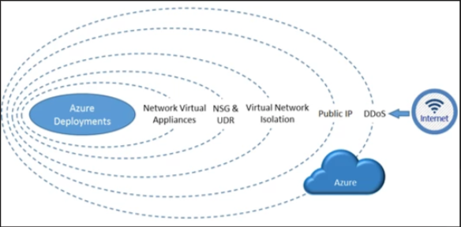

### Network Security Groups (NSG)

An Azure NSG allows filtering of network traffic to and from Azure resources in an Azure virtual network. NSGs contains security rules that allow or deny inbound network traffic to, or outbound network traffic from, Azure-based network resources. For each rule, you can specify source and destination, port, and protocol.
You can associate different NSGs directly to a Network Interface (NIC) or the subnet that a NIC or azure service is bound to. When that happens, all network access rules are applied to the traffic, by priority in each NSG, in the following order:

| **Traffic** | **Applied To** | **Description**                                                                                                                              |
| ----------- | :------------- | :------------------------------------------------------------------------------------------------------------------------------------------- |
| Inbound     | Subnet         | If subnet NSG has a matching rule to deny traffic, the packet will be dropped here.                                                          |
| Inbound     | NIC            | If NIC NSG has a matching rule to deny traffic, the packet will be dropped at NIC, although subnet NSG has a matching rule to allow traffic. |
| Outbound    | Subnet         | If NIC NSG has a matching rule to deny traffic, the packet will be dropped here.                                                             |
| Outbound    | NIC            | If subnet NSG has a matching rule to deny traffic, the packet will be dropped here, although NIC NSG has a matching rule to allow traffic.   |

Although you can only associate a single NSG to a subnet or NIC; you can associate the same NSG to as many resources as you want.

| **Feature Reference**                                                                                       |
| ----------------------------------------------------------------------------------------------------------- |
| [Network Security Group Overview](https://docs.microsoft.com/en-us/azure/virtual-network/security-overview) |

### Application Security Groups (ASG)

Application security groups will enable network security as a natural extension of an application's structure, allowing the grouping of virtual machines and network security policies based on those groups. [[Customer]] can reuse security policy at scale without manual maintenance of explicit IP addresses. The platform handles the complexity of explicit IP addresses and multiple rule sets, allowing focus on the business logic. To better understand application security groups, consider the following diagram:

[[/.media/asgs.png]]
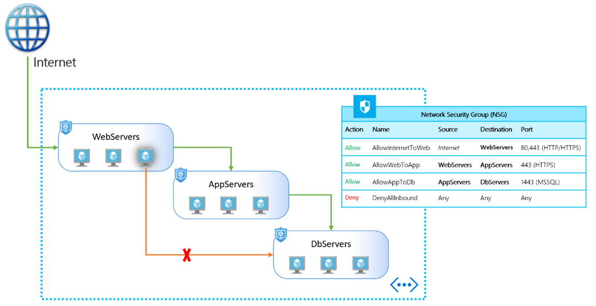

| **Feature Reference**                                                                                     |
| --------------------------------------------------------------------------------------------------------- |
| [Application Security Groups Overview](https://azure.microsoft.com/en-us/blog/applicationsecuritygroups/) |

### Virtual Network Service Endpoints

Virtual Network Service Endpoints will restrict traffic to Azure PaaS services from selected virtual networks and subnets. This provides an ability to create a secure network boundary for data hosted in these services. Service Endpoints are also highly customizable, allowing access for on-premises networks and other trusted internet traffic using network rules based on IP address ranges.
The source connects to the target PaaS service via the public IP address of the resource; however, the connectivity goes over the Microsoft backbone.

[[/.media/service-endpoints.png]]
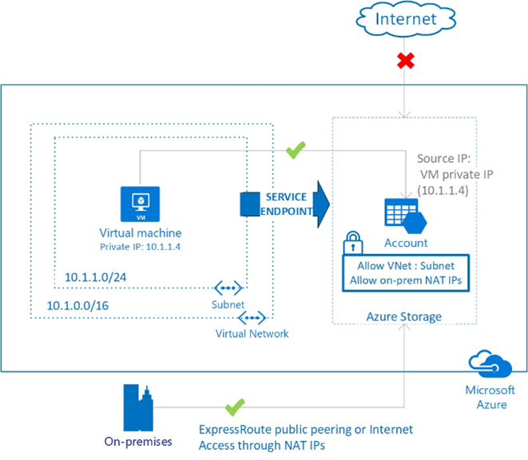

| **Feature Reference**                                                                                                                           |
| ----------------------------------------------------------------------------------------------------------------------------------------------- |
| [Virtual Network Service Endpoints Overview](https://docs.microsoft.com/en-us/azure/virtual-network/virtual-network-service-endpoints-overview) |

### Private Endpoints

Azure Private Endpoints are a network interface that connects privately and securely to a service powered by Azure Private Link. A Private Endpoint uses a private IP address from an existing subnet in the vNet, effectively bringing the service into a private vNet.
The source connects to the target PaaS service via a private IP address that is mapped to the resource, this can be from the on-premises network across a private connection or within a vNet in Azure.

[[/.media/network-topology-and-connectivity/pe.jpg]]

| **Feature Reference**                                                                                       |
| ----------------------------------------------------------------------------------------------------------- |
| [Private Endpoints Overview](https://docs.microsoft.com/en-us/azure/private-link/private-endpoint-overview) |

### User-Defined Routes

User Defined Routes (UDRs) allows the assignment of static routes that override the default implicit system routes and ExpressRoute BGP advertised routes. UDRs will allow the next-hop destination of internal and external firewall devices to inspect and filter traffic across the platform.

[[/.media/udr.png]]
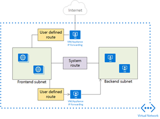

| **Feature Reference**                                                                                                |
| -------------------------------------------------------------------------------------------------------------------- |
| [User Defined Routes Overview](https://docs.microsoft.com/en-us/azure/virtual-network/virtual-networks-udr-overview) |

### Azure DDOS Protection

The DDoS protection is offered in two tiers:

1. DDoS Network Protection
2. DDoS IP Protection

#### DDoS Network Protection

Azure DDoS Network Protection, combined with application design best practices, provides enhanced DDoS mitigation features to defend against DDoS attacks.

#### DDoS IP Protection

DDoS IP Protection is a pay-per-protected IP model. DDoS IP Protection contains the same core engineering features as DDoS Network Protection, but will differ in the following value-added services: DDoS rapid response support, cost protection, and discounts on WAF.

##### Key Features

- Always-on traffic monitoring
- Adaptive real time tuning
- DDoS Protection analytics
- Application based mitigation policies
- Integration with Firewall Manager
- Mitigation policies tuned to customers application
- Public IP Standard tier protection

| **Feature Reference**                                                                                                |
| -------------------------------------------------------------------------------------------------------------------- |
| [Azure DDOS Protection Overview](https://learn.microsoft.com/en-us/azure/ddos-protection/ddos-protection-overview) |

### Azure Application Gateway

Azure Application Gateway is a web traffic load balancer that enables you to manage traffic to your web applications. Traditional load balancers operate at the transport layer (OSI layer 4 - TCP and UDP) and route traffic based on source IP address and port, to a destination IP address and port.

Application Gateway can make routing decisions based on additional attributes of an HTTP request, for example URI path or host headers. For example, you can route traffic based on the incoming URL. So if /images is in the incoming URL, you can route traffic to a specific set of servers (known as a pool) configured for images. If /video is in the URL, that traffic is routed to another pool that's optimized for videos.

[[/.media/app-gwy.png]]

| **Feature Reference**                                                                                     |
| --------------------------------------------------------------------------------------------------------- |
| [Azure Application Gateway Overview](https://docs.microsoft.com/en-us/azure/application-gateway/overview) |

### Azure Firewall

Azure Firewall is a cloud-native and intelligent network firewall security service that provides the best of breed threat protection for your cloud workloads running in Azure. It's a fully stateful, firewall as a service with built-in high availability and unrestricted cloud scalability. It provides both east-west and north-south traffic inspection.

Azure Firewall is offered in three SKUs: Basic, Standard and Premium.

- Azure Basic provides some important features such as Built-in high availability, Zones and FQDN and Service tags. But, it is recommended for SMB customers with throughput needs of less than 250 Mbps.

- Azure Firewall Standard provides L3-L7 filtering and threat intelligence feeds directly from Microsoft Cybersecurity. Threat intelligence-based filtering can alert and deny traffic from/to known malicious IP addresses and domains which are updated in real time to protect against new and emerging attacks.

- Azure Firewall Premium provides advanced capabilities include signature-based IDPS to allow rapid detection of attacks by looking for specific patterns. These patterns can include byte sequences in network traffic, or known malicious instruction sequences used by malware. There are more than 58,000 signatures in over 50 categories which are updated in real time to protect against new and emerging exploits. The exploit categories include malware, phishing, coin mining, and Trojan attacks.

| **Feature Reference**                                                               |
| ----------------------------------------------------------------------------------- |
| [Azure Firewall Overview](https://docs.microsoft.com/en-us/azure/firewall/overview) |

## Network Security Design Decisions

### Azure Firewall Configuration

- A centrally managed **Azure Firewall** will be used to provide unified firewalling services across the Azure environment.
- It will be deployed in the **Platform Connectivity** subscription and configured to run in all three Availability Zones within the **Australia East** region, ensuring high availability and resilience.
- In the event of SNAT port exhaustion, a **NAT Gateway** can be attached the the Azure Firewall subnet.
- Additional public IPs can be attached, using code, to support any DNAT requirements.

### North/South Firewalling

- **User Defined Routes (UDRs)** will control traffic flowing from Azure to external destinations and from external sources into the platform, excluding HTTPS traffic.
- This setup ensures a clear separation between trusted and untrusted networks.

### East/West Firewalling

- **UDRs** will also be used to manage traffic between virtual networks (inter-VNet) in Azure, as well as traffic to and from the on-premises environment.
- This allows for granular traffic inspection and policy enforcement for internal workloads.

### Network Security Groups (NSGs)

- **NSGs** will secure traffic within a single virtual network (subnet-to-subnet).
- They will only be associated at the subnet level, not at the network interface level, to simplify management and maintain consistency.
- NSGs will be provisioned simultaneously with Virtual Networks and Subnets to ensure they are applied from the onset.

### Application Firewalling

- **Azure Application Gateway** with the **Web Application Firewall (WAF)** can be used to protect both internal and external HTTPS applications deployed in Azure. This can be deployed either centrally or in a spoke.
- If deployed centrally, Application Gateways must reside in a dedicated virtual network in the **Platform Connectivity** subscription, secured according to best practices.
- Additional load balancing services (e.g., **Azure Front Door**, **Azure Traffic Manager**) may be used to complement Application Gateway, depending on specific application requirements.

### Private Endpoints and Service Endpoints

- Where appropriate (a vast majority), **Azure PaaS services** will be accessed via **Private Endpoints** to remove direct external connectivity and effectively embed these services within a virtual network. Some services like e.g. **Azure Monitor** will continue to use public ingress to support enhanced features and capabilities.
- If a PaaS services is placed on a Private Endpoint but still requires external access to a PaaS service is required, it can be routed through **Azure Firewall** or **Azure Application Gateway**.
- If a PaaS service does not yet support **Private Endpoints**, **Service Endpoints** will be used instead.
- **Azure Policy** will enforce the use of Private Endpoints for all supported services.
- Private endpoints for **platform-wide services** will be housed in a dedicated virtual network in the **Platform Connectivity** subscription.
- Private endpoints for **Landing Zones** will each reside in a dedicated virtual network within their respective Landing Zone subscriptions.

> **Rationale:** Leveraging Azure-native security services—such as Azure Firewall, Network Security Groups, and Private Endpoints—allows for fully automated provisioning and configuration, ensuring consistency and reliability. By adopting these native constructs, the design benefits from built-in scalability, high availability, and seamless integration across the Azure ecosystem, while avoiding complexity and potential conflicts that can arise from third-party network virtual appliance solutions.
>
> **Implications** By adopting these Azure-native security constructs, organizations can streamline governance, unify security controls across all cloud workloads, and reduce operational complexity, ultimately enhancing overall security posture and maintaining long-term manageability.

## Network Security Design

The design decisions outlined above address the following network security traffic patterns within the Platform:

- **Azure to On-Premises**
- **On-Premises to Azure**
- **Azure to the Azure (Intra-vNet)**
- **Azure to the Azure (Inter-vNet)**
- **Azure to the Internet**
- **Internet to Azure (HTTPS)**
- **Internet to Azure (Non-HTTPS)**

---

### Azure to On-Premises Configuration

For Azure workloads that need access to on-premises services.

[[/.media/azure-onprem.png]]
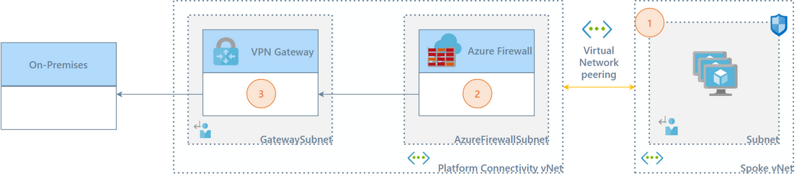

1. Traffic exits the spoke virtual network (vNet)—if outbound rules on the NSG allow—through vNet peering, with the next-hop set to the private IP address of the **Azure Firewall** in the hub vNet.
2. The Azure Firewall then routes the traffic to the **VPN Gateway**, provided the firewall rules permit it.
3. The VPN Gateway sends the traffic over **ExpressRoute**.

---

### On-Premises to Azure Configuration

For users and systems on-premises that need to access workloads and applications in Azure.

[[/.media/onprem-azure.png]]
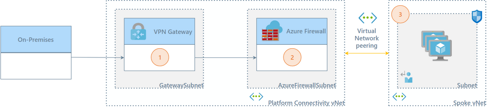

1. Traffic traverses the **Site-to-Site VPN** tunnel. A UDR on the Gateway subnet forwards traffic to Azure CIDR ranges, with the next hop set to the private IP address of the **Azure Firewall**.
2. The Azure Firewall then routes the traffic to the spoke virtual network, if the firewall rules allow.
3. The traffic proceeds via vNet peering to the destination, assuming the **NSG** inbound rules allow it.

---

### Azure to Azure (Intra-vNet) Configuration

[[/.media/azure-azure-intra-vnet.png]]
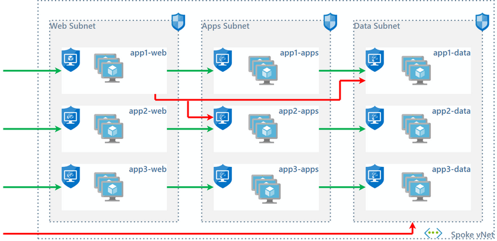

Traffic **within** a single virtual network is controlled by **Network Security Groups (NSGs)** for both inbound and outbound connectivity. All intra-vNet traffic remains within the virtual network and does not pass through the firewall.

---

### Azure to Azure (Inter-vNet) Configuration

When traffic originates from a virtual machine (VM) within a private subnet in one vNet and is destined for a VM in a different private subnet in another vNet, a **User Defined Route (UDR)** directs it to the firewall. Because these vNets are peered, the firewall should not apply NAT to traffic between private subnets.

> **Note:**
> Since UDRs forward traffic, traffic between private subnets in different vNets will enter and exit the firewall on the same interface, effectively using the same zone. By default, intra-zone security rules allow all traffic within a zone. To limit traffic between these subnets, you must create a specific rule **above** the default intra-zone policy, then modify the default policy to **deny** traffic.

[[/.media/azure-azure.png]]
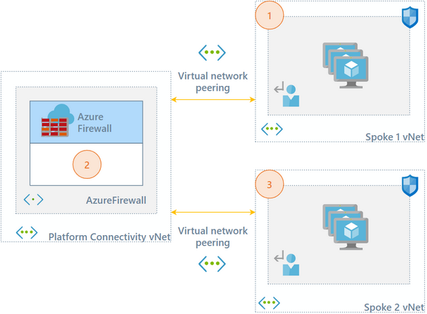

1. Traffic exits the spoke vNet (if outbound NSG rules allow) through vNet peering, with the next-hop set to the private IP address of the **Azure Firewall** in the hub vNet.
2. The Azure Firewall routes the traffic to the destination spoke vNet, if allowed by firewall rules.
3. The traffic then traverses vNet peering to the target VM, assuming the NSG inbound rules allow it.

---

### Azure to Internet Configuration

Traffic originating from a VM on a private subnet that is destined for the internet will be directed to the firewall through a **UDR**. The firewall must translate the source IP address of the outbound traffic to a public IP address on its public subnet. Azure then translates the source IP address again when the traffic leaves the vNet.

> **Note:**
>
> - The public IP address used in the NAT policy can be either the primary interface IP or any secondary IP address on the firewall's public interface.
> - Ensure no IP conflicts arise when assigning secondary IP addresses for NAT.

[[/.media/azure-internet.png]]
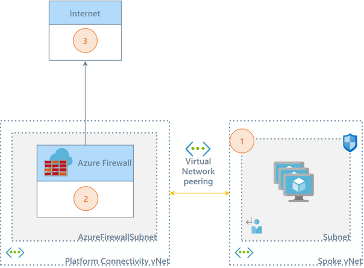

1. Traffic exits the spoke vNet—assuming outbound NSG rules allow—through vNet peering, with the next-hop set to the Azure Firewall’s private IP in the hub vNet.
2. If permitted by the firewall rules, the **Azure Firewall** translates the source IP to its associated public IP.
3. Traffic is sent to its internet destination.

---

### Internet to Azure (HTTPS) Configuration

This traffic pattern places the **Azure Application Gateway** inline with the Azure Firewall.

[[/.media/internet-azure.png]]
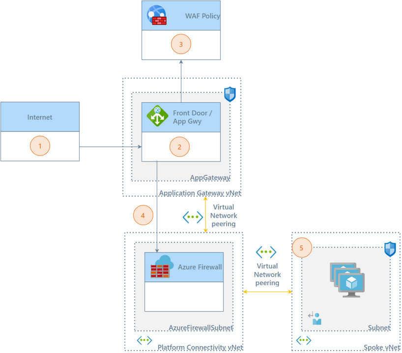

1. A user or system on the internet requests a URL or public IP address.
2. The **Application Gateway** (WAF) receives the request, applying WAF protection and scrubbing traffic before forwarding it to the backend.
3. The Application Gateway performs the NAT (port and IP translation) to the internal IP address.
4. Traffic from the gateway is routed to the **Azure Firewall** based on the route table configuration for the Application Gateway subnet.
5. The firewall forwards traffic over the vNet peering to the spoke vNet, where the **NSG** must allow inbound traffic for final delivery.

---

### Internet to Azure (Non-HTTPS) Configuration

Use this pattern only when inbound external traffic over non-HTTPS protocols is required.

> **Note:**
>
> - To protect private resources, associate the public IP address with the **Azure Firewall** rather than with individual VMs in private subnets.
> - Azure networking translates the public IP to the internal IP upon entry to the vNet, so internal IP addresses must be used in the firewall's security and NAT policies.
> - Multiple secondary IP addresses can be assigned to the firewall’s public interface to avoid port translation conflicts.

[[/.media/internet-azure2.png]]
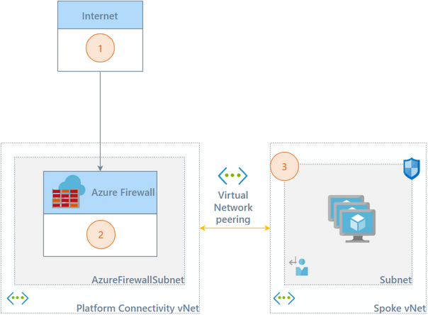

1. Traffic arrives at the **Azure Firewall**'s public IP address in the hub vNet.
2. If the firewall rules allow, the traffic is forwarded to the private subnet.
3. Traffic is ultimately sent to its intended resource within the spoke vNet.
