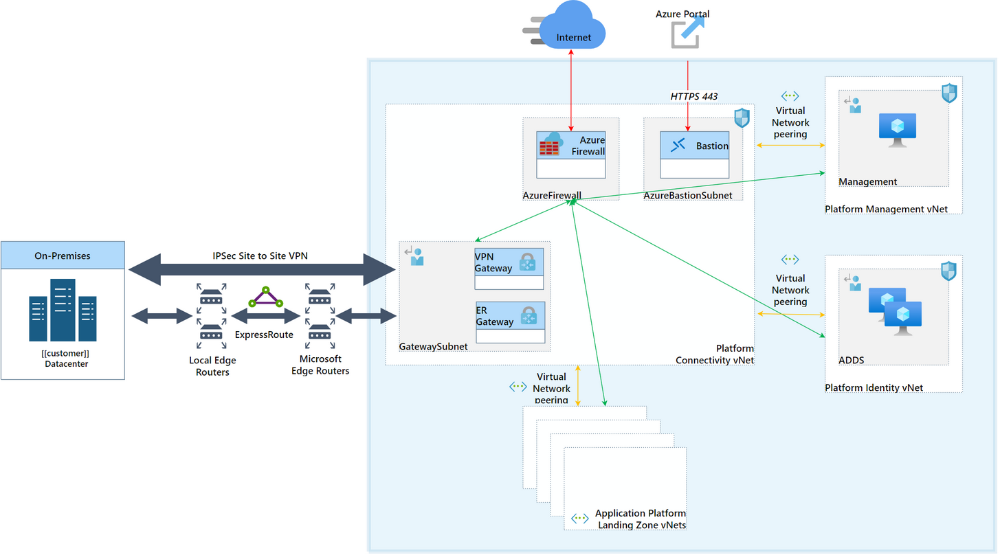
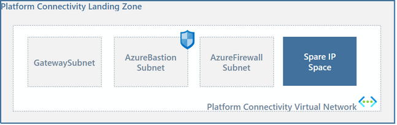
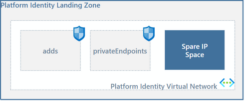
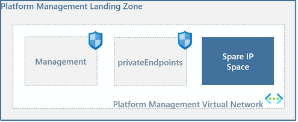

# Network Topology

- [Network Topology](#network-topology)
  - [Network Topology Overview](#network-topology-overview)
  - [Network Topology Design Decisions](#network-topology-design-decisions)
  - [Network Topology Design](#network-topology-design)
    - [Network Topology Configuration - Platform Connectivity](#network-topology-configuration---platform-connectivity)
    - [Network Topology Configuration - Platform Identity](#network-topology-configuration---platform-identity)
    - [Network Topology Configuration - Platform Management](#network-topology-configuration---platform-management)

## Network Topology Overview

Azure Virtual Networks provide a key building block for establishing virtual private networks. Virtual networks can be used to allow isolated network communication within the Azure environment or establish cross-premises network communication between an on-premises environment and Azure. By default, when virtual machines are created and connected to an Azure Virtual Network, they can route to any subnet within the virtual network, and outbound access to the Internet is provided by Azure’s Internet connection.

A fundamental first step in creating services within Microsoft Azure is establishing a Virtual Network. To establish a virtual private network within Azure, you must create a minimum of one virtual network. Each virtual network must contain an IP address space and a minimum of one subnet that leverages all or part of the virtual network address space. To establish remote network communications to on-premises or other virtual networks, a gateway subnet must be allocated for the virtual network and a virtual network gateway must be added to it.

## Network Topology Design Decisions

- A traditional hub & spoke network topology will be used, where transit networking services connectivity will be centralised in the hub virtual network. All spoke virtual networks will peer to the hub for connectivity between Landing Zones, and the on-premises environment.
- Azure environment will be assigned with at-least a dedicated /16 CIDR range now for deriving platform and application landing zones sub ranges. CIDR Range: `X.X.X.X/16`. A dedicated network sheet would be created for tracking the used and available network ranges.
- The Australia East (Sydney) Azure region will be used as the primary Azure region across three (3) Availability Zones.
- There will Platform and Landing Zone virtual networks deployed across the Azure environment.
- The following Platform virtual networks have been proposed:
  - **Connectivity:** A virtual network with a /22 address allocation for all Platform Connectivity services.
  - **Management:** A virtual network with a /22 address allocation for all Platform Management services.
  - **Identity**: A virtual network with a /24 address allocation for all Platform Identity services.
- Each Landing Zone virtual network would include at least a /24 to accommodate the proposed solution with room to expand as required. Each virtual network will be broken into smaller subnets that will align with the proposed workload. An additional subnet /26 will also be provisioned for Landing Zone Private Endpoints.

> **Rationale:** The traditional hub & spoke network topology pattern is a tried and tested network pattern. Using Availability Zones within the Australia East Azure region will provide redundancy and resiliency across datacentres within the region. The proposed virtual networks allow different use cases and patterns between the Platform and Application workloads.
>
> **Implications:** The CIDR ranges need to be unique and allow for future growth without wasting private IP space. The composition of the Landing Zone virtual networks will be dependent on the workloads that will be provisioned in the Landing Zone.

## Network Topology Design

The proposed network architecture will consist of software-defined networking using a traditional hub and spoke network architecture. The hub virtual network will act as a transit zone within the Australia East region and be used to terminate ExpressRoute connections from the on-premises locations.

[[/.media/platform-network-topology.png]]

### Network Topology Configuration - Platform Connectivity

The proposed network architecture will consist of software-defined networking using a traditional hub and spoke network architecture. The hub virtual network will act as a transit zone within each Azure region and used to terminate ExpressRoute and VPN connections from the on-premises environment.

The hub virtual network will have the following subnets predefined, including:

- **GatewaySubnet:** This is required by Azure to host the ExpressRoute and VPN gateways. This subnet cannot be renamed and will be created with the last range in the CIDR address space to enable any expansion of the other subnets without the risk of affecting the ExpressRoute connectivity.
- **AzureBastionSubnet:** This dedicated subnet will be used for Azure Bastion services to provide remote access into the environment.
- **AzureFirewallSubnet:** This subnet is dedicated to Azure Firewalls which require a dedicated subnet in order to function.
- **Free IP Space:** There will be free IP space in the virtual network that can be used to create further subnets as required.

[[/.media/platform-network-connectivity.png]]

| Subscription Name           | Virtual Network Name           | Subnet Name         | Virtual Network CIDR | Subnet CIDR    |
| :-------------------------- | :----------------------------- | :------------------ | :------------------- | :------------- |
| sub-[[CustomerCode_Lower]]-plat-conn-01 | vnt-[[locPrefix]]-plat-conn-[[platConnCIDRwith_]] |                     | [[platConnCIDRwith/]]        |                |
|                             |                                | AzureBastionSubnet  |                      | [[platConnBastionCIDRwith/]] |
|                             |                                | AzureFirewallSubnet |                      | [[platConnFirewallCIDRwith/]]|
|                             |                                | GatewaySubnet       |                      | [[platConnGatewayCIDRwith/]]|
|                             |                                | Free Subnet         |                      | Not calculated |

### Network Topology Configuration - Platform Identity

A virtual network for Identity & Access Management services will reside in the dedicated Platform Identity Subscription. The identity virtual network will have the following subnets predefined, including:

- **Adds:** This subnet will be provisioned for replica Active Directory Domain Controllers if required.
- **privateEndpoints:** This subnet will be provisioned for enabling private Endpoints consumed by the Azure PaaS Services.
- **Free IP Space:** There will be free IP space in the virtual network that can be used to create further subnets as required.

[[/.media/platform-network-identity.png]]

| Subscription Name             | Virtual Network Name                                | Subnet Name      | Virtual Network CIDR  | Subnet CIDR               |
| :---------------------------- | :-------------------------------------------------- | :--------------- | :-------------------- | :------------------------ |
| sub-[[CustomerCode_Lower]]-plat-idam-01 | vnt-[[locPrefixes]]-plat-idam-[[platIdamCIDRwith_]] |                  | [[platIdamCIDRwith/]] |                           |
|                               |                                                     | adds             |                       | [[platIdamAddsCIDRwith/]] |
|                               |                                                     | privateEndpoints |                       | [[platIdamPeCIDRwith/]]   |
|                               |                                                     | Free Subnet      |                       | [[platIdamFreeCIDRwith/]] |

### Network Topology Configuration - Platform Management

A Management virtual network will be provisioned in the Australia East Azure region and reside in the dedicated Management subscription. The management virtual network will have the following subnets predefined, including:

- **management:** This subnet will contain any required management servers, including jump hosts for remote server access.
<!-- - **privateEndpoints:** This subnet will be provisioned for enabling private Endpoints consumed by the Azure PaaS Services.
- **deployments**: For centralised GitHub/Azure DevOps runner virtual machines/scale sets or Azure Container Apps. -->
- **Free IP Space:** There will be free IP space in the vNet that can be used to create further subnets as required.

[[/.media/platform-network-management.png]]

| Subscription Name           | Virtual Network Name           | Subnet Name      | Virtual Network CIDR | Subnet CIDR     |
| :-------------------------- | :----------------------------- | :--------------- | :------------------- | :-------------- |
| sub-[[CustomerCode_Lower]]-plat-mgmt-01 | vnt-[[locPrefix]]-plat-mgmt-[[platMgmtCIDRwith_]] | [[platMgmtCIDRwith/]]     | | |
|                             |                                | management       |                      | [[platMgmtMgmtCIDRwith/]] |
