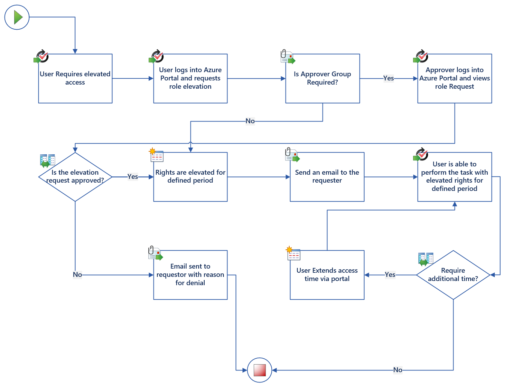

# Azure AD Privileged Identity Management

- [Azure AD Privileged Identity Management](#azure-ad-privileged-identity-management)
  - [Azure AD Privileged Identity Management Overview](#azure-ad-privileged-identity-management-overview)
  - [Azure AD Privileged Identity Management Design Decisions](#azure-ad-privileged-identity-management-design-decisions)
  - [Microsoft Entra ID Privileged Identity Management Design](#microsoft-entra-id-privileged-identity-management-design)
    - [Azure Resources Configuration](#azure-resources-configuration)

## Azure AD Privileged Identity Management Overview

Entra Privileged Identity Management (Entra PIM) is a function within Microsoft Entra ID services that facilitates the ability to manage, control and monitor access to important roles and resources within a Microsoft cloud tenant. These resources include Azure, Entra ID and Online services such as Office 365, SharePoint Online, Teams down to Microsoft Intune.

The ability to minimize the number of people who have access to secure information or resources reduces the chances of a malicious person getting access to critical resources or preventing an authorized user from accidentally impacting a critical resource.
Entra PIM provides a time-based and approval-based activation solution to mitigate the risks of excessive or misused permissions on resources that are critical to the organization.

- Provide just-in-time privileged access to Entra ID and Azure resources
- Assign time-bound access to resources using start and end dates
- Require approval to activate privileged roles
- Enforce multi-factor authentication to activate any role
- Use justification to understand why users activate
- Get notifications when privileged roles are activated
- Conduct access reviews to ensure users still need roles
- Download audit history for internal or external audit

The Privileged Role Administrator can enable approval for specific roles, specify which groups can approve requests and run reports of the request and approvals within the environment. The users assigned the Approver permission can view the pending approval requests, approve, or reject the requests for role elevation and document their reasons for approving or denying the requests. Users that are assigned the Eligible role permissions can request the activation of a role that requires elevation approval, view the status of their requests pending activation and complete their tasks within Entra ID once the request was activated.

[[/.media/privileged-identity-management.png]]

| **Feature Reference**                                                                                                                                                                                                                                         |
| ------------------------------------------------------------------------------------------------------------------------------------------------------------------------------------------------------------------------------------------------------------- |
| [Entra ID Privileged Identity Management Overview](<https://docs.microsoft.com/en-us/azure/active-directory/privileged-identity-management/pim-configure#:~:text=Privileged%20Identity%20Management%20(PIM)%20is,Microsoft%20365%20or%20Microsoft%20Intune.>) |
| [Cloud Adoption Framework Reference](https://docs.microsoft.com/en-us/azure/active-directory/roles/security-planning?toc=%2Fazure%2Fcloud-adoption-framework%2Ftoc.json&bc=%2Fazure%2Fcloud-adoption-framework%2F_bread%2Ftoc.json)                           |
|                                                                                                                                                                                                                                                               |

## Azure AD Privileged Identity Management Design Decisions

- Entra ID PIM will be configured to allow the management of privileged identity management within Azure and Azure Active Directory if they choose to.
- The following decisions will be implemented as part of the PIM configuration.
  - Entra ID PIM will be structured for both Azure AD Roles and Azure Resources. [Privileged Access Groups](https://docs.microsoft.com/en-us/azure/active-directory/privileged-identity-management/groups-features), won't be configured at this stage but can easily be enabled if required.
  - _Eligible_ assignment types will be configured using Entra ID groups to underpin these roles.
  - For Azure Resources the following will be configured;
  - A Service Principal (MS-PIM) will be created and applied to the Management Group with the User Access Administrator role that will be responsible for managing the assignment of these roles to the platform.
  - [Access Reviews](https://docs.microsoft.com/en-us/azure/active-directory/privileged-identity-management/pim-perform-azure-ad-roles-and-resource-roles-review) should be conducted regularly to ensure that changes over time are captured and updated accordingly. The access reviews need to capture the following details;
    - Scope of the access review
    - Frequency
    - Roles and assignment types.
    - Users that should review (can be individual(s) or the user’s self)
    - What to do when a reviewer does not respond.
    - Periodic viewing of raised alerts should also be included as part of this review process.

> **Rationale:** Implementation of Microsoft Entra ID PIM will help govern privileged access to the Azure Platform as well as Azure AD Roles used for Azure and Office 365.
>
> **Implications:** A process will need to be defined for the reviewing of permissions on a periodic basis to ensure that all roles and assignments are fit for purpose.

## Microsoft Entra ID Privileged Identity Management Design

The diagram below outlines the approval workflow for the elevation of permissions using Microsoft Entra ID PIM.

[[/.media/approval-workflow.png]]

### Azure Resources Configuration

For the full configuration of PIM for the Azure Landing Zone, refer to the Bicep parameter file `src\configuration\platform\privilegedIdentityManagement.bicepparam`
