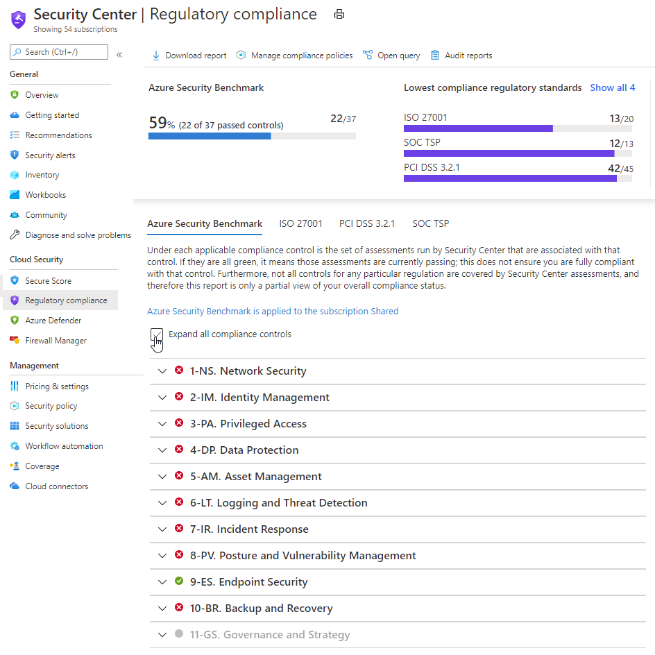

# Regulatory Compliance

- [Regulatory Compliance](#regulatory-compliance)
  - [Regulatory Compliance Overview](#regulatory-compliance-overview)
  - [Regulatory Compliance Design Decisions](#regulatory-compliance-design-decisions)
  - [Regulatory Compliance Configuration](#regulatory-compliance-configuration)

## Regulatory Compliance Overview

Regulatory Compliance in Azure Policy provides built-in initiative definitions to view a list of the controls and compliance domains based on responsibility (Customer, Microsoft, Shared). For Microsoft-responsible controls, Microsoft provide additional details of the audit results based on third-party attestation and the implementation details to achieve that compliance.

Regulatory Compliance is built on the grouping portion of an initiative definition. In built-ins, each grouping in the initiative definition defines a name (control), a category (compliance domain), and provides a reference to the policyMetadata object that has information about that control. A Regulatory Compliance initiative definition must have the category property set to Regulatory Compliance. As an otherwise standard initiative definition, Regulatory Compliance initiatives support parameters to create dynamic assignments.

## Regulatory Compliance Design Decisions

- The ISO 27001:2013 Azure Policy Initiative will be applied across the Azure platform to ensure alignment to this regulatory compliance standard.
- The Azure Security Benchmark Azure Policy Initiative will be applied across the Azure platform to ensure alignment to this regulatory compliance standard.
- The CIS Microsoft Azure Foundations Benchmark 1.3.0 Azure Policy Initiative will be applied across the Azure platform to ensure alignment to this regulatory compliance standard.
- Further Regulatory Compliance Azure Policy Initiatives can also be used in the future. These can be applied at different scopes as needed.

> **Rationale:** Implementation of this Azure Policy initiative will help address compliance with ISO 27001:2013, Azure CIS and other compliance initiatives.
>
> **Implications:** The Azure Policy initiative assists with the control; however, there often is not a one-to-one or complete match between a control and one or more policies. As such, being compliant in Azure Policy refers only to the policy definitions themselves; this doesn't ensure you're fully compliant with all requirements.\*

## Regulatory Compliance Configuration

All Azure Policy Initiatives for Regulatory Compliance can be managed in Azure Security Center or in the Policy blade in the Azure portal.

[[/.media/compliance-dashboard.png]]

The tables below outlines the Azure Policies that have been implemented for Regulatory Compliance.

| Regulatory Compliance Azure Policy Assignment Name | PolicySet Definition Id                                                                        | Link                                                                                              |
| -------------------------------------------------- | ---------------------------------------------------------------------------------------------- | :------------------------------------------------------------------------------------------------ |
| Audit ISO 27001-2013 Compliance                    | "/providers/Microsoft.Authorization/policySetDefinitions/89c6cddc-1c73-4ac1-b19c-54d1a15a42f2" | [Link](https://docs.microsoft.com/en-us/azure/governance/policy/samples/iso-27001)                |
| Audit Azure Foundations CIS Benchmark v1.3.0       | "/providers/Microsoft.Authorization/policySetDefinitions/612b5213-9160-4969-8578-1518bd2a000c" | [Link](https://docs.microsoft.com/en-us/azure/governance/policy/samples/cis-azure-1-3-0)          |
| Enable Azure Security Benchmark                    | "/providers/Microsoft.Authorization/policySetDefinitions/1f3afdf9-d0c9-4c3d-847f-89da613e70a8" | [Link](https://docs.microsoft.com/en-us/azure/governance/policy/samples/azure-security-benchmark) |
