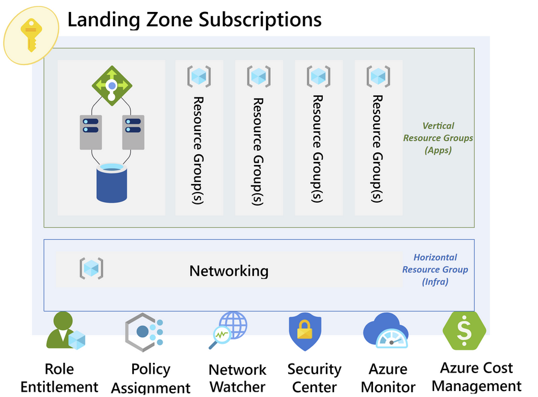

# Resource Groups

- [Resource Groups](#resource-groups)
  - [Resource Groups Overview](#resource-groups-overview)
  - [Resource Groups Design Decisions](#resource-groups-design-decisions)
  - [Platform Resource Groups Configuration Details](#platform-resource-groups-configuration-details)
    - [Platform Resource Group Naming Standard](#platform-resource-group-naming-standard)
    - [Platform Connectivity](#platform-connectivity)
    - [Platform Identity](#platform-identity)
    - [Platform Management](#platform-management)

## Resource Groups Overview

Resource groups are containers that hold related Azure resources that need to be managed as a whole group for an application or solution. A resource group is associated with a specific Azure region but may contain resources from more than one region.

A resource group can be described in the following scenarios:

| Type       | Description                                                                                          | Example                                        |
| ---------- | ---------------------------------------------------------------------------------------------------- | ---------------------------------------------- |
| Vertical   | Contains all resources in a single application or solution that share the same application lifecycle | Specific business applications or solutions    |
| Horizontal | Contains all core infrastructure resources that can be leveraged by vertical resource groups         | networking, security, and management resources |

| **Feature Reference**                                                                                                              |
| ---------------------------------------------------------------------------------------------------------------------------------- |
| [Resource Groups Overview](https://docs.microsoft.com/en-us/azure/azure-resource-manager/management/manage-resource-groups-portal) |

## Resource Groups Design Decisions

- Resource groups for the Platform Subscriptions that rarely change will be pre-created so that future solutions can leverage these platform services.
- Resource groups will include the required resource tags during creation.
- Resource Groups for Landing Zones will include a `lzMgmt` Resource Group that will pre-create the networking resources as part of the provisioning of the Landing Zones.

[[/.media/resource-groups.png]]

> **Rationale:**Using an automated approach to creating resource groups will ensure things like resource tags, budgets, and RBAC permissions are catered for during the creation process.\*

## Platform Resource Groups Configuration Details

### Platform Resource Group Naming Standard

| Resource Type                      | Naming Prefix | Example                     |                            Comments |
| ---------------------------------- | ------------- | --------------------------- | ----------------------------------: |
| Microsoft.Resources/resourceGroups | E-B-C-D-F     | **arg**-[[locPrefix]]-plat-conn-network | All platform Connectivity resources |

The tables below outline the Platform Resource Groups that are deployed as part of the day zero set up of the [[Customer_Shortname]] Platform.

### Platform Connectivity

| Resource Group Name             | Region         | Use Case                                                                                                                                                                              |
| ------------------------------- | -------------- | ------------------------------------------------------------------------------------------------------------------------------------------------------------------------------------- |
| **arg**-[[locPrefix]]-plat-conn-network     | Australia East | All Networking Services including Virtual Network, Subnets, Route Tables, NSG, ER and VPN Gateways.                                                                                   |
| **arg**-[[locPrefix]]-plat-conn-privatedns  | Australia East | All Azure Private DNS Zones that will support privateLink and private endpoints across the environment.                                                                               |
| **arg**-[[locPrefix]]-plat-conn-publicdns | Australia East | All Azure Public DNS Zones that will support privateLink and private endpoints across the environment.                                                                               |
| ascExportRG                     | Australia East | Used to configure Microsoft Defender for Cloud export to Log Analytics/ Azure Sentinel, this resource group will be common across all subscriptions and is deployed via Azure Policy. |
| networkWatcherRG                | Australia East | Network Watcher resource, this resource group will be common across all subscriptions and is deployed via Azure Policy.                                                               |
| alertsRG                        | Australia East | Platform alerts that are deployed via Azure Policy.                                                                                                                                   |

### Platform Identity

| Resource Group Name          | Region         | Use Case                                                                                                                                                                              |
| ---------------------------- | -------------- | ------------------------------------------------------------------------------------------------------------------------------------------------------------------------------------- |
| **arg**-[[locPrefix]]-plat-idam-network  | Australia East | Virtual Network, Route Tables and NSGs for the Azure IaaS Domain Controllers.                                                                                                         |
| **arg**-[[locPrefix]]-plat-idam-security | Australia East | Azure Key Vault for Secret, Key and Certificates for all the Platform subscriptions.                                                                                                  |
| **arg**-[[locPrefix]]-plat-idam-adds     | Australia East | Active Directory Domain Controllers for the Corporate Domain.                                                                                                                         |
| ascExportRG                  | Australia East | Used to configure Microsoft Defender for Cloud export to Log Analytics/ Azure Sentinel, this resource group will be common across all subscriptions and is deployed via Azure Policy. |
| networkWatcherRG             | Australia East | Network Watcher resource, this resource group will be common across all subscriptions and is deployed via Azure Policy.                                                               |
| alertsRG                     | Australia East | Platform alerts that are deployed via Azure Policy.                                                                                                                                   |

### Platform Management

> **Note**: Additional Resource Groups are created over time/usage of the Azure Landing Zone Platform. E.g. Jumphosts, centralised runners and more will receive their own resource groups. See [HighLevelDesign-azure-subscriptions](HighLevelDesign\HighLevelDesign-azure-subscriptions.md) for more information and context.

| Resource Group Name           | Region         | Use Case                                                                                                                                                                       |
| ----------------------------- | -------------- | ------------------------------------------------------------------------------------------------------------------------------------------------------------------------------ |
| **arg**-[[locPrefix]]-plat-mgmt-logging    | Australia East | All Platform Management Services for the subscription including Log Analytics, Azure Sentinel, Azure Automation and Azure Storage for Diagnostics.                             |
| **arg**-[[locPrefix]]-plat-mgmt-network   | Australia East | Virtual Network, Route Tables and NSGs for any services that require private network connectivity.                                                                             |
| ascExportRG                   | Australia East | Used to configure Azure Security Center export to Log Analytics/ Azure Sentinel, this resource group will be common across all subscriptions and is deployed via Azure Policy. |
| networkWatcherRG              | Australia East | Network Watcher resource, , this resource group will be common across all subscriptions and is deployed via Azure Policy.                                                      |
| alertsRG                      | Australia East | Platform alerts that are deployed via Azure Policy.                                                                                                                            |
