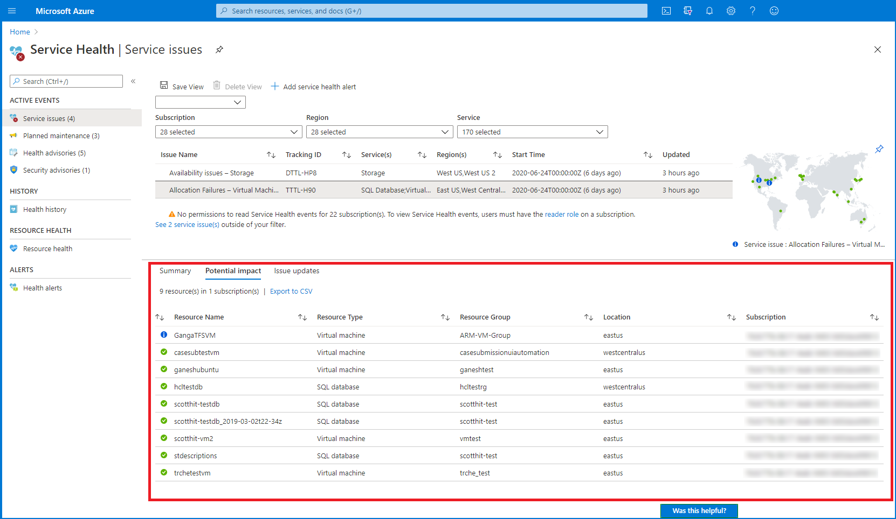

# Service Health

- [Service Health](#service-health)
  - [Service Health Overview](#service-health-overview)
    - [Service Health Events](#service-health-events)
  - [Service Health Design Decisions](#service-health-design-decisions)
  - [Service Health Design](#service-health-design)
    - [Service Health Configuration Details](#service-health-configuration-details)
    - [Action Group Configuration Details](#action-group-configuration-details)

## Service Health Overview

Service Health provides a customizable dashboard which tracks the health of Azure services in the regions where you use them. In this dashboard, you can track active events like ongoing service issues, upcoming planned maintenance, or relevant health advisories. When events become inactive, they get placed in the health history for up to 90 days. Finally, you can use the Service Health dashboard to create and manage service health alerts which proactively notify you when service issues are affecting your resources.

### Service Health Events

Service Health tracks four types of health events that may impact your resources:

1. **Service issues** - Problems in the Azure services that affect you right now.
2. **Planned maintenance** - Upcoming maintenance that can affect the availability of your services in the future.
3. **Health advisories** - Changes in Azure services that require your attention. Examples include deprecation of Azure features or upgrade requirements (e.g upgrade to a supported PHP framework).
4. **Security advisories** - Security related notifications or violations that may affect the availability of your Azure services.

[[/.media/azure-service-health-overview.png]]

## Service Health Design Decisions

- Service Health will be deployed to all Azure subscriptions to provide insights into Azure and platform related issues.
- As part of the Landing Zone provisioning process each new subscription will have a subscription Service Health alert setup

## Service Health Design

The following Service Health Alerts have been set up across the platform, this will need to updated as new Azure subscriptions are provisioned.

### Service Health Configuration Details

| Alert Name                                 | Subscription                  | Regions                | Services     | Event Types                                                              | Action Group        | Email Address |
| ------------------------------------------ | ----------------------------- | ---------------------- | ------------ | ------------------------------------------------------------------------ | ------------------- | ------------- |
| serviceHealthAlert - Platform Management   | sub-[[CustomerCode]]-plat-conn-01 | Australia East, Global | All Services | Service Issue, Planned Maintenance, Health advisories, security advisory | platformActionGroup | [[Customer_Email_Alerts]]         |
| serviceHealthAlert - Platform Connectivity | sub-[[CustomerCode]]-plat-idam-01 | Australia East, Global | All Services | Service Issue, Planned Maintenance, Health advisories, security advisory | platformActionGroup | [[Customer_Email_Alerts]]         |
| serviceHealthAlert - Platform Identity     | sub-[[CustomerCode]]-plat-mgmt-01 | Australia East, Global | All Services | Service Issue, Planned Maintenance, Health advisories, security advisory | platformActionGroup | [[Customer_Email_Alerts]]         |

### Action Group Configuration Details

| Action Group Name   | DisplayName               | Resource Group | Subscription                  | Notification Types | Email Address               |
| ------------------- | ------------------------- | -------------- | ----------------------------- | ------------------ | --------------------------- |
| platformActionGroup | networksandinfrastructure | alertsRG       | sub-[[CustomerCode]]-plat-mgmt-01 | Email              | [[Customer_Email_Alerts]] |
