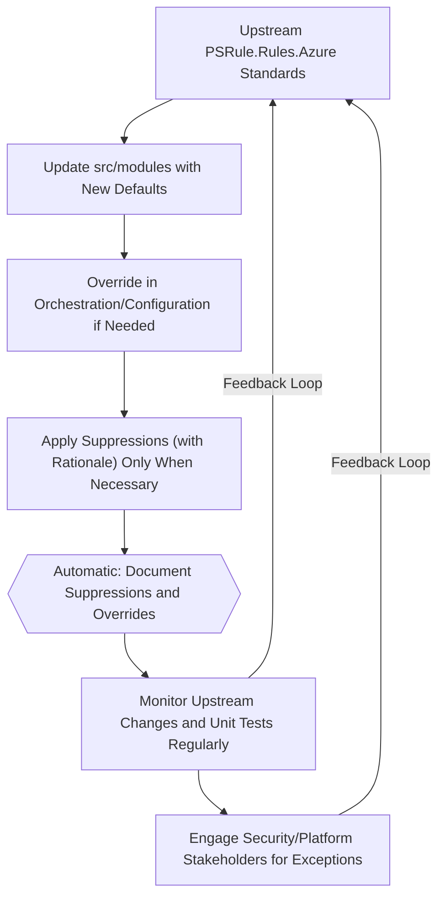

# How-to Guide: Keeping Infrastructure as Code to a High Standard with PSRule

## Introduction

Maintaining high-quality Infrastructure as Code (IaC) is essential for ensuring security, compliance, and operational excellence in Azure environments. [PSRule for Azure](https://azure.github.io/PSRule.Rules.Azure/) provides a comprehensive set of rules aligned with the Azure Well-Architected Framework and Cloud Adoption Framework to validate your Bicep.

Upstream rules are periodically updated, which may introduce new requirements or checks. For instance, [PR #3401](https://github.com/Azure/PSRule.Rules.Azure/pull/3401) added rules that could cause existing modules in this repository to fail validation if certain configurations are missing or incorrectly set.

A recent example is the introduction of a rule requiring geo-replication to be enabled for Log Analytics workspaces. This guide outlines a structured process for understanding, reviewing, and managing such rule changes to keep your environment compliant and operational.

## Prerequisites

Before getting started, ensure the following:

- PowerShell is installed on your machine (PowerShell Core is recommended)
- Install required modules:

```powershell
Install-Module -Name PSRule -Scope CurrentUser -Force
Install-Module -Name PSRule.Rules.Azure -Scope CurrentUser -Force
```

- Familiarity with your repository structure, particularly:
  - `src/modules/` – reusable modules
  - `src/orchestration/` – deployment composition, typically reference lots of local modules or Azure Verified modules.
  - `src/configuration/` – environment-specific configuration that is used by both modules or orchestration files.
- Basic understanding of Bicep and ARM
- Some working knowledge of PSRule concepts (rules, suppression groups, scopes, etc.). Check out <https://azure.github.io/PSRule.Rules.Azure/about/>
- 📘 Also check out: `docs/wiki/GettingStarted.md` for team-specific onboarding and usage guidance.

## Implementing Best Practices in `src/modules/`

Your `src/modules/` directory should reflect Microsoft’s recommended defaults **at all times**. You do this to ensure your code if used elsewhere, is meeting the latest standards set out by Microsoft. For example, to comply with `Azure.Log.Replication`, enable Log Analytics workspace geo-replication as a default:

```bicep
@description('Optional. Log Analytics Replication settings.')
param logAnalyticsReplication object = {
  enabled: true
  location: 'australiasoutheast'
}
```

## Overriding Defaults in Orchestration or Configuration

With the default set in the module, some environments may intentionally override the default because there position is not to replicate data beyond a geographical boundary. To achieve this, use orchestration (`src/orchestration/`) or bicepparam files (`src/configuration/platform/`) to apply these overrides cleanly.

```bicep
module logAnalytics '.../logAnalytics.bicep' = {
  name: 'logAnalytics'
  params: {
    logAnalyticsReplication: {
      enabled: false
      location: 'australiasoutheast'
    }
  }
}
```

```bicepparam
param logAnalyticsReplication = {
  enabled: false
  location: 'australiasoutheast'
}
```

This takes the `true` default and makes it `false` 'new' default one level higher.

## Managing Violations Using Suppression Rules

When you override the default to `false`, PSRule will continue to flag these settings as violations unless you explicitly suppress them with a clear rationale. To address this, you **MUST** create suppression group rules in the `.ps-rule/` directory.

> **TIP**: Choose the most appropriate `<value>.Rule.yaml` file for your suppression rule. Make sure your file name ends with `Rule.yaml` so the PSRule engine can detect it.

### Suppressing for Parameter File

```yaml
# Synopsis: Suppress Azure.Log.Replication for Platform Management Log Analytics - Parameter
apiVersion: github.com/microsoft/PSRule/v1
kind: SuppressionGroup
metadata:
  name: SuppressAzureLogReplicationForPlatformManagementParameter
  description: 'Platform Management Log Analytics workspace is not replicated to a secondary region as part of the platform design.'
spec:
  rule:
    - Azure.Log.Replication
  if:
    allOf:
      - type: '.'
        in:
          - 'Microsoft.OperationalInsights/workspaces'
      - source: 'Parameter'
        withinPath:
          - 'src/configuration/platform'
```

### Suppressing for Template File

```yaml
# Synopsis: Suppress Azure.Log.Replication for Platform Management Log Analytics
apiVersion: github.com/microsoft/PSRule/v1
kind: SuppressionGroup
metadata:
  name: SuppressAzureLogReplicationForPlatformManagement
  description: 'Platform Management Log Analytics workspace is not replicated to a secondary region as part of the platform design.'
spec:
  rule:
    - Azure.Log.Replication
  if:
    allOf:
      - type: '.'
        in:
          - 'Microsoft.OperationalInsights/workspaces'
      - source: 'Template'
        withinPath:
          - 'src/modules/platformManagement.bicep'
```

## Validating Locally

### Running PSRule Analysis in VSCode

If you're using VSCode, you can leverage the built-in "Run and Debug" feature to execute PSRule analysis tasks directly from the IDE. See the `.vscode/launch.json` the supported PowerShell scripts that are called.

```json
{
  "name": "PSRule Analyse [Modules]",
  "type": "PowerShell",
  "request": "launch",
  "script": "${workspaceFolder}/scripts/Test-BicepModules.ps1",
  "args": ["-PSRule", "-ModulesDirectoryPaths", "src/modules"],
  "cwd": "${workspaceFolder}",
  "presentation": {
  "hidden": false,
  "group": "3. Utilities"
  }
},
{
  "name": "PSRule Analyse [Configuration]",
  "type": "PowerShell",
  "request": "launch",
  "script": "${workspaceFolder}/scripts/Test-BicepModules.ps1",
  "args": ["-PSRule", "-ModulesDirectoryPaths", "src/configuration"],
  "cwd": "${workspaceFolder}",
  "presentation": {
  "hidden": false,
  "group": "3. Utilities"
  }
}
```

By opening the "Run and Debug" panel in VSCode and selecting the desired PSRule analysis task, you'll be able to validate your modules or configuration.

Review results and confirm suppression matches intent. Then simply push your changes to the branch

### Invoke-PSRule

After making changes or applying suppressions, you can validate your templates locally using the `Invoke-PSRule` command. This ensures your modules or configurations comply with the latest rules and that any suppressions are working as intended.

```powershell
# Validate all modules in the src/modules directory
Invoke-PSRule -InputPath ./src/modules -Module PSRule.Rules.Azure

# Or validate a specific configuration directory
Invoke-PSRule -InputPath ./src/configuration -Module PSRule.Rules.Azure
```

> **TIP**: You can also test individual files with `Invoke-PSRule`.

Review the output for any rule violations or suppressed results. Address any issues as needed before pushing your changes.

## Best Practices



- Treat `src/modules` as the source of truth for Microsoft best practices. When upstream standards change, update these modules to reflect the new defaults.
- Use orchestration and configuration layers to override module defaults for specific environments or requirements. For example, if a default is `true` in `src/modules` but your scenario requires `false`, apply the override in orchestration or parameter files.
- Apply suppressions only when necessary, with a clear rationale and well-documented scope. Reference the affected configuration or orchestration files in your automated documentation.
- Regularly monitor upstream changes in [PSRule.Rules.Azure](https://github.com/Azure/PSRule.Rules.Azure), such as [PR #3401](https://github.com/Azure/PSRule.Rules.Azure/pull/3401), to stay aligned with evolving standards.
- Engage with security and platform stakeholders when deviating from best practices to ensure risks are understood and managed.

> **NOTE**: While best practices establish a solid baseline, there are scenarios where exceptions are appropriate to the `src/modules` position above. For instance, if all traffic between virtual networks is controlled by a centralised Azure Firewall, it may be reasonable to relax certain Network Security Group (NSG) PSRule checks in those environments.

## Alternative approach

### Pinning PSRule.Rules.Azure to a Specific Version (Not Recommended)

As a last resort, you can pin the `PSRule.Rules.Azure` module to a specific version in your root `ps-rule.yaml` file. This approach is highly discouraged, as it prevents you from benefiting from important rule updates and security fixes. I.e. Microsoft Cloud Adoption Standard evolve over time and this will free you in a state of staleness.

To pin the version, update the relevant section as follows:

```yaml
  PSRule.Rules.Azure: '=1.44.0'
```

This change locks your environment to version `1.44.0` of the rules module, overriding the default version range (e.g., `@pre >=1.40.0`).

## Additional Resources

- [PSRule for Azure Documentation](https://azure.github.io/PSRule.Rules.Azure/)
- [PSRule Suppression Group Docs](https://microsoft.github.io/PSRule/v3/concepts/PSRule/en-US/about_PSRule_SuppressionGroups/)
- [Upstream PR #3401](https://github.com/Azure/PSRule.Rules.Azure/pull/3401)
