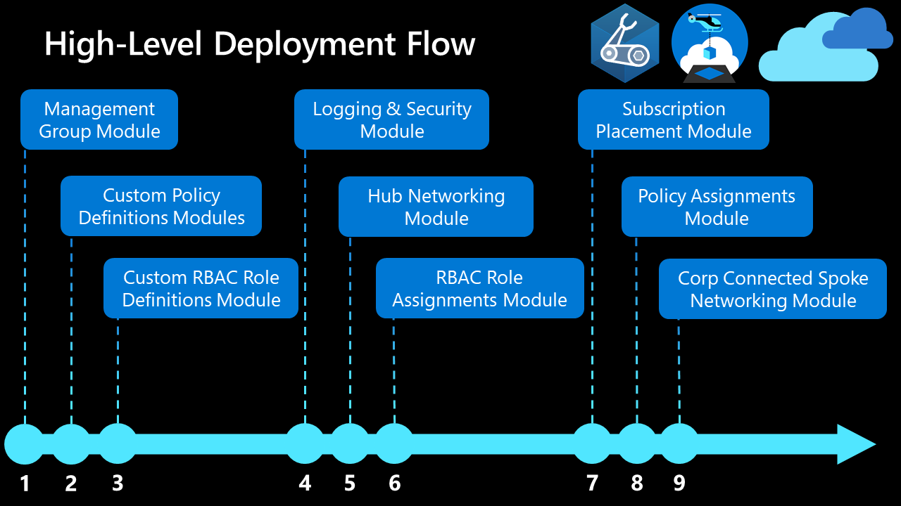

<!-- markdownlint-disable -->

## Azure Platform Landing Zones - Deployment Flow

<!-- markdownlint-restore -->

This document outlines the prerequisites, dependencies and flow to help orchestrate an end-to-end Azure Landing Zone deployment. The orchestration templates provided with this reference implementation have been pre-configured to follow the dependencies described in this document.

## Prerequisites

1. Microsoft Entra Tenant.
2. Minimum 1 subscription. Subscription(s) are required when configuring `Log Analytics Workspace` & `Hub Networking` services. Each can be deployed in the same subscription or separate subscriptions based on deployment requirements.
3. Deployment Identity with `Owner` permission to the `/` root management group. Owner permission is required to allow the Service Principal Account to create role-based access control assignments. See [configuration instructions below](#deployment-identity).

## High Level Deployment Flow

[[./media/high-level-deployment-flow.png]]

## Module Deployment Sequence

Modules in this reference implementation must be deployed in the following order to ensure consistency across the environment:

| Order | Module                                 | Description                                                                                                                                    | Prerequisites                                                                         |
| :---: | -------------------------------------- | ---------------------------------------------------------------------------------------------------------------------------------------------- | ------------------------------------------------------------------------------------- |
|   1   | Management Groups                      | Configures the management group hierarchy to support Azure Landing Zone reference implementation.                                              | Owner role assignment at `/` root management group.                                   |
|   2   | Custom Policy Definitions              | Configures Custom Policy Definitions at the `organization management group`.                                                                   | Management Groups.                                                                    |
|   3   | Custom Role Definitions                | Configures custom roles based on Cloud Adoption Framework's recommendations at the `organization management group`.                            | Management Groups.                                                                    |
|   4   | Logging & Sentinel                     | Configures a centrally managed Log Analytics Workspace, Automation Account and Sentinel in the `Platform Management` subscription.             | Management Groups & Platform Management Subscription.                                 |
|   5   | Hub Networking                         | Creates Hub networking infrastructure with Azure Firewall to support Hub & Spoke network topology in the `Platform Connectivity` subscription. | Management Groups & Platform Connectivity Subscription                                |
|   6   | Role Assignments                       | Creates role assignments using built-in and custom role definitions.                                                                           | Management Groups & Platform Subscriptions.                                           |
|   7   | Subscription Placement                 | Moves one or more subscriptions to the target management group.                                                                                | Management Groups & Platform Subscriptions.                                           |
|   8   | Built-In and Custom Policy Assignments | Creates policy assignments to provide governance at scale.                                                                                     | Management Groups, Log Analytics Workspace, Azure Storage & Custom Policy Definitions |
|   9   | Custom Modules for Landing Zones       | Additional Modules that can be deployed for Domain Controllers, networking and more details Platform Subscription resources.                   | All of the above                                                                      |

## Deployment Identity

### Service Principal Account(s)

Several service principal accounts are required to automate through Azure DevOps or GitHub Actions. Refer to the Wiki to determine how many will be created for each customer deployment.

> **Note**: Never use one service principal for the entire solution. Please always follow the design decisions captured in the Wiki/High Level Design.

### Initial Set Up

See [step-by-step instructions on Azure Docs](https://docs.microsoft.com/azure/azure-resource-manager/templates/deploy-to-tenant?tabs=azure-powershell#required-access) to configure the role assignment at `/` root management group.

This will be needed for the initial deployment of Management Groups and the Landing Zone. It should be immediately removed and replaced with a custom role definition once deployed or multiple default role assignments for the first service principal. E.g. `Management Group Contributor`, `User Access Administrator` and `Resource Policy Administrator`.

> **Note**: Never leave an account with Owner rights at the "/" tenant scope level!
>
> **Tip**: Once the Management Groups are deployed along with the custom role definitions, you can modify `src\configuration\platform\roleAssignments.bicepparam` to assign rights for the other service principals across the platform landing zones subscriptions pre-deployed. This is a great way to controlling RBAC for all services principals used by the platform and Subscription Vending Landing Zones.

### Configure Service Principal Account in Azure DevOps or GitHub

- Azure DevOps: [Setup Service Connection](https://docs.microsoft.com/azure/devops/pipelines/library/service-endpoints?view=azure-devops&tabs=yaml)

- GitHub: [Connect GitHub Actions to Azure, using OpenID Connect](https://docs.microsoft.com/azure/developer/github/connect-from-azure)
