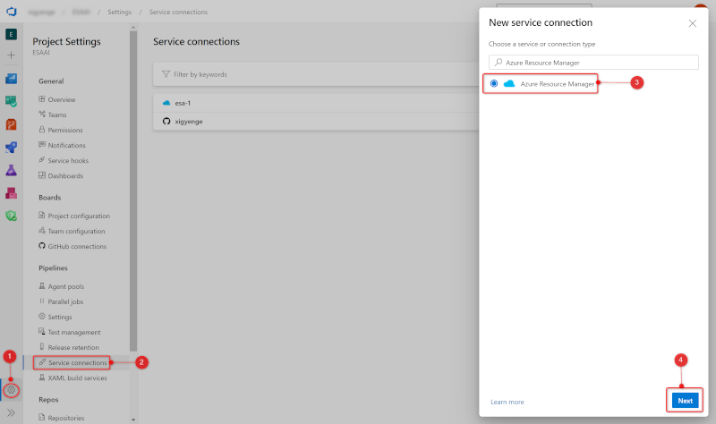

# Azure DevOps Pipeline Configuration Guide

- [Create Azure Service Principals](#create-azure-service-principals)
- [Configure Service Connections](#configure-service-connections)
- [Update YAML Variable File](#update-yaml-variable-file)
- [Pipeline Performance Optimisation](#pipeline-performance-optimisation)
- [Repository Permissions for Automation](#repository-permissions-for-automation)
- [Configure Variable Groups](#configure-variable-groups)
- [Pipeline Environments](#pipeline-environments)
- [Pull Requests and Build Validation](#pull-requests-and-build-validation)
- [Repository Management Pipeline](#repository-management-pipeline)
  - [Bicep Unit Testing](#bicep-unit-testing)
  - [Policy Synchronisation with Microsoft ALZ Repository](#policy-synchronisation-with-microsoft-alz-repository)

This guide outlines the process for setting up Azure DevOps Pipelines to deploy customer-specific environments.

## Create Azure Service Principals

Refer to the [Prerequisites Guide](../deployments/Deployments-pre-deploy.md) for instructions on creating the required Azure Service Principals.

## Configure Service Connections

Create an Azure Resource Manager service connection in Azure DevOps:

1. Create an Azure DevOps project following [these instructions](https://learn.microsoft.com/azure/devops/organizations/projects/create-project?view=azure-devops&tabs=preview-page).
2. In Azure DevOps, navigate to **Project settings** > **Service connections**.
3. Select **New service connection**, and then choose **Azure Resource Manager**.

   

4. Choose **Workload Identity federation (manual)** on the next screen.
5. Complete Step 1 by entering the requested fields.
6. For Step 2, configure the service principal in Azure Entra ID with the appropriate **Issuer** and **Subject Identifier** values.
7. On Step 2, enter the **Service Principal ID** (`clientId`) and **Tenant ID** (`tenantId`) for the service principal created in Step 1. Click **Verify and Save** to test the connection, ensuring you set the appropriate scope.
8. Enter a clear, descriptive **Connection name** (e.g., `PlatformLandingZone-Connectivity`). Save this name as it will be required in pipeline configuration steps.
9. Optionally provide a **Description**, then click **Verify and save**.

Further details can be found in [Microsoft’s documentation](https://learn.microsoft.com/azure/devops/pipelines/library/connect-to-azure?view=azure-devops).

> **Important**: Multiple service connections may be necessary depending on deployment scopes (e.g., Management Group vs Resource Group deployments). While the same service principal can be used for multiple connections, be cautious with granting excessive permissions.

## Update YAML Variable File

Update the file `variables/platform_variables.yml` with the required deployment variables, for example:

```yaml
variables:
  # Location
  - name: location
    value: australiaeast

  # Management Group Configuration
  - name: rootMg
    value: 'mg-alz'
  - name: lzMg
    value: 'mg-alz-landingzones'

  # Post-Deployment Resource Groups
  - name: resourceGroupName_Firewall
    value: arg-aue-plat-conn-network
  - name: resourceGroupName_SiteToSite
    value: arg-aue-plat-conn-network

  # Bicep Templates and Parameters
  - name: deploy_ManagementGroups.templateFile
    value: ./src/modules/managementGroups/managementGroups.bicep
  - name: deploy_ManagementGroups.templateParameterFile
    value: ./src/configuration/platform/managementGroups.bicepparam

  # Additional configuration as necessary
```

> **Note:** You will also need to update `azure-pipelines.yml` and any `azure-pipelines-X.yml` files with the correct Service Connection names, Management Group IDs, and other relevant values. Review the `platform-variable.yml` file thoroughly to identify all required configuration settings in all associated YAML files.

## Pipeline Performance Optimisation

Consider purchasing parallel pipeline jobs to significantly reduce build and deployment times. Without parallel jobs, builds can exceed 30 minutes. Additional details on parallel jobs are available at [Azure DevOps Licensing](https://learn.microsoft.com/azure/devops/pipelines/licensing/concurrent-jobs?view=azure-devops).

## Repository Permissions for Automation

To enable automation tasks (e.g., documentation generation and pull request contributions), configure repository permissions:

1. Navigate to your Azure DevOps Project > **Repos**.
2. Select your repository and open the **Security** tab.
3. Add the service principal or build service identity (**[ProjectName] Build Service ([OrganizationName])**) to the repository's permissions.
4. Grant these permissions:
   - **Contribute**: Allow
   - **Create branch**: Allow
   - **Contribute to pull request**: Allow
   - **Create tag**: Allow
   - **Read**: Allow

These permissions allow automated pipelines to commit and push changes to branches and pull requests.

## Configure Variable Groups

Our Azure DevOps pipelines primarily uses YAML variables defined in `.azdo/variables/platform-variables.yml`. However, at least one secret is required in a variable group named `platform-secrets`. Specifically, set the secret `VPN_SHARED_KEY` used for site-to-site connectivity.

If site-to-site connectivity is not used, you MUST still create the `platform-secrets` variable group and set `VPN_SHARED_KEY` to a placeholder value for pipeline completeness.

For details, see [Variable Groups Documentation](https://learn.microsoft.com/azure/devops/pipelines/process/set-secret-variables?view=azure-devops&tabs=yaml%2Cbash#create-new-variable-groups).

## Pipeline Environments

The pipeline automatically creates the following environments:

- `platform-connectivity`
- `platform-firewall`
- `platform-identity`
- `platform-management`
- `platform-managementGroup`
- `platform-pim`
- `platform-policy`
- `platform-role`

> **Tip**: Manually create these environments if they were not automatically imported. Consider configuring approval gates for controlled deployments.

## Pull Requests and Build Validation

If your code and pipelines are both managed in Azure DevOps, configure a [branch policy](https://learn.microsoft.com/azure/devops/repos/git/branch-policies?view=azure-devops&tabs=browser#build-validation) to enforce build validation using the imported pipeline `azure-pipelines-pr.yml`.

> **Note**: The `pr:` trigger defined in the YAML file only applies to repositories hosted externally, such as GitHub or Bitbucket. When using Azure DevOps repositories, manual configuration via branch policy is necessary.

Proper configuration ensures that all pull requests undergo unit testing, preventing unverified code from merging into your `main` branch.

## Repository Management Pipeline

The pipeline `azure-pipelines-RepositoryManagement.yml` automates repository maintenance tasks for Azure Landing Zone (ALZ) deployments. It runs weekly on the `main` branch using an Ubuntu agent, completed Bicep Unit Tests (simple build) and synchronises content from the official [ALZ repository](https://github.com/Azure/Enterprise-Scale).

### Bicep Unit Testing

The pipeline performs the following tasks:

- Validates Bicep CLI version.
- Builds and lints Bicep templates.
- Automatically creates Azure Boards bugs if failures occur.

This ensures existing deployments remain functional against upstream changes.

### Policy Synchronisation with Microsoft ALZ Repository

This pipeline updates policy templates by:

- Cloning the official repository.
- Applying detected policy updates.
- Converting updates into Bicep templates.
- Creating and pushing pull requests for detected changes.

If no changes occur, pipeline steps are skipped, ensuring efficiency.

For environments and organisations using [Azure EPAC](https://azure.github.io/enterprise-azure-policy-as-code/), this synchronisation task can typically be disabled.
